# Engineering Decision Guide — Algorithm Selection Architecture

> **The Central Thesis:** Classical and optimal control dominate whenever a usable physical model is available; machine learning and sampling earn their keep only where models are unavailable, non-smooth, or unmodeled—and even then, classical feedback or supervisory shields are what make deployment certified and safe.

This document synthesizes the empirical verdicts of all **34 experiments** across the `aimct` framework into an actionable, structured decision system.

---

## 1. Executive Decision Flowchart

Follow this branching logic to determine the appropriate control methodology for your operational requirements:

```mermaid
flowchart TD
    Start["New Control Problem"] --> ModelQ{"Do you have analytical<br/>equations of motion?"}

    %% Physics-based branch
    ModelQ -- Yes --> LinearQ{"Is system operating near<br/>a fixed equilibrium?"}

    LinearQ -- Yes --> ConstrQ{"Are there hard state /<br/>actuator inequality bounds?"}
    ConstrQ -- Yes --> MPC["<b>Constrained Linear MPC</b><br/>(Active-Set Condensed QP)<br/><i>[Exp 08, Exp 28, Exp 30]</i>"]
    ConstrQ -- No --> NoiseQ{"Is full state measurable<br/>without sensor noise?"}
    NoiseQ -- Clean State --> LQR["<b>LQR / CARE Gain Design</b><br/>(Infinite upper gain margin)<br/><i>[Exp 04, Exp 18, Exp 30]</i>"]
    NoiseQ -- Sensor Noise --> LQG["<b>LQG / Kalman Filtering</b><br/>(Optimal noise-bandwidth trade)<br/><i>[Exp 06, Exp 15]</i>"]
    NoiseQ -- Steady Bias / Wind --> LQI["<b>Integral LQR (LQI) / MRAC / SISO PI</b><br/>(Eliminates steady-state droop)<br/><i>[Exp 03, Exp 17, Exp 30]</i>"]

    LinearQ -- No (Nonlinear / Global) --> TaskQ{"What is the primary<br/>operational objective?"}
    TaskQ -- Trajectory Tracking (Smooth Dynamics) --> iLQR["<b>iLQR / RTI-NMPC</b> or <b>Flatness LQR</b><br/>(150x tighter than sampling; real-time budget)<br/><i>[Exp 14, Exp 24, Exp 26]</i>"]
    TaskQ -- Non-Convex Keep-Out / Obstacles --> CEM["<b>Sampling MPC (CEM)</b><br/>(Escapes non-convex barrier saddles)<br/><i>[Exp 20, Exp 25]</i>"]
    TaskQ -- Underactuated Swing-Up (180° -> 0°) --> Energy["<b>Lyapunov Energy Shaping + LQR</b><br/>(Homoclinic orbit pumping + catch)<br/><i>[Exp 07, Exp 28]</i>"]
    TaskQ -- Underactuated Ball and Beam (Relative Deg 4) --> BallBeam["<b>Multivariable LQR / Linear MPC</b><br/>(1.49s settling; eliminates cascaded loop lag)<br/><i>[Exp 33]</i>"]
    TaskQ -- Aerodynamic Wind / Unmeasured Force --> DOB["<b>Disturbance Observer (DOB) + LQR</b><br/>(Instantaneous acceleration feedforward; 5x faster settling)<br/><i>[Exp 34]</i>"]
    TaskQ -- Robot Manipulator (Euler-Lagrange) --> ArmQ{"Does payload / friction<br/>drift over time?"}
    ArmQ -- Known Model --> CT["<b>Computed Torque / Joint LQR</b><br/>(Millimeter trajectory tracking)<br/><i>[Exp 23]</i>"]
    ArmQ -- Unknown Payload --> AdaptiveCT["<b>Slotine-Li Adaptive CT (MRAC)</b><br/>(Dynamic mass estimation)<br/><i>[Exp 23]</i>"]
    TaskQ -- Wheeled Mobile Robot (Unicycle) --> Mobile["<b>Path LQR (Curvature Feedforward)</b><br/>(Sub-10mm cross-track precision)<br/><i>[Exp 22]</i>"]
    TaskQ -- Coupled Process Hydraulics --> Tanks["<b>Multivariable LQR / Linear MPC</b><br/>(-22% pump energy; zero level violations)<br/><i>[Exp 30]</i>"]
    TaskQ -- High-Speed Vehicle Steering --> TireQ{"Is tire operating in<br/>linear slip regime?"}
    TireQ -- Gentle Maneuver (alpha < 1.7°) --> KinMPC["<b>Kinematic MPC / LQR</b><br/>(52.5mm RMS tracking)<br/><i>[Exp 27]</i>"]
    TireQ -- Low-mu / Friction Saturation --> Stanley["<b>Model-Free Stanley</b> or <b>DAgger</b><br/>(DAgger relabels high-slip states to recover expert)<br/><i>[Exp 27, Exp 29]</i>"]

    %% Data-driven / Black-box branch
    ModelQ -- No (Data-Driven) --> DataQ{"Can you collect offline /<br/>online transition rollouts?"}
    DataQ -- Rollout Data Available --> SysID["<b>Least-Squares / DMDc SysID</b><br/>&rarr; Design Model-Based LQR / MPC<br/><i>[Exp 09, Exp 10]</i>"]
    DataQ -- Simulator Interaction Only --> InteractQ{"Is environment interaction<br/>bottlenecked / expensive?"}
    InteractQ -- High Cost (Real Hardware / Slow Sim) --> SAC["<b>Soft Actor-Critic (SAC)</b><br/>(Off-policy replay; 15-20x sample savings)<br/><i>[Exp 31]</i>"]
    InteractQ -- Low Cost (Fast Simulation) --> RL["<b>Deep RL (DQN / PPO)</b><br/>(On-policy simplicity for cheap sims)<br/><i>[Exp 11, Exp 18, Exp 31]</i>"]
    DataQ -- Expert Demonstrations Available --> ImitationQ{"Is training data free<br/>of distribution shift?"}
    ImitationQ -- Gentle Maneuvers Only --> DAgger["<b>DAgger (Dataset Aggregation)</b><br/>(Iterative expert relabeling closes drift)<br/><i>[Exp 29]</i>"]
    ImitationQ -- Uniform State Coverage --> BC["<b>Behavioral Cloning (Plain BC)</b><br/>(Caution: fragile out-of-distribution)<br/><i>[Exp 27, Exp 29]</i>"]

    %% Safety Wrapping
    RL --> ShieldQ{"Deploying learned policy<br/>near physical boundaries?"}
    SAC --> ShieldQ
    SysID --> ShieldQ
    DAgger --> ShieldQ
    BC --> ShieldQ
    ShieldQ -- Yes --> Shield["<b>Supervisory Safety Shield</b><br/>(Guarantees forward invariance)<br/><i>[Exp 12, Exp 21]</i>"]
```

---

## 2. Master Decision Matrix by Problem Class

The table below catalogs the concrete recommendations, alternatives, failure modes, and proving experiments for every operational regime in the 34-experiment benchmark suite:

| Operational Situation | Recommended Method | Fallback / Alternative | Known Failure Mode & Boundary | Proving Experiment |
| :--- | :--- | :--- | :--- | :--- |
| **SISO Regulation under Saturation** | **PID with Anti-Windup Clamping** | Static PD / Feedforward | Unclamped integrator winds up, inflating overshoot to $53\%$ and destabilizing unstable poles | [Exp 03](../experiments/03_pid_stabilizes_unstable/) |
| **Linear State-Space Stabilization** | **LQR (Algebraic CARE)** | Ackermann Pole Placement | Single-loop PID allows unobserved internal cart drift ($0.82\,\text{m}$ off-rail); manual pole placement requires trial-and-error | [Exp 04](../experiments/04_lqr_vs_pole_placement_cartpole/), [Exp 18](../experiments/18_rl_zoo_vs_lqr/) |
| **Local Linearization Envelope** | **LQR within Tangent Cone** | Nonlinear Gain Scheduling / NMPC | Linear state-space diverges when initial perturbation exceeds $|\theta_0| > 23^\circ$ ($0.4\,\text{rad}$) | [Exp 02](../experiments/02_linearization_validity/), [Exp 05](../experiments/05_cartpole_basin_of_attraction/) |
| **Noisy Sensor Measurements** | **LQG (Kalman Filter + LQR)** | Luenberger Observer | Fast observer poles amplify high-frequency encoder noise into destructive actuator thrashing ($16.2\,\text{N}^2\text{s}$) | [Exp 06](../experiments/06_lqg_vs_lqr_measurement_noise/), [Exp 15](../experiments/15_quadrotor_ekf_output_feedback/) |
| **Unmeasured State Estimation** | **Extended Kalman Filter (EKF)** | Finite Differencing | Naive finite differencing of position measurements injects differentiation noise, inflating control energy $150\times$ | [Exp 15](../experiments/15_quadrotor_ekf_output_feedback/) |
| **Hard State / Track Constraints** | **Linear MPC (Condensed QP)** | Soft Barrier Penalty LQR | Unconstrained LQR violates physical rail boundary by $+23\%$; MPC enforces $|x| \le 0.5\,\text{m}$ by previewing constraints | [Exp 08](../experiments/08_mpc_vs_lqr_constrained_cartpole/) |
| **Actuator Torque Saturation** | **Constrained Linear MPC** | Upright LQR | LQR saturates peak torque at $0.15\,\text{N}\cdot\text{m}$; Linear MPC proactively caps torque at $0.1343\,\text{N}\cdot\text{m}$ with zero clipping | [Exp 28](../experiments/28_furuta_pendulum_control/) |
| **Underactuated Ball and Beam** | **Multivariable LQR / Linear MPC** | Cascade PID / PFL | Cascaded PID suffers from inner-outer bandwidth lag ($5.0\,\text{s}$ settling) and steady friction droop ($0.55\,\text{cm}$); Multivariable LQR/MPC coordinates tilt and roll directly ($1.49\,\text{s}$ settling, zero droop) | [Exp 33](../experiments/33_ball_and_beam_control/) |
| **Coupled Process Hydraulics** | **Multivariable LQR / Linear MPC** | SISO PI Control | SISO PI regulates level ($e_{ss}=0.0\,\text{cm}$) but burns $+28\%$ pump voltage ($8546\,\text{V}^2\text{s}$); multivariable LQR/MPC coordinates cross-coupling and cuts energy to $6659\,\text{V}^2\text{s}$ | [Exp 30](../experiments/30_two_tank_level_control/) |
| **Underactuated Global Swing-Up** | **Lyapunov Energy Shaping + LQR** | Hybrid Reinforcement Learning | Linear controllers cannot stabilize hanging equilibrium ($\pm 180^\circ$); Tabular Q-learning chatters ($1.48\,\text{rad}$ limit cycle) | [Exp 07](../experiments/07_cartpole_swingup_hybrid/), [Exp 11](../experiments/11_qlearning_vs_classical/), [Exp 28](../experiments/28_furuta_pendulum_control/) |
| **Smooth Trajectory Tracking** | **iLQR / RTI-NMPC** or **Flatness LQR** | Preview MPC | Stochastic sampling (CEM) takes $28\text{--}31\,\text{ms}$ (violating real-time budget) and tracks loosely ($202\,\text{mm}$ vs $1.34\,\text{mm}$) | [Exp 14](../experiments/14_quadrotor_figure8_tracking/), [Exp 24](../experiments/24_ilqr_vs_sampling_mpc/), [Exp 26](../experiments/26_harder_reference_paths/) |
| **Non-Convex Dynamic Obstacles** | **Sampling MPC (CEM)** | Gradient iLQR / RTI-NMPC | Quartic barrier Hessians lose convexity near obstacle centers; single-step gradient iLQR stalls on saddle points ($69$ hits vs CEM $36$ hits) | [Exp 20](../experiments/20_quadrotor_obstacle_nmpc/), [Exp 25](../experiments/25_diffdrive_moving_obstacle/) |
| **Robot Manipulator Tracking** | **Computed Torque / Joint LQR** | Joint PID + Gravity Comp | Decentralized PD exhibits significant joint lag ($32.2\,\text{mm}$ error); computed torque delivers millimeter precision ($4.3\,\text{mm}$) | [Exp 23](../experiments/23_twolink_arm_tracking/) |
| **Manipulator Payload Adaptation** | **Slotine--Li Adaptive CT (MRAC)** | Nominal Computed Torque | Nominal computed torque collapses under unknown $0.5\,\text{kg}$ load step ($394\,\text{mm}$ error, $36.9\%$ completion); Slotine--Li restores $4.9\,\text{mm}$ ($100\%$) | [Exp 23](../experiments/23_twolink_arm_tracking/) |
| **Wheeled Mobile Robot Tracking** | **Path LQR (Curvature Feedforward)** | Pure Pursuit / Stanley | Pure Pursuit geometrically cuts corners on curves ($35\,\text{mm}$ offset); Path LQR curvature feedforward achieves $9.25\,\text{mm}$ cross-track error | [Exp 22](../experiments/22_diffdrive_path_following/) |
| **Vehicle Steering (Linear Tire)** | **Kinematic MPC / LQR** | Model-Free Stanley | Model-free Stanley is $4\text{--}7\times$ looser ($371\,\text{mm}$ vs $52.5\,\text{mm}$) when tire slip is small ($\alpha < 1.7^\circ$) | [Exp 27](../experiments/27_bicycle_double_lane_change/) |
| **Vehicle Steering (Low-$\mu$ Pacejka)** | **Model-Free Stanley** | Robust / Tire-Aware NMPC | Kinematic MPC collapses ($1326\,\text{mm}$) due to false zero-slip assumption; Behavior-Cloned RL completely drives off the road ($5223\,\text{mm}$ RMS) | [Exp 27](../experiments/27_bicycle_double_lane_change/) |
| **Imitation Distribution Shift** | **DAgger (Dataset Aggregation)** | Plain Behavior Cloning | Plain BC drifts into unvisited states and diverges off-road ($6022\,\text{mm}$ RMS); DAgger relabels student states with expert LQR, restoring expert tracking ($768.8\,\text{mm}$) | [Exp 29](../experiments/29_dagger_vs_bc_lane_change/) |
| **Continuous RL (High Interaction Cost)** | **Soft Actor-Critic (SAC)** | Proximal Policy Optimization (PPO) | On-policy PPO discards rollouts ($O(1)$ reuse), requiring $>100\text{k}$ samples; off-policy SAC reaches threshold in $8\text{k}$ steps ($15\text{--}20\times$ faster) and beats classical hybrid ($-364$ vs $-816$) | [Exp 31](../experiments/31_sac_vs_ppo_sample_efficiency/) |
| **Aerodynamic Wind / Unmeasured Force** | **Disturbance Observer (DOB) + LQR** | Integral LQR (LQI) / MRAC | Integral action incurs phase lag and downwind drift ($9.14\,\text{cm}$, $2.91\,\text{s}$ settling); MRAC diverges on unmatched force ($87.2\,\text{cm}$); DOB provides instantaneous acceleration feedforward ($1.68\,\text{cm}$ RMSE, $0.58\,\text{s}$ settling) | [Exp 34](../experiments/34_dob_wind_rejection/) |
| **Plant Parameter Drift (Stiffness)** | **Lyapunov MRAC** | Fixed / Gain-Scheduled LQR | Fixed LQR droops to $0.42\,\text{m}$ error under $5\times$ stiffness change; MRAC holds $< 1\,\text{mm}$ tracking error | [Exp 17](../experiments/17_adaptive_vs_fixed_changing_plant/) |
| **Data-Driven Model Identification** | **Least-Squares / DMDc SysID** | Black-Box Neural Network | Closed-loop SysID on short data ($1\,\text{s}$) causes fatal drift; $24\,\text{s}$ data gives robust LQR stability despite $20\%$ residual | [Exp 09](../experiments/09_control_on_identified_model/) |
| **Learned Residual Dynamics** | **Grey-Box MLP + Sampling MPC** | Pure Black-Box Network | Pure black-box models require massive datasets and fail to generalize; grey-box residual over physics matches true model within $3\%$ | [Exp 10](../experiments/10_planning_learned_vs_true_model/), [Exp 20](../experiments/20_quadrotor_obstacle_nmpc/) |
| **Black-Box Continuous Control** | **From-Scratch PPO / SAC** | Tabular Q / DQN | From-scratch continuous PPO matches LQR return $-0.3$ on CartPole, but requires $240,000$ samples vs $0$ for analytical LQR; SAC slashes sample bill $15\text{--}20\times$ | [Exp 18](../experiments/18_rl_zoo_vs_lqr/), [Exp 31](../experiments/31_sac_vs_ppo_sample_efficiency/) |
| **Deploying Uncertified Policies** | **Supervisory Safety Shield** | Raw Policy Execution | Unshielded RL policy enters limit cycles or breaches safety keep-out; safety shield guarantees zero violations with $35\%$ less energy | [Exp 12](../experiments/12_shielded_qlearning/), [21](../experiments/21_grand_capstone_bakeoff/) |

---

## 3. Detailed Method-by-Method Evidence & Failure Envelopes

### 3.1 Proportional-Integral-Derivative (PID)
- **Strengths:** SISO loops where steady-state error rejection to step commands or constant loads is the primary requirement.
- **Critical Failure Mode:** Single-loop PID cannot coordinate multi-state, single-actuator plants (e.g., Cart-Pole angle PID balances pole but drifts cart $0.82\,\text{m}$ off-rail, [Exp 04](../experiments/04_lqr_vs_pole_placement_cartpole/)).
- **Mandatory Requirement:** Anti-windup clamping is non-negotiable under actuator saturation; unclamped integration inflates overshoot ($53.1\% \to 39.4\%$) and induces windup instability ([Exp 03](../experiments/03_pid_stabilizes_unstable/)).

### 3.2 Linear Quadratic Regulator (LQR) & Pole Placement
- **Strengths:** The analytical baseline for linear(ized) systems. Solves the Algebraic Riccati Equation (CARE) directly, providing guaranteed infinite upper gain margin, $[-6\,\text{dB}, +\infty\,\text{dB}]$ lower gain margin, and $\ge 60^\circ$ phase margin ([Exp 04](../experiments/04_lqr_vs_pole_placement_cartpole/), [Exp 18](../experiments/18_rl_zoo_vs_lqr/)).
- **Critical Failure Mode:** No native constraint awareness (violates track limit by $+23\%$, [Exp 08](../experiments/08_mpc_vs_lqr_constrained_cartpole/)); validity envelope is strictly local ($|\theta| \le 23^\circ$, [Exp 02](../experiments/02_linearization_validity/)); requires Bryson-rule normalization on ill-conditioned systems ([Exp 14](../experiments/14_quadrotor_figure8_tracking/)).

### 3.3 Constrained Linear Model Predictive Control (Linear MPC)
- **Strengths:** Explicit multi-variable inequality constraint handling ($u_{\min} \le u \le u_{\max}$, $x_{\min} \le x \le x_{\max}$) via active-set condensed QP. Reference preview eliminates trajectory corner-cutting ([Exp 08](../experiments/08_mpc_vs_lqr_constrained_cartpole/), [Exp 14](../experiments/14_quadrotor_figure8_tracking/), [Exp 28](../experiments/28_furuta_pendulum_control/), [Exp 30](../experiments/30_two_tank_level_control/), [Exp 33](../experiments/33_ball_and_beam_control/)).
- **Critical Failure Mode:** Computational latency ($\sim 12\text{--}40\,\text{ms}$ on CPU). Tiled single setpoints exhibit corner-cutting without explicit trajectory preview.

### 3.4 Gradient iLQR / Real-Time Iteration NMPC vs. Stochastic Sampling MPC (CEM)
- **iLQR / RTI-NMPC Dominance on Smooth Costs:** Gradient backward Riccati sweeps outperform stochastic sampling by $32\times\text{--}840\times$ in tracking precision across Lemniscate ($1.34\,\text{mm}$ vs $202.2\,\text{mm}$), Lissajous 3:2 ($5.41\,\text{mm}$ vs $172.8\,\text{mm}$), and Archimedean Spiral ($0.18\,\text{mm}$ vs $147.6\,\text{mm}$) at $4\text{--}14\times$ less energy ([Exp 24](../experiments/24_ilqr_vs_sampling_mpc/), [Exp 26](../experiments/26_harder_reference_paths/)).
- **Real-Time Compliance:** iLQR solves deterministically in $14\text{--}16.5\,\text{ms}$, complying with $20\,\text{ms}$ flight budgets; CEM requires $28\text{--}31\,\text{ms}$, violating deadlines.
- **When Sampling MPC (CEM) Is Mandatory:** On non-convex keep-out fields and dynamic obstacles, quartic barrier Hessians lose convexity; 1-step RTI gradient sweeps stall on saddle points ($69$ collision steps), whereas derivative-free CEM discovers the topological avoidance homotopy ($36$ collision steps) ([Exp 20](../experiments/20_quadrotor_obstacle_nmpc/), [Exp 25](../experiments/25_diffdrive_moving_obstacle/)).

### 3.5 State Estimation (Kalman, EKF, UKF)
- **Kalman Filtering:** Mandatory in the presence of sensor noise. Naive finite differencing explodes control energy $150\times$; LQG delivers smooth, optimal actuation with $7\times$ lower energy than fast Luenberger observers ([Exp 06](../experiments/06_lqg_vs_lqr_measurement_noise/), [Exp 15](../experiments/15_quadrotor_ekf_output_feedback/)).
- **UKF vs. EKF:** Tangent linearization (EKF) gets trapped in false $2\pi$-shifted basins ($6.28\,\text{rad}$ error) under broad priors; UKF $2n+1$ sigma points accurately propagate nonlinear covariance, converging to $0.07\,\text{rad}$ ([Exp 16](../experiments/16_ekf_vs_ukf/)). Near tight operating points, EKF matches UKF at $1/5$ the compute.

### 3.6 Adaptive Control & Computed Torque (MRAC / Slotine--Li)
- **Model Reference Adaptive Control (MRAC):** Dynamically cancels plant parameter drift ($5\times$ spring change) to maintain sub-millimeter tracking where fixed LQR droops to $0.42\,\text{m}$ ([Exp 17](../experiments/17_adaptive_vs_fixed_changing_plant/)).
- **Slotine--Li Adaptive Computed Torque:** Nominal feedback linearization collapses under unmodeled payload steps ($394\,\text{mm}$ error, $36.9\%$ completion); Slotine--Li regressor adaptation dynamically identifies unknown wrist mass, restoring $4.93\,\text{mm}$ precision and $100\%$ completion ([Exp 23](../experiments/23_twolink_arm_tracking/)).

### 3.7 Vehicle Lateral Guidance & Tire Friction Dynamics
- **Linear Regime ($\alpha < 1.7^\circ$):** Kinematic MPC wins with $52.5\,\text{mm}$ RMS tracking; model-free Stanley is $7\times$ looser ($371.4\,\text{mm}$) ([Exp 27](../experiments/27_bicycle_double_lane_change/)).
- **Friction Saturation (Pacejka $\mu=0.6$):** Complete ranking inversion. Model-free Stanley wins ($733.7\,\text{mm}$) because it makes no false tire assumptions. Kinematic MPC collapses ($1326\,\text{mm}$) because assuming infinite lateral grip causes severe overshoot ([Exp 27](../experiments/27_bicycle_double_lane_change/)).
- **Behavior-Cloned RL Brittleness:** A policy trained via behavioral cloning matches LQR in nominal conditions ($84.3\,\text{mm}$) but fails catastrophically out-of-distribution ($5223\,\text{mm}$ RMS, $11.4\,\text{m}$ peak error off-road). Cloning an input-output map destroys the self-correcting feedback mechanism of the true expert ([Exp 27](../experiments/27_bicycle_double_lane_change/)).

### 3.8 Imitation Learning: DAgger Distribution-Shift Recovery
- **Plain Behavior Cloning (BC) Failure:** When trained on a nominal gentle dataset, Plain BC cannot correct compounding lateral drift on sharp maneuvers, careening $12.4\,\text{m}$ off-road ($6022\,\text{mm}$ RMS) ([Exp 29](../experiments/29_dagger_vs_bc_lane_change/)).
- **DAgger Iterative Aggregation:** By iteratively relabeling student-visited states with the expert LQR across 8 rounds, DAgger pulls the training distribution onto the high-slip Pacejka boundary, slashing tracking error to $768.8\,\text{mm}$ RMS ($1708\,\text{mm}$ peak) and matching expert LQR ($767.8\,\text{mm}$) ([Exp 29](../experiments/29_dagger_vs_bc_lane_change/)).
- **The Imitation Ceiling:** DAgger inherits the performance envelope of the supervising expert; it cannot transcend the structural limitations of the teacher policy.

### 3.9 Coupled Process Hydraulics (Two-Tank Level Control)
- **SISO PI vs. Square-Root Torricelli Loss:** SISO PI achieves exact zero steady-state droop ($e_{ss} = 0.00\,\text{cm}$) by integrating residual flow error against nonlinear Torricelli outflow ($Q \propto \sqrt{h}$) ([Exp 30](../experiments/30_two_tank_level_control/)).
- **Multivariable Coordination (LQR / MPC):** Accounting for inter-tank cross-coupling $[h_1, h_2]$ coordinates pump voltage proactively, reducing total voltage actuation energy by $22\%$ ($6659\,\text{V}^2\text{s}$ vs $8546\,\text{V}^2\text{s}$) while strictly respecting physical level ($h_1 \le 30\,\text{cm}$) and pump saturation ($V_p \le 12\,\text{V}$) bounds ([Exp 30](../experiments/30_two_tank_level_control/)).

### 3.10 Off-Policy Soft Actor-Critic (SAC) vs. On-Policy PPO
- **Sample-Efficiency Multiplier ($15\text{--}20\times$):** Continuous replay buffer reuse allows SAC to achieve target upright swing-up performance ($-966$) in only $8,000$ environment steps, whereas on-policy PPO discards samples and fails to reach the bar within $60,000$ steps ($-1340$) ([Exp 31](../experiments/31_sac_vs_ppo_sample_efficiency/)).
- **Breaking the Expert Ceiling:** While DAgger imitation is bounded by the teacher's policy envelope ([Exp 29]), SAC optimizes the true reward objective directly, reaching $-364$ and outperforming the hand-built energy+LQR hybrid ($-816$) ([Exp 31](../experiments/31_sac_vs_ppo_sample_efficiency/)).
- **Autonomous Exploration-Exploitation Scheduling:** Dynamic temperature optimization auto-anneals $\alpha$ from $0.74 \to 0.05$ as state space certainty increases, eliminating manual exploration decay schedules ([Exp 31](../experiments/31_sac_vs_ppo_sample_efficiency/)).

### 3.11 Ball and Beam Underactuated Balance & Positioning
- **Cascade PID Bandwidth Bottleneck:** Outer-to-inner loop time-scale separation introduces severe dynamic phase lag, resulting in an extended $5.0\,\text{s}$ settling tail and $0.55\,\text{cm}$ steady-state droop under ball rolling friction ([Exp 33](../experiments/33_ball_and_beam_control/)).
- **Multivariable Coordination (LQR / MPC):** Simultaneously closing loops on $[r, \dot{r}, \theta, \dot\theta]$ cuts settling time by $70\%$ ($1.49\,\text{s}$ vs $5.0\,\text{s}$) with virtually zero overshoot ($1.3\%$) and exact zero droop ([Exp 33](../experiments/33_ball_and_beam_control/)).
- **Receding-Horizon Actuator Moderation:** Linear MPC proactively optimizes motor torque over the prediction horizon, reducing peak torque demand to $0.784\,\text{N}\cdot\text{m}$ (vs $0.966\,\text{N}\cdot\text{m}$ for LQR and $1.500\,\text{N}\cdot\text{m}$ saturation clipping for PID/PFL) with lowest actuation energy ($0.0184$) ([Exp 33](../experiments/33_ball_and_beam_control/)).

### 3.12 Disturbance Observer (DOB) & Q-Filter Architectures
- **Acceleration Feedforward vs. Integrator Lag:** On underactuated systems with unmatched disturbance channels (such as horizontal quadrotor wind gusts, where $B_x = 0$), classical integral action ($\int e_x dt$) requires physical downwind drift ($9.14\,\text{cm}$) over several seconds before generating compensating tilt angle ($\Delta \theta$), introducing $-90^\circ$ phase lag and a $2.91\,\text{s}$ settling tail. A relative-degree-matched 2-DOF Disturbance Observer ($Q(s) = \omega_Q^2 / (s + \omega_Q)^2$) detects disturbance acceleration instantaneously from the plant input-output mismatch $\hat{d}(s) = Q(s)[P_n^{-1}(s)y(s) - u(s)]$, feeding forward corrective pitch tilt ($\theta_{\text{cmd}} = \theta_{\text{base}} + \hat{d}_x/g$) to eliminate transient drift before tracking error accumulates ($1.68\,\text{cm}$ vs $4.30\,\text{cm}$ RMSE, $0.58\,\text{s}$ settling, $5\times$ faster) ([Exp 34](../experiments/34_dob_wind_rejection/)).
- **Direct Matched Cancellation:** On matched channels (altitude thrust $z$, attitude torque $\theta$), DOB directly subtracts the estimated disturbance force/torque $\Delta T = -\hat{F}_{w,z}/\cos\theta$, eliminating integrator overshoot entirely ($0.18\,\text{cm}$ vs $0.49\,\text{cm}$ RMSE) ([Exp 34](../experiments/34_dob_wind_rejection/)).
- **MRAC Failure Under Unmatched External Forces:** Standard direct MRAC adapts state-feedback gain matrices under the assumption of matched parameter variation ($\Delta A, \Delta B$). External force disturbances cause parameter adaptation gains to drift violently, leading to divergent lateral tracking ($87.24\,\text{cm}$ RMSE, $159.32\,\text{cm}$ peak drift) ([Exp 34](../experiments/34_dob_wind_rejection/)).

---

## 4. The 12 Invariant Engineering Laws Across 34 Experiments

1. **Feedforward Does the Heavy Lifting:** Model-based feedforward (differential flatness, steady-state inversion, curvature feedforward, reference preview) generates the nominal trajectory directly, leaving feedback to correct only residual errors and unexpected disturbances ([Exp 03], [Exp 14], [Exp 17], [Exp 22]).
2. **Integral Action is Mandatory for Persistent Loads:** No amount of proportional gain tuning eliminates steady-state droop under persistent external loads (wind, gravity bias, non-linear Torricelli leakage); explicit integrator augmentation or parameter adaptation is required ([Exp 03], [Exp 17], [Exp 23], [Exp 30]).
3. **Disturbance Observers Beat Integrators on Unmatched Channels:** On underactuated dynamics where disturbances enter through unactuated states ($B_x = 0$), integral action requires physical downwind tracking error to build trim control, adding $-90^\circ$ phase lag and sluggish recovery ($2.91\,\text{s}$). Disturbance observers estimate acceleration mismatch directly via inverse-nominal plant filtering, feeding forward corrective virtual control (tilt) to slash settling time $5\times$ ($0.58\,\text{s}$) with $61\%$ less drift ([Exp 34]).
4. **Bryson Normalization is Load-Bearing:** On ill-conditioned or multi-timescale physical systems (e.g., quadrotor attitude vs. position, tank levels vs. pump voltages, ball position vs. beam angle), naive identity weights ($Q=I, R=I$) produce nonsensical high-frequency gains. Normalizing by maximum allowable states and controls ($Q_{ii} = 1/x_{i,\max}^2, R_{jj} = 1/u_{j,\max}^2$) is essential ([Exp 14], [Exp 18], [Exp 19], [Exp 30], [Exp 33]).
5. **Model Error is Survivable within Robustness Margins:** Full-state LQR provides infinite upper gain margin and $[-6\,\text{dB}, +\infty\,\text{dB}]$ lower gain margin, tolerating up to $50\%$ parameter identification error without loss of asymptotic stability ([Exp 09]).
6. **Convexity Dictates Planner Selection (The Duality of Gradient vs. Sampling MPC):** On smooth dynamical models and quadratic tracking costs, gradient-based iLQR / RTI-NMPC dominates stochastic sampling by $32\times\text{--}840\times$ at lower compute across arbitrary geometries ([Exp 24], [Exp 26]). Conversely, on non-convex geometric keep-out fields and dynamic obstacles, derivative-free sampling (CEM) is mandatory to discover obstacle-clearing paths where single-iteration gradient Riccati sweeps stall on non-convex barrier Hessians ([Exp 20], [Exp 25]).
7. **Imitation Learning Loses the Self-Correcting Feedback Structure (Sim-to-Real Brittleness):** Behavior-cloning an expert controller memorizes the nominal state-action distribution. When deployed out-of-distribution (e.g., unannounced low-$\mu$ surface or tire saturation), the model-based expert degrades gracefully via live closed-loop error feedback, while the frozen neural policy diverges catastrophically off the road ([Exp 27]).
8. **DAgger Closes Distribution Shift but Inherits the Teacher's Ceiling:** Iteratively aggregating student-visited rollouts relabeled by an expert supervisor pulls the training dataset onto off-nominal recovery trajectories, resolving compounding distribution drift and restoring closed-loop fidelity ($768.8\,\text{mm}$ vs $6022\,\text{mm}$ Plain BC) ([Exp 29]). However, the cloned policy is strictly bounded by the teacher's capability and cannot surpass model-free geometric tracking ([Exp 27], [Exp 29]).
9. **Off-Policy Replay Slashes Interaction Costs by $15\text{--}20\times$ and Breaks the Expert Ceiling:** While on-policy PPO discards rollouts every update ($O(1)$ sample reuse), off-policy SAC's continuous experience replay buffer reuses transitions dozens of times, reaching threshold return $15\text{--}20\times$ faster in environment steps ([Exp 31]). Crucially, while imitation learning ([Exp 29]) is bounded by the teacher's policy envelope, direct RL reward optimization discovers non-convex trajectory shortcuts that outperform the hand-crafted classical hybrid ([Exp 31]).
10. **Multivariable State Feedback Outperforms Cascaded Loops on High Relative-Degree Underactuation:** Cascaded loop architectures (inner-outer PID) depend on artificial time-scale separation, introducing severe dynamic phase lag and long settling tails ($5.0\,\text{s}$) on relative degree 4 systems like Ball and Beam; simultaneous multivariable state feedback (LQR/MPC) coordinates tilt and roll dynamics directly to slash settling time by $70\%$ ($1.49\,\text{s}$) without overshoot ([Exp 33]).
11. **Underactuated Energy Pumping Unlocks Global Basins:** For underactuated pendulums (Cart-Pole, Furuta RIP), linear controllers cannot stabilize inverted hanging states ($\pm 180^\circ$); Lyapunov energy shaping drives mechanical energy monotonically to the homoclinic orbit, enabling reliable handoff to LQR / MPC ([Exp 07], [Exp 28]).
12. **Reporting Failure Modes is as Essential as Reporting Wins:** Engineering judgment relies on knowing exact breaking points: linearisation breakdown past $23^\circ$ ([Exp 02]), EKF false basin trapping ([Exp 16]), closed-loop SysID correlation bias ([Exp 09]), nominal computed torque collapse under payload step ([Exp 23]), pure RL bootstrap failure on low-inertia plants ([Exp 21]), Kinematic MPC overshoot under Pacejka tire saturation ([Exp 27]), Plain BC lane departure under high slip ([Exp 29]), cascaded PID droop on rolling ball friction ([Exp 33]), and MRAC parameter drift divergence under unmatched force disturbances ([Exp 34]).

