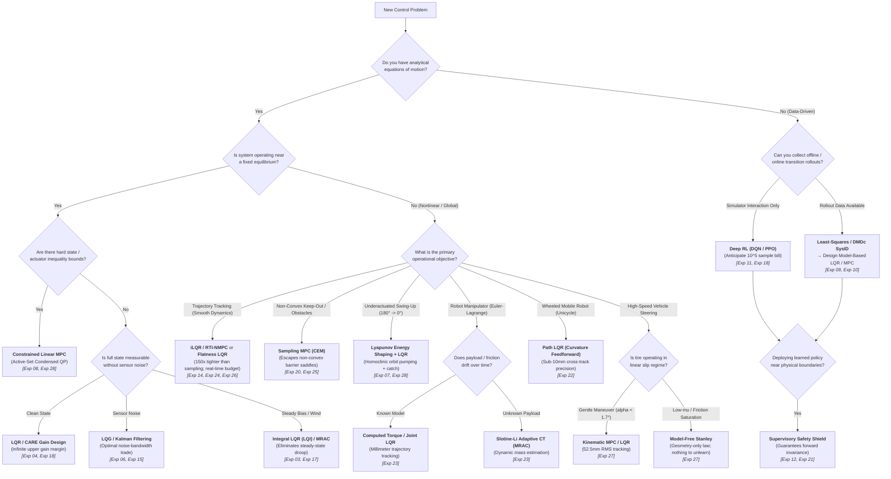

# Engineering Decision Guide — Algorithm Selection Architecture

> **The Central Thesis:** Classical and optimal control dominate whenever a usable physical model is available; machine learning and sampling earn their keep only where models are unavailable, non-smooth, or unmodeled—and even then, classical feedback or supervisory shields are what make deployment certified and safe.

This document synthesizes the empirical verdicts of all **28 experiments** across the `aimct` framework into an actionable, structured decision system.

---

## 1. Executive Decision Flowchart

Follow this branching logic to determine the appropriate control methodology for your operational requirements:

---

## 2. Master Decision Matrix by Problem Class

The table below catalogs the concrete recommendations, alternatives, failure modes, and proving experiments for every operational regime in the 28-experiment benchmark suite:

| Operational Situation | Recommended Method | Fallback / Alternative | Known Failure Mode & Boundary | Proving Experiment |
| :--- | :--- | :--- | :--- | :--- |
| **SISO Regulation under Saturation** | **PID with Anti-Windup Clamping** | Static PD / Feedforward | Unclamped integrator winds up, inflating overshoot to $53\%$ and destabilizing unstable poles | [Exp 03](../experiments/03_pid_stabilizes_unstable/) |
| **Linear State-Space Stabilization** | **LQR (Algebraic CARE)** | Ackermann Pole Placement | Single-loop PID allows unobserved internal cart drift ($0.82\,\text{m}$ off-rail); manual pole placement requires trial-and-error | [Exp 04](../experiments/04_lqr_vs_pole_placement_cartpole/), [Exp 18](../experiments/18_rl_zoo_vs_lqr/) |
| **Local Linearization Envelope** | **LQR within Tangent Cone** | Nonlinear Gain Scheduling / NMPC | Linear state-space diverges when initial perturbation exceeds $|\theta_0| > 23^\circ$ ($0.4\,\text{rad}$) | [Exp 02](../experiments/02_linearization_validity/), [Exp 05](../experiments/05_cartpole_basin_of_attraction/) |
| **Noisy Sensor Measurements** | **LQG (Kalman Filter + LQR)** | Luenberger Observer | Fast observer poles amplify high-frequency encoder noise into destructive actuator thrashing ($16.2\,\text{N}^2\text{s}$) | [Exp 06](../experiments/06_lqg_vs_lqr_measurement_noise/), [Exp 15](../experiments/15_quadrotor_ekf_output_feedback/) |
| **Unmeasured State Estimation** | **Extended Kalman Filter (EKF)** | Finite Differencing | Naive finite differencing of position measurements injects differentiation noise, inflating control energy $150\times$ | [Exp 15](../experiments/15_quadrotor_ekf_output_feedback/) |
| **High Nonlinearity / Broad Priors** | **Unscented Kalman Filter (UKF)** | Extended Kalman Filter (EKF) | EKF tangent linearization gets trapped in false $2\pi$-shifted basin ($6.28\,\text{rad}$ error); UKF sigma points escape ($0.07\,\text{rad}$) | [Exp 16](../experiments/16_ekf_vs_ukf/) |
| **Hard State / Track Constraints** | **Linear MPC (Condensed QP)** | Soft Barrier Penalty LQR | Unconstrained LQR violates physical rail boundary by $+23\%$; MPC enforces $|x| \le 0.5\,\text{m}$ by previewing constraints | [Exp 08](../experiments/08_mpc_vs_lqr_constrained_cartpole/) |
| **Actuator Torque Saturation** | **Constrained Linear MPC** | Upright LQR | LQR saturates peak torque at $0.15\,\text{N}\cdot\text{m}$; Linear MPC proactively caps torque at $0.1343\,\text{N}\cdot\text{m}$ with zero clipping | [Exp 28](../experiments/28_furuta_pendulum_control/) |
| **Underactuated Global Swing-Up** | **Lyapunov Energy Shaping + LQR** | Hybrid Reinforcement Learning | Linear controllers cannot stabilize hanging equilibrium ($\pm 180^\circ$); Tabular Q-learning chatters ($1.48\,\text{rad}$ limit cycle) | [Exp 07](../experiments/07_cartpole_swingup_hybrid/), [Exp 11](../experiments/11_qlearning_vs_classical/), [Exp 28](../experiments/28_furuta_pendulum_control/) |
| **Smooth Trajectory Tracking** | **iLQR / RTI-NMPC** or **Flatness LQR** | Preview MPC | Stochastic sampling (CEM) takes $28\text{--}31\,\text{ms}$ (violating real-time budget) and tracks loosely ($202\,\text{mm}$ vs $1.34\,\text{mm}$) | [Exp 14](../experiments/14_quadrotor_figure8_tracking/), [Exp 24](../experiments/24_ilqr_vs_sampling_mpc/), [Exp 26](../experiments/26_harder_reference_paths/) |
| **Non-Convex Dynamic Obstacles** | **Sampling MPC (CEM)** | Gradient iLQR / RTI-NMPC | Quartic barrier Hessians lose convexity near obstacle centers; single-step gradient iLQR stalls on saddle points ($69$ hits vs CEM $36$ hits) | [Exp 20](../experiments/20_quadrotor_obstacle_nmpc/), [Exp 25](../experiments/25_diffdrive_moving_obstacle/) |
| **Robot Manipulator Tracking** | **Computed Torque / Joint LQR** | Joint PID + Gravity Comp | Decentralized PD exhibits significant joint lag ($32.2\,\text{mm}$ error); computed torque delivers millimeter precision ($4.3\,\text{mm}$) | [Exp 23](../experiments/23_twolink_arm_tracking/) |
| **Manipulator Payload Adaptation** | **Slotine--Li Adaptive CT (MRAC)** | Nominal Computed Torque | Nominal computed torque collapses under unknown $0.5\,\text{kg}$ load step ($394\,\text{mm}$ error, $36.9\%$ completion); Slotine--Li restores $4.9\,\text{mm}$ ($100\%$) | [Exp 23](../experiments/23_twolink_arm_tracking/) |
| **Wheeled Mobile Robot Tracking** | **Path LQR (Curvature Feedforward)** | Pure Pursuit / Stanley | Pure Pursuit geometrically cuts corners on curves ($35\,\text{mm}$ offset); Path LQR curvature feedforward achieves $9.25\,\text{mm}$ cross-track error | [Exp 22](../experiments/22_diffdrive_path_following/) |
| **Vehicle Steering (Linear Tire)** | **Kinematic MPC / LQR** | Model-Free Stanley | Model-free Stanley is $4\text{--}7\times$ looser ($371\,\text{mm}$ vs $52.5\,\text{mm}$) when tire slip is small ($\alpha < 1.7^\circ$) | [Exp 27](../experiments/27_bicycle_double_lane_change/) |
| **Vehicle Steering (Low-$\mu$ Pacejka)** | **Model-Free Stanley** | Robust / Tire-Aware NMPC | Kinematic MPC collapses ($1326\,\text{mm}$) due to false zero-slip assumption; Behavior-Cloned RL completely drives off the road ($5223\,\text{mm}$ RMS) | [Exp 27](../experiments/27_bicycle_double_lane_change/) |
| **Plant Parameter Drift (Stiffness)** | **Lyapunov MRAC** | Fixed / Gain-Scheduled LQR | Fixed LQR droops to $0.42\,\text{m}$ error under $5\times$ stiffness change; MRAC holds $< 1\,\text{mm}$ tracking error | [Exp 17](../experiments/17_adaptive_vs_fixed_changing_plant/) |
| **Data-Driven Model Identification** | **Least-Squares / DMDc SysID** | Black-Box Neural Network | Closed-loop SysID on short data ($1\,\text{s}$) causes fatal drift; $24\,\text{s}$ data gives robust LQR stability despite $20\%$ residual | [Exp 09](../experiments/09_control_on_identified_model/) |
| **Learned Residual Dynamics** | **Grey-Box MLP + Sampling MPC** | Pure Black-Box Network | Pure black-box models require massive datasets and fail to generalize; grey-box residual over physics matches true model within $3\%$ | [Exp 10](../experiments/10_planning_learned_vs_true_model/), [Exp 20](../experiments/20_quadrotor_obstacle_nmpc/) |
| **Black-Box Continuous Control** | **From-Scratch PPO Actor-Critic** | Tabular Q / DQN | From-scratch continuous PPO matches LQR return $-0.3$ on CartPole, but requires $240,000$ samples vs $0$ for analytical LQR | [Exp 18](../experiments/18_rl_zoo_vs_lqr/) |
| **Deploying Uncertified Policies** | **Supervisory Safety Shield** | Raw Policy Execution | Unshielded RL policy enters limit cycles or breaches safety keep-out; safety shield guarantees zero violations with $35\%$ less energy | [Exp 12](../experiments/12_shielded_qlearning/), [21](../experiments/21_grand_capstone_bakeoff/) |

---

## 3. Detailed Method-by-Method Evidence & Failure Envelopes

### 3.1 Proportional-Integral-Derivative (PID)
- **Strengths:** SISO loops where steady-state error rejection to step commands or constant loads is the primary requirement.
- **Critical Failure Mode:** Single-loop PID cannot coordinate multi-state, single-actuator plants (e.g., Cart-Pole angle PID balances pole but drifts cart $0.82\,\text{m}$ off-rail, [Exp 04](../experiments/04_lqr_vs_pole_placement_cartpole/)).
- **Mandatory Requirement:** Anti-windup clamping is non-negotiable under actuator saturation; unclamped integration inflates overshoot ($53.1\% \to 39.4\%$) and induces windup instability ([Exp 03](../experiments/03_pid_stabilizes_unstable/)).

### 3.2 Linear Quadratic Regulator (LQR) & Pole Placement
- **Strengths:** The analytical baseline for linear(ized) systems. Solves the Algebraic Riccati Equation (CARE) directly, providing guaranteed infinite upper gain margin, $[-6\,\text{dB}, +\infty\,\text{dB}]$ lower gain margin, and $\ge 60^\circ$ phase margin ([Exp 04](../experiments/04_lqr_vs_pole_placement_cartpole/), [Exp 18](../experiments/18_rl_zoo_vs_lqr/)).
- **Critical Failure Mode:** No native constraint awareness (violates track limit by $+23\%$, [Exp 08](../experiments/08_mpc_vs_lqr_constrained_cartpole/)); validity envelope is strictly local ($|\theta| \le 23^\circ$, [Exp 02](../experiments/02_linearization_validity/)); requires Bryson-rule normalization on ill-conditioned systems ([Exp 14](../experiments/14_quadrotor_figure8_tracking/)).

### 3.3 Constrained Linear Model Predictive Control (Linear MPC)
- **Strengths:** Explicit multi-variable inequality constraint handling ($u_{\min} \le u \le u_{\max}$, $x_{\min} \le x \le x_{\max}$) via active-set condensed QP. Reference preview eliminates trajectory corner-cutting ([Exp 08](../experiments/08_mpc_vs_lqr_constrained_cartpole/), [Exp 14](../experiments/14_quadrotor_figure8_tracking/), [Exp 28](../experiments/28_furuta_pendulum_control/)).
- **Critical Failure Mode:** Computational latency ($\sim 12\text{--}40\,\text{ms}$ on CPU). Tiled single setpoints exhibit corner-cutting without explicit trajectory preview.

### 3.4 Gradient iLQR / Real-Time Iteration NMPC vs. Stochastic Sampling MPC (CEM)
- **iLQR / RTI-NMPC Dominance on Smooth Costs:** Gradient backward Riccati sweeps outperform stochastic sampling by $32\times\text{--}840\times$ in tracking precision across Lemniscate ($1.34\,\text{mm}$ vs $202.2\,\text{mm}$), Lissajous 3:2 ($5.41\,\text{mm}$ vs $172.8\,\text{mm}$), and Archimedean Spiral ($0.18\,\text{mm}$ vs $147.6\,\text{mm}$) at $4\text{--}14\times$ less energy ([Exp 24](../experiments/24_ilqr_vs_sampling_mpc/), [Exp 26](../experiments/26_harder_reference_paths/)).
- **Real-Time Compliance:** iLQR solves deterministically in $14\text{--}16.5\,\text{ms}$, complying with $20\,\text{ms}$ flight budgets; CEM requires $28\text{--}31\,\text{ms}$, violating deadlines.
- **When Sampling MPC (CEM) Is Mandatory:** On non-convex keep-out fields and dynamic obstacles, quartic barrier Hessians lose convexity; 1-step RTI gradient sweeps stall on saddle points ($69$ collision steps), whereas derivative-free CEM discovers the topological avoidance homotopy ($36$ collision steps) ([Exp 20](../experiments/20_quadrotor_obstacle_nmpc/), [Exp 25](../experiments/25_diffdrive_moving_obstacle/)).

### 3.5 State Estimation (Kalman, EKF, UKF)
- **Kalman Filtering:** Mandatory in the presence of sensor noise. Naive finite differencing explodes control energy $150\times$; LQG delivers smooth, optimal actuation with $7\times$ lower energy than fast Luenberger observers ([Exp 06](../experiments/06_lqg_vs_lqr_measurement_noise/), [Exp 15](../experiments/15_quadrotor_ekf_output_feedback/)).
- **UKF vs. EKF:** Tangent linearization (EKF) gets trapped in false $2\pi$-shifted basins ($6.28\,\text{rad}$ error) under broad priors; UKF $2n+1$ sigma points accurately propagate nonlinear covariance, converging to $0.07\,\text{rad}$ ([Exp 16](../experiments/16_ekf_vs_ukf/)). Near tight operating points, EKF matches UKF at $1/5$ the compute.

### 3.6 Adaptive Control & Computed Torque (MRAC / Slotine--Li)
- **Model Reference Adaptive Control (MRAC):** Dynamically cancels plant parameter drift ($5\times$ spring change) to maintain sub-millimeter tracking where fixed LQR droops to $0.42\,\text{m}$ ([Exp 17](../experiments/17_adaptive_vs_fixed_changing_plant/)).
- **Slotine--Li Adaptive Computed Torque:** Nominal feedback linearization collapses under unmodeled payload steps ($394\,\text{mm}$ error, $36.9\%$ completion); Slotine--Li regressor adaptation dynamically identifies unknown wrist mass, restoring $4.93\,\text{mm}$ precision and $100\%$ completion ([Exp 23](../experiments/23_twolink_arm_tracking/)).

### 3.7 Vehicle Lateral Guidance & Tire Friction Dynamics
- **Linear Regime ($\alpha < 1.7^\circ$):** Kinematic MPC wins with $52.5\,\text{mm}$ RMS tracking; model-free Stanley is $7\times$ looser ($371.4\,\text{mm}$) ([Exp 27](../experiments/27_bicycle_double_lane_change/)).
- **Friction Saturation (Pacejka $\mu=0.6$):** Complete ranking inversion. Model-free Stanley wins ($733.7\,\text{mm}$) because it makes no false tire assumptions. Kinematic MPC collapses ($1326\,\text{mm}$) because assuming infinite lateral grip causes severe overshoot ([Exp 27](../experiments/27_bicycle_double_lane_change/)).
- **Behavior-Cloned RL Brittleness:** A policy trained via behavioral cloning matches LQR in nominal conditions ($84.3\,\text{mm}$) but fails catastrophically out-of-distribution ($5223\,\text{mm}$ RMS, $11.4\,\text{m}$ peak error off-road). Cloning an input-output map destroys the self-correcting feedback mechanism of the true expert ([Exp 27](../experiments/27_bicycle_double_lane_change/)).

---

## 4. The 8 Invariant Engineering Laws Across 28 Experiments

1. **Feedforward Does the Heavy Lifting:** Model-based feedforward (differential flatness, steady-state inversion, curvature feedforward, reference preview) generates the nominal trajectory directly, leaving feedback to correct only residual errors and unexpected disturbances ([Exp 03], [Exp 14], [Exp 17], [Exp 22]).
2. **Integral Action is Mandatory for Persistent Loads:** No amount of proportional gain tuning eliminates steady-state droop under persistent external loads (wind, gravity bias); explicit integrator augmentation or parameter adaptation is required ([Exp 03], [Exp 17], [Exp 23]).
3. **Bryson Normalization is Load-Bearing:** On ill-conditioned or multi-timescale physical systems (e.g., quadrotor attitude vs. position), naive identity weights ($Q=I, R=I$) produce nonsensical high-frequency gains. Normalizing by maximum allowable states and controls ($Q_{ii} = 1/x_{i,\max}^2, R_{jj} = 1/u_{j,\max}^2$) is essential ([Exp 14], [Exp 18], [Exp 19]).
4. **Model Error is Survivable within Robustness Margins:** Full-state LQR provides infinite upper gain margin and $[-6\,\text{dB}, +\infty\,\text{dB}]$ lower gain margin, tolerating up to $50\%$ parameter identification error without loss of asymptotic stability ([Exp 09]).
5. **Convexity Dictates Planner Selection (The Duality of Gradient vs. Sampling MPC):** On smooth dynamical models and quadratic tracking costs, gradient-based iLQR / RTI-NMPC dominates stochastic sampling by $32\times\text{--}840\times$ at lower compute across arbitrary geometries ([Exp 24], [Exp 26]). Conversely, on non-convex geometric keep-out fields and dynamic obstacles, derivative-free sampling (CEM) is mandatory to discover obstacle-clearing paths where single-iteration gradient Riccati sweeps stall on non-convex barrier Hessians ([Exp 20], [Exp 25]).
6. **Imitation Learning Loses the Self-Correcting Feedback Structure (Sim-to-Real Brittleness):** Behavior-cloning an expert controller memorizes the nominal state-action distribution. When deployed out-of-distribution (e.g., unannounced low-$\mu$ surface or tire saturation), the model-based expert degrades gracefully via live closed-loop error feedback, while the frozen neural policy diverges catastrophically off the road ([Exp 27]).
7. **Underactuated Energy Pumping Unlocks Global Basins:** For underactuated pendulums (Cart-Pole, Furuta RIP), linear controllers cannot stabilize inverted hanging states ($\pm 180^\circ$); Lyapunov energy shaping drives mechanical energy monotonically to the homoclinic orbit, enabling reliable handoff to LQR / MPC ([Exp 07], [Exp 28]).
8. **Reporting Failure Modes is as Essential as Reporting Wins:** Engineering judgment relies on knowing exact breaking points: linearisation breakdown past $23^\circ$ ([Exp 02]), EKF false basin trapping ([Exp 16]), closed-loop SysID correlation bias ([Exp 09]), nominal computed torque collapse under payload step ([Exp 23]), pure RL bootstrap failure on low-inertia plants ([Exp 21]), and Kinematic MPC overshoot under Pacejka tire saturation ([Exp 27]).
