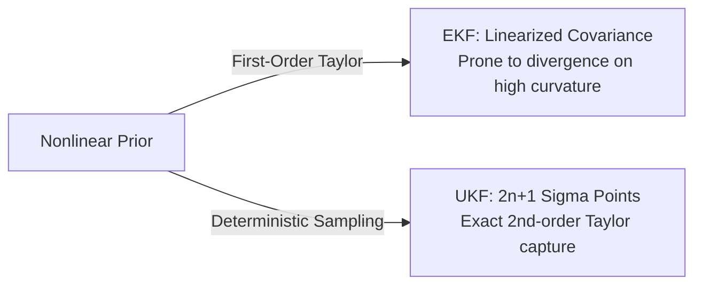

# State Estimation, Observers & Moving-Horizon Filters

In real-world control systems, the full internal state vector $x(t) \in \mathbb{R}^n$ is rarely directly accessible. Sensors provide noisy, partial, and indirect measurements $y(t) \in \mathbb{R}^p$ (often $p \ll n$). State estimation is the discipline of reconstructing optimal estimates $\hat{x}(t)$ in real time.

---

## 1. Linear Observers: Luenberger & The Kalman Filter

For linear time-invariant systems with Gaussian white process noise $w_k \sim \mathcal{N}(0, Q)$ and measurement noise $v_k \sim \mathcal{N}(0, R)$:

$$x_{k+1} = A x_k + B u_k + w_k, \qquad y_k = C x_k + v_k$$

### Luenberger Observer
Deterministic pole placement selects observer gain $L$ such that the error dynamics $e_{k+1} = (A - LC)e_k$ decay at desired eigenvalues. However, aggressively fast observer poles amplify high-frequency measurement noise.

### Discrete Kalman Filter (KF)
The Kalman Filter finds the mathematically optimal, minimum-variance gain $L_k = K_k$ by propagating the state covariance $P_k$:

$$\begin{aligned}
\text{Time Update (Predict):} \quad &\hat{x}_{k|k-1} = A \hat{x}_{k-1|k-1} + B u_{k-1} \\
&P_{k|k-1} = A P_{k-1|k-1} A^T + Q \\
\text{Measurement Update (Correct):} \quad &K_k = P_{k|k-1} C^T (C P_{k|k-1} C^T + R)^{-1} \\
&\hat{x}_{k|k} = \hat{x}_{k|k-1} + K_k (y_k - C \hat{x}_{k|k-1}) \\
&P_{k|k} = (I - K_k C) P_{k|k-1}
\end{aligned}$$

As proven in [Experiment 06](../experiments/06_lqg_vs_lqr_measurement_noise.md), coupling a Kalman Filter with LQR yields the Linear Quadratic Gaussian (LQG) controller. By the **Certainty Equivalence Principle**, the optimal LQG gain is identical to the full-state LQR gain acting on $\hat{x}_{k|k}$.

---

## 2. Nonlinear Estimation: EKF vs. UKF

When system dynamics $f(x, u)$ or sensor models $h(x)$ are nonlinear, linear Kalman filtering fails.



### Extended Kalman Filter (EKF)
The EKF linearizes $f$ and $h$ around current estimates:
$$F_k = \left.\frac{\partial f}{\partial x}\right|_{\hat{x}_{k-1|k-1}}, \qquad H_k = \left.\frac{\partial h}{\partial x}\right|_{\hat{x}_{k|k-1}}$$
While computationally lightweight ($\mathcal{O}(n^3)$), EKF linearizations discard higher-order Taylor terms, leading to estimation bias or divergence under high-angular-rate maneuvers ([Exp 15](../experiments/15_quadrotor_ekf_output_feedback.md)).

### Unscented Kalman Filter (UKF)
The UKF uses the **Unscented Transform**: it propagates a deterministic set of $2n+1$ sigma points through the exact nonlinear equations:
$$\chi_0 = \hat{x}, \quad \chi_i = \hat{x} \pm \left(\sqrt{(n + \lambda)P}\right)_i$$
As evaluated in [Experiment 16](../experiments/16_ekf_vs_ukf.md), UKF captures posterior mean and covariance accurately up to the 3rd order (Taylor series) without analytical Jacobians, eliminating coordinate singularity divergence in 6-DOF quadrotor attitude estimation.

---

## 3. Non-Gaussian Estimation: The Particle Filter (SMC)

For highly non-Gaussian, multi-modal, or bearings-only tracking problems (where angle measurements yield an arc-shaped posterior distribution), even Gaussian approximations break down. Sequential Monte Carlo (Particle Filtering) represents the posterior as an empirical cloud of $N_p$ weighted samples:

$$p(x_k | y_{1:k}) \approx \sum_{i=1}^{N_p} w_k^{(i)} \delta(x_k - x_k^{(i)})$$

With **Systematic Resampling** to eliminate weight degeneracy, the Particle Filter tracks multi-modal hypotheses seamlessly ([Exp 41](../experiments/41_particle_filter_bearings_only.md)).

---

## 4. Constrained Estimation: Moving-Horizon Estimation (MHE)

Neither KF, EKF, UKF, nor standard Particle Filters can enforce hard physical inequality constraints on states (such as non-negative chemical concentrations $c(t) \ge 0$, bounded physical temperatures, or actuator limits).

**Moving-Horizon Estimation (MHE)** frames state estimation over a sliding window of length $N$ as a constrained optimization problem:

$$\min_{x_{k-N}, \{w_t\}_{t=k-N}^{k-1}} \|x_{k-N} - \bar{x}_{k-N}\|_{P_{k-N}^{-1}}^2 + \sum_{t=k-N}^{k-1} \|w_t\|_{Q^{-1}}^2 + \sum_{t=k-N}^k \|y_t - h(x_t)\|_{R^{-1}}^2$$

$$\text{subject to: } x_{t+1} = f(x_t, u_t) + w_t, \qquad x_{min} \le x_t \le x_{max}, \quad w_t \in \mathcal{W}$$

Where the **arrival cost** $\|x_{k-N} - \bar{x}_{k-N}\|_{P_{k-N}^{-1}}^2$ summarizes prior measurements outside the horizon.

```python
from aimct.estimation import MovingHorizonEstimator

mhe = MovingHorizonEstimator(
    dynamics=sys.step,
    measurement_fn=sys.measure,
    horizon=10,
    state_bounds=(x_min, x_max)
)
x_hat = mhe.update(y_k, u_k)
```

In [Experiment 38](../experiments/38_mhe_vs_ekf.md), MHE is benchmarked against EKF on constrained multi-phase reactors and saturated mechanical systems, demonstrating zero constraint violations and superior disturbance recovery.
