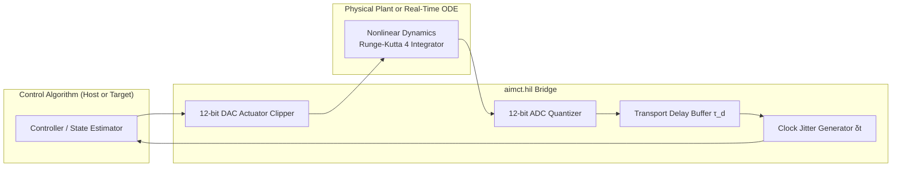

# Real-Time Hardware Bridge & Embedded Deployment

A control algorithm verified in continuous-time Python simulation faces harsh realities when deployed to physical microcontrollers (e.g., STM32, ESP32, Raspberry Pi Pico) and real-time operating systems (RTOS):
- Discrete sampling intervals $\Delta t$ and clock jitter
- Actuator and sensor signal quantization ($12$-bit ADC/DAC)
- Sensor transport latency and computational delay
- Finite CPU word lengths and floating-point roundoff
- Zero-allocation memory constraints

---

## 1. Discretization, Sampling & Transport Latency

Continuous controllers $K(s)$ must be transformed into discrete-time difference equations $K(z)$.

### Tustin (Bilinear) Transformation with Prewarping
$$s \leftarrow \frac{2}{\Delta t} \frac{z - 1}{z + 1}$$
To match resonant critical frequencies $\omega_0$:
$$s \leftarrow \frac{\omega_0}{\tan(\omega_0 \Delta t / 2)} \frac{z - 1}{z + 1}$$

### Computational & Transport Latency
Sensor acquisition, SPI/I2C communication, and solver execution introduce input-output latency $\tau_d$. In the frequency domain, latency adds a linear phase lag:
$$\Delta \phi(\omega) = -\omega \tau_d \quad (\text{rad})$$
A delay of just $\tau_d = 10\,\text{ms}$ at $\omega = 50\,\text{rad/s}$ destroys $28.6^\circ$ of phase margin, transforming an otherwise stable feedback loop into an unstable limit cycle.

---

## 2. Hardware-in-the-Loop (HIL) Simulation Architecture

`aimct.hil` provides a deterministic bridge connecting software controller algorithms with real-time emulation environments.



### Quantization Modeling
Signals are discretized to discrete integer LSB levels:
$$y_{quant} = y_{min} + \Delta y \cdot \text{round}\left(\frac{y - y_{min}}{\Delta y}\right), \qquad \Delta y = \frac{y_{max} - y_{min}}{2^{N_{bits}} - 1}$$

In [Experiment 36](../experiments/36_hil_arm_balance.md), HIL balancing of a two-link robotic arm is benchmarked across varying transport latencies ($\tau \in [0, 20]\,\text{ms}$) and quantization resolutions ($8$-bit to $16$-bit).

---

## 3. Zero-Allocation C99 & MicroPython Code Generation

For deployment on resource-constrained microcontrollers without dynamic memory allocators (`malloc`/`free` forbidden in safety-critical MISRA C standards):

`aimct.deploy` generates standalone, zero-allocation C99 code for state estimators (KF, EKF) and controllers (LQR, PID, Linear MPC):

```c
/* Generated by aimct.deploy - Zero dynamic memory allocation */
#include "aimct_controller.h"

static float state[4] = {0.0f, 0.0f, 0.0f, 0.0f};
static const float K[4] = {-2.236f, -3.812f, 28.451f, 5.123f};

float aimct_step(const float y_meas[2], float dt) {
    /* 1. Update estimator */
    /* 2. Compute feedback: u = -K * x */
    float u = -(K[0]*state[0] + K[1]*state[1] + K[2]*state[2] + K[3]*state[3]);
    /* 3. Saturate actuation */
    if (u > 12.0f) u = 12.0f;
    if (u < -12.0f) u = -12.0f;
    return u;
}
```

### MicroPython Export
For high-level embedded prototyping on ESP32 or RP2040, `aimct.deploy.export_micropython` generates pure Python modules with pre-allocated `array('f')` buffers to avoid triggering garbage collection pauses during real-time control loops.
