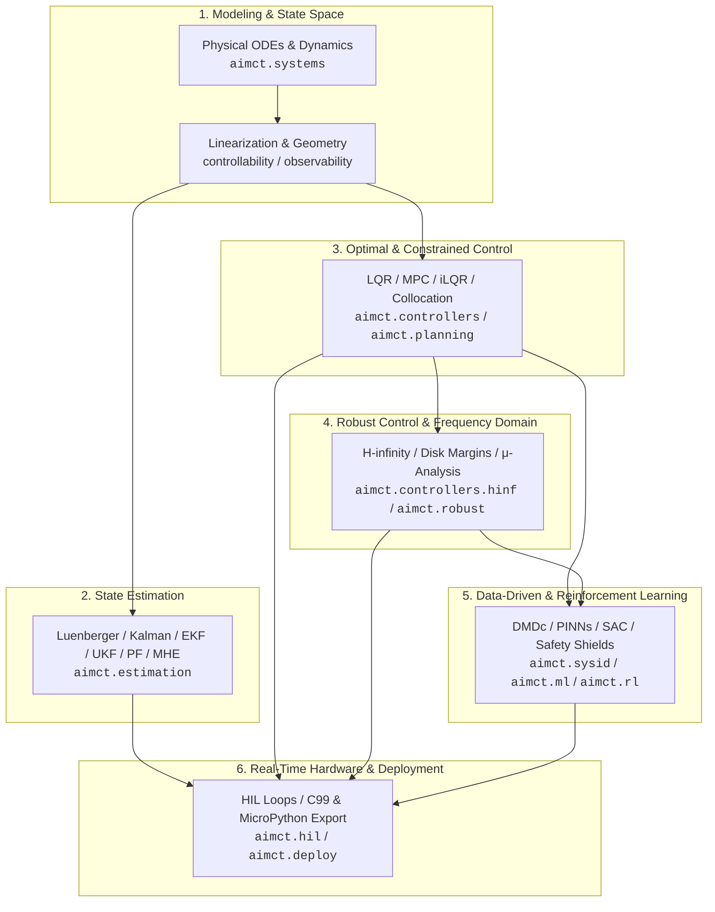

# Core Concepts in Modern Feedback & AI Control

`aimct` (*AI Meets Control Theory*) is structured around **six fundamental conceptual pillars**. Rather than treating classical control, optimal control, state estimation, robust control, machine learning, and physical hardware deployment as disconnected silos, `aimct` builds a unified, mathematically rigorous continuum.

---

## The Conceptual Pillars

| Pillar | Core Questions & Mathematical Focus | Primary Submodules | Key Experiments |
| :--- | :--- | :--- | :--- |
| **[1. State-Space Dynamics](state-space.md)** | Where is the linear tangent valid? When is a system controllable? Energy conservation vs numerical damping. | `aimct.systems` | [Exp 01](../experiments/01_rk4_vs_euler.md), [Exp 02](../experiments/02_jacobian_linearization.md), [Exp 04](../experiments/04_lqr_vs_pole_placement_cartpole.md), [Exp 05](../experiments/05_cartpole_basin_of_attraction.md) |
| **[2. State Estimation](estimation.md)** | How to reconstruct unmeasured states under non-Gaussian noise, nonlinear kinematics, and hard constraints? | `aimct.estimation` | [Exp 06](../experiments/06_lqg_vs_lqr_measurement_noise.md), [Exp 15](../experiments/15_quadrotor_ekf_output_feedback.md), [Exp 16](../experiments/16_ekf_vs_ukf.md), [Exp 38](../experiments/38_mhe_vs_ekf.md), [Exp 41](../experiments/41_particle_filter_bearings_only.md) |
| **[3. Optimal & Constrained Control](optimal-constrained.md)** | How to balance performance against actuation bounds, rate limits, and hard state safety boundaries? | `aimct.controllers`, `aimct.planning` | [Exp 04](../experiments/04_lqr_vs_pole_placement_cartpole.md), [Exp 08](../experiments/08_mpc_vs_lqr_constrained_cartpole.md), [Exp 24](../experiments/24_ilqr_vs_sampling_mpc.md), [Exp 32](../experiments/32_direct_collocation_vs_ilqr.md) |
| **[4. Robustness & Frequency Domain](robustness.md)** | How to guarantee closed-loop stability under unmodelled high-frequency resonances and parameter drift? | `aimct.controllers.hinf`, `aimct.robust` | [Exp 09](../experiments/09_control_on_identified_model.md), [Exp 17](../experiments/17_adaptive_vs_fixed_changing_plant.md), [Exp 34](../experiments/34_dob_wind_rejection.md), [Exp 35](../experiments/35_hinf_vs_lqg.md), [Exp 40](../experiments/40_mu_analysis_rs_rp.md) |
| **[5. Data-Driven & Reinforcement Learning](learning.md)** | When does deep RL out-perform classical control, and how to formally certify safety via control barrier certificates? | `aimct.sysid`, `aimct.ml`, `aimct.rl`, `aimct.hybrid` | [Exp 10](../experiments/10_planning_learned_vs_true_model.md), [Exp 11](../experiments/11_qlearning_vs_classical.md), [Exp 12](../experiments/12_shielded_qlearning.md), [Exp 31](../experiments/31_sac_vs_ppo_sample_efficiency.md) |
| **[6. Hardware Bridge & Embedded Deployment](hardware-bridge.md)** | How do continuous control algorithms survive discrete sampling, 12-bit DAC/ADC quantization, transport latency, and jitter? | `aimct.hil`, `aimct.sysid`, `aimct.deploy` | [Exp 23](../experiments/23_twolink_arm_tracking.md), [Exp 36](../experiments/36_hil_arm_balance.md) |

---

## Suggested Reading Paths

- **Control Theorist Path:** Start with [State-Space Dynamics](state-space.md) $\rightarrow$ [Optimal & Constrained Control](optimal-constrained.md) $\rightarrow$ [Robustness](robustness.md) $\rightarrow$ [Hardware Bridge](hardware-bridge.md).
- **Robotics & ML Practitioner Path:** Start with [Optimal & Constrained Control](optimal-constrained.md) $\rightarrow$ [State Estimation](estimation.md) $\rightarrow$ [Learning & Safe Hybrid Control](learning.md) $\rightarrow$ [Hardware Bridge](hardware-bridge.md).
- **Embedded & Mechatronics Path:** Start with [State-Space Dynamics](state-space.md) $\rightarrow$ [State Estimation](estimation.md) $\rightarrow$ [Hardware Bridge](hardware-bridge.md).
