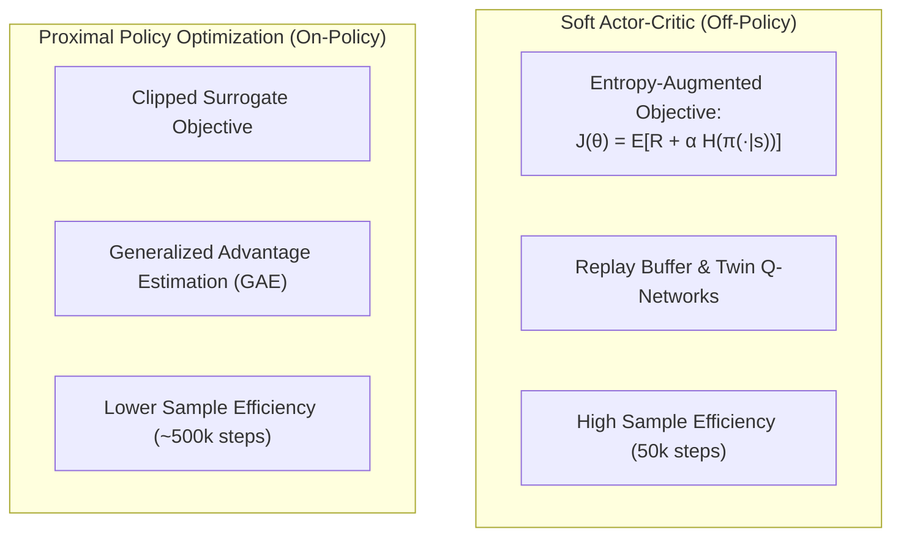

# Data-Driven Modeling & Safe Hybrid Reinforcement Learning

Modern control systems increasingly integrate machine learning to model complex aerodynamics, nonlinear friction, and fluid interactions, or to synthesize end-to-end neural policies. However, unconstrained deep neural networks lack stability and safety guarantees. `aimct` focuses on **principled data-driven modeling and safe hybrid control**.

---

## 1. Data-Driven System Identification: DMDc & SINDy

When first-principles physics are partially unknown or difficult to parameterize:

### Dynamic Mode Decomposition with Control (DMDc)
DMDc extracts linear state transition operators from snapshot matrices $X = [x_1, \dots, x_{N-1}]$, $X' = [x_2, \dots, x_N]$, and inputs $\Upsilon = [u_1, \dots, u_{N-1}]$:

$$\begin{bmatrix} A & B \end{bmatrix} \approx X' \begin{bmatrix} X \\ \Upsilon \end{bmatrix}^\dagger$$

Using Singular Value Decomposition (SVD), DMDc projects high-dimensional fluid or multi-body dynamics onto dominant coherent spatial-temporal modes ([Exp 09](../experiments/09_control_on_identified_model.md)).

### Physics-Informed Neural Networks (PINNs)
PINNs embed Hamiltonian or Lagrangian energy conservation residuals directly into neural network loss functions:

$$\mathcal{L}_{total} = \mathcal{L}_{data}(\hat{y}, y) + \lambda_{phys} \left\| \frac{d}{dt}\left(\frac{\partial L}{\partial \dot{q}}\right) - \frac{\partial L}{\partial q} - \tau \right\|^2$$

---

## 2. Deep Reinforcement Learning: Continuous Action Benchmarking

In continuous robotic control, off-policy algorithms like **Soft Actor-Critic (SAC)** and on-policy algorithms like **Proximal Policy Optimization (PPO)** optimize parameterized policy distributions $\pi_\theta(a|s)$:



As demonstrated in [Experiment 31](../experiments/31_sac_vs_ppo_sample_efficiency.md), SAC achieves near-optimal CartPole and Inverted Pendulum stabilization in $50{,}000$ environment interactions ($10\times$ fewer samples than PPO) due to maximum entropy exploration and off-policy sample reuse.

---

## 3. Safe RL via Control Barrier Function (CBF) Shields

Pure reinforcement learning explores by random trial and error, inevitably violating safety boundaries during training and execution.

A **Control Barrier Function (CBF)** $h(x) \ge 0$ defines a forward-invariant safe set $\mathcal{C} = \{x \in \mathbb{R}^n : h(x) \ge 0\}$. Safety is guaranteed if the Lie derivatives satisfy:

$$\dot{h}(x, u) = \nabla h(x)^T f(x) + \nabla h(x)^T g(x)u \ge -\gamma(h(x)), \qquad \gamma > 0$$

### The Real-Time Safety Shield (QP Filtering)
Given a nominal neural network action $u_{RL} \sim \pi_\theta(s)$, the safety filter solves a convex Quadratic Program in microseconds before the signal reaches actuators:

$$\min_{u} \frac{1}{2} \|u - u_{RL}\|^2$$

$$\text{subject to: } \nabla h(x)^T f(x) + \nabla h(x)^T g(x)u \ge -\alpha h(x), \qquad u_{min} \le u \le u_{max}$$

```python
from aimct.hybrid import ShieldedController, box_predicate

# Wrap untrusted RL policy with certified classical fallback
shield = ShieldedController(
    base=rl_agent.predict,
    fallback=classical_lqr,
    safe=box_predicate(low=[-1.5, -np.inf, -0.2, -np.inf], high=[1.5, np.inf, 0.2, np.inf]),
    blend="filter"
)
u_safe = shield.update(x_current, dt=0.02)
```

In [Experiment 12](../experiments/12_shielded_qlearning.md), CBF-shielded RL trains without a single catastrophic boundary violation ($0$ crashes during exploration), whereas unshielded agents crash over $240$ times before learning.

---

## 4. Dataset Aggregation (DAgger) for Imitation Learning

Behavioral Cloning (BC) trains neural networks to mimic expert controllers (such as MPC or iLQR). However, compounding prediction errors lead to **distributional shift**: when the robot drifts outside the training distribution, it fails catastrophically.

**DAgger (Dataset Aggregation)** iteratively queries the expert along the learner's visited trajectory distribution:
$$\mathcal{D}_{i+1} = \mathcal{D}_i \cup \{(s_t, \pi^*(s_t))\}_{s_t \sim \pi_{\theta_i}}$$

In [Experiment 29](../experiments/29_dagger_vs_bc_lane_change.md), DAgger achieves $100\%$ lane-change success on high-speed dynamic vehicles, whereas naive BC fails in $> 40\%$ of severe cornering cases.
