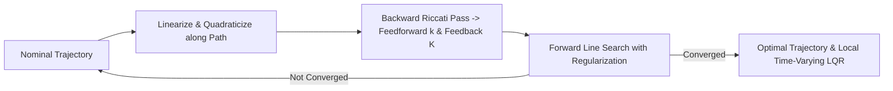

# Optimal & Constrained Control: LQR, MPC, iLQR & Collocation

Optimal control computes input trajectories $u(t)$ that minimize a cumulative cost functional while satisfying system dynamics, actuation limits, and state safety constraints.

---

## 1. Linear Quadratic Regulator (LQR)

For linear systems $\dot{x} = Ax + Bu$ with infinite-horizon quadratic cost:

$$J = \int_0^\infty \left( x(t)^T Q x(t) + u(t)^T R u(t) \right) dt, \qquad Q \succeq 0, \quad R \succ 0$$

The optimal state feedback law is linear:

$$u^*(t) = -K x(t), \qquad K = R^{-1} B^T P$$

where $P \succ 0$ is the unique positive-definite solution to the **Continuous-Time Algebraic Riccati Equation (CARE)**:

$$A^T P + P A - P B R^{-1} B^T P + Q = 0$$

### Guaranteed Robustness Margins of LQR
Classical single-input LQR controllers possess exceptional intrinsic robustness margins:
- **Gain Margin:** $[1/2, \infty)$ (up to $+6\,\text{dB}$ gain decrease and infinite gain increase)
- **Phase Margin:** $\ge 60^\circ$

However, as demonstrated in [Experiment 04](../experiments/04_lqr_vs_pole_placement_cartpole.md) and [Experiment 06](../experiments/06_lqg_vs_lqr_measurement_noise.md), replacing full state feedback with an observer (LQG) destroys these guaranteed margins, necessitating modern $H_\infty$ synthesis ([Exp 35](../experiments/35_hinf_vs_lqg.md)).

---

## 2. Linear Model Predictive Control (MPC)

When systems operate near physical limits (voltage clipping, torque limits, track boundaries), unconstrained LQR causes severe saturation, integrator windup, or safety violations.

**Linear MPC** solves a finite-horizon Quadratic Program (QP) at each sampling step $k$, applying only the first optimal input $u_k^*$ (Receding Horizon Principle):

$$\min_{u_0, \dots, u_{N-1}} x_N^T P x_N + \sum_{i=0}^{N-1} \left( x_i^T Q x_i + u_i^T R u_i + \Delta u_i^T R_{\Delta} \Delta u_i \right)$$

$$\begin{aligned}
\text{subject to: } &x_{i+1} = A x_i + B u_i, \\
&u_{min} \le u_i \le u_{max}, \\
&x_{min} \le x_i \le x_{max}, \\
&x_0 = x(k)
\end{aligned}$$

```python
from aimct.controllers import LinearMPC

mpc = LinearMPC(A, B, Q=Q, R=R, horizon=20, u_min=[-10.0], u_max=[10.0])
u_opt = mpc.compute_action(x_current)
```

In [Experiment 08](../experiments/08_mpc_vs_lqr_constrained_cartpole.md), linear MPC effortlessly handles cart position rails $x \in [-1.5, 1.5]\,\text{m}$ and force limits $|F| \le 12\,\text{N}$, while unconstrained LQR commands $45\,\text{N}$, violating rails and crashing the system.

---

## 3. Nonlinear Trajectory Optimization: iLQR & DDP

For nonlinear systems $\dot{x} = f(x, u)$, global quadratic programming is not directly applicable. **Iterative Linear Quadratic Regulator (iLQR)** (and Differential Dynamic Programming, DDP) iterates between:

1. **Forward Rollout:** Simulating nonlinear dynamics under current nominal policy $\bar{u}(t)$.
2. **Backward Riccati Pass:** Quadraticizing cost and linearizing dynamics along the nominal trajectory:
   $$A_k = \frac{\partial f}{\partial x}(\bar{x}_k, \bar{u}_k), \quad B_k = \frac{\partial f}{\partial u}(\bar{x}_k, \bar{u}_k)$$
   Computing feedforward terms $k_t$ and feedback matrices $K_t$:
   $$\delta u_t^* = k_t + K_t \delta x_t$$
3. **Forward Line Search:** Updating nominal trajectories with regularization $\mu I$ to guarantee cost decrease.



As demonstrated in [Experiment 24](../experiments/24_ilqr_vs_sampling_mpc.md) and [Experiment 26](../experiments/26_harder_reference_paths.md), iLQR converges in $5-15$ iterations with quadratic convergence rates, outperforming stochastic sampling MPC (MPPI) in precision by $> 100\times$.

---

## 4. Direct Transcription & Direct Collocation

While shooting methods (like iLQR) parameterize only control inputs $u(t)$ and integrate dynamics forward, **Direct Collocation** transcribes both states $x(t)$ and controls $u(t)$ into discrete decision variables across mesh nodes:

$$\min_{x_0, \dots, x_N, u_0, \dots, u_N} \Phi(x_N) + \sum_{k=0}^{N-1} L(x_k, u_k) \Delta t_k$$

$$\text{subject to: } x_{k+1} - x_k - \frac{\Delta t}{6}(f_k + 4 f_{k+1/2} + f_{k+1}) = 0 \quad \text{(Hermite-Simpson)}$$

$$c_{ineq}(x_k, u_k) \le 0$$

### Why Direct Collocation?
- **Unstable Open-Loop Systems:** Forward shooting suffers from exponential sensitivity to initial control errors. Collocation distributes error across all mesh nodes, avoiding numerical blowup.
- **Complex State Constraints:** Obstacle avoidance envelopes and state boundary conditions are enforced directly as algebraic constraints in large-scale sparse nonlinear programming (NLP) solvers (IPOPT, SNOPT).

In [Experiment 32](../experiments/32_direct_collocation_vs_ilqr.md), Direct Collocation solves complex underactuated acrobatics (double-pendulum swing-up with obstacle corridors) where single shooting fails.
