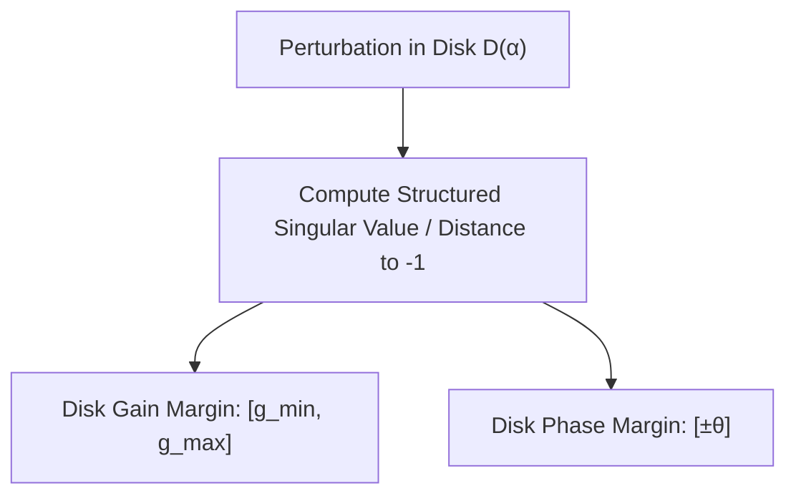

# Robust Control & Frequency Domain: Loop Shaping, Margins & $\mu$-Analysis

In physical engineering, no mathematical model is exact. Plants exhibit parameter variation (mass changes, payload fluctuations), unmodelled high-frequency structural resonances, actuator delay, and external spectral disturbances (gusts, turbulence, vibrations). Robust control guarantees stability and performance across an entire family of perturbed plants.

---

## 1. Classical Frequency-Domain Bounds & The Waterbed Effect

For a negative feedback loop with plant $P(s)$ and controller $K(s)$:
- **Open-loop transfer function:** $L(s) = P(s)K(s)$
- **Sensitivity function:** $S(s) = (I + L(s))^{-1}$ (governs disturbance rejection & tracking error)
- **Complementary sensitivity:** $T(s) = L(s)(I + L(s))^{-1} = I - S(s)$ (governs noise attenuation & robust stability)

### Bode's Sensitivity Integral (The "Waterbed Effect")
For open-loop stable systems with relative degree $\ge 2$:

$$\int_0^\infty \ln |S(j\omega)| \, d\omega = 0$$

If open-loop unstable poles $p_i$ exist in the right-half plane ($\text{Re}(p_i) > 0$):

$$\int_0^\infty \ln |S(j\omega)| \, d\omega = \pi \sum_{i=1}^{N_p} \text{Re}(p_i)$$

Pushing $|S(j\omega)| \ll 1$ down at low frequencies (for tight disturbance rejection) **forces** $|S(j\omega)| > 1$ (amplification peak $M_s$) at intermediate frequencies.

---

## 2. Disk Margins vs. Classical Gain/Phase Margins

Classical gain margin ($GM$) and phase margin ($PM$) test perturbations in gain and phase **independently**. In multi-loop or cross-coupled systems, simultaneous small variations in both gain and phase can destabilize a system with seemingly large classical margins.

**Disk Margin Analysis** models simultaneous gain variations $\delta_g \in [1-\alpha, 1+\alpha]$ and phase variations $\delta_\phi \in [-\theta, \theta]$ within a complex disk region $D(\alpha)$:



In `aimct.robust`, disk margins are computed systematically to certify stability under simultaneous gain/phase uncertainty.

---

## 3. $H_\infty$ Mixed-Sensitivity Loop Shaping

$H_\infty$ synthesis designs a controller $K(s)$ that minimizes the peak energy amplification ($\mathcal{L}_2 \to \mathcal{L}_2$ induced norm) of the closed-loop system:

$$\min_{K(s)} \left\| \begin{bmatrix} W_1(s) S(s) \\ W_2(s) K(s) S(s) \\ W_3(s) T(s) \end{bmatrix} \right\|_\infty < \gamma$$

where:
- $W_1(s)$ is a low-pass weighting filter enforcing tracking performance and disturbance attenuation ($|S(j\omega)| < 1/|W_1(j\omega)|$).
- $W_2(s)$ penalizes excessive high-frequency actuator effort, preventing control signal clipping.
- $W_3(s)$ is a high-pass weighting filter bounding multiplicative plant uncertainty $\Delta(s)$ ($|T(j\omega)| < 1/|W_3(j\omega)|$), ensuring robust stability against unmodelled structural flexibility.

```python
from aimct.controllers.hinf import mixsyn, weight_S, weight_T

# Synthesize H-infinity controller via S / KS / T loop shaping
K_ss, gamma = mixsyn(
    G=plant_ss,
    W_S=weight_S(wb=1.0, A=1e-3, M=2.0),
    W_T=weight_T(wb=10.0, A=1e-2, M=2.0)
)
```

In [Experiment 35](../experiments/35_hinf_vs_lqg.md), $H_\infty$ mixed-sensitivity loop shaping is compared against LQG on a flexible two-mass oscillator. While LQG destabilizes under a $+15\%$ resonance frequency shift, $H_\infty$ maintains guaranteed asymptotic stability and $< 1.2\,\text{dB}$ sensitivity peak.

---

## 4. Structured Singular Value ($\mu$-Analysis)

When uncertainty is structured (e.g., independent parametric bounds on mass $\delta_m$, damping $\delta_c$, and unmodelled actuator dynamics $\Delta_{unc}(s)$), standard $H_\infty$ small-gain bounds ($\bar{\sigma} < 1$) are overly conservative.

The **Structured Singular Value** $\mu_{\boldsymbol{\Delta}}(M)$ is defined as:

$$\mu_{\boldsymbol{\Delta}}(M) = \frac{1}{\min \{ \bar{\sigma}(\Delta) : \Delta \in \boldsymbol{\Delta}, \det(I - M\Delta) = 0 \}}$$

- **Robust Stability (RS):** $\mu_{\boldsymbol{\Delta}}(M_{11}(j\omega)) < 1, \quad \forall \omega$
- **Robust Performance (RP):** $\mu_{\boldsymbol{\Delta}_{aug}}(M(j\omega)) < 1, \quad \forall \omega$

In [Experiment 40](../experiments/40_mu_analysis_rs_rp.md), $\mu$-analysis is used to evaluate robust performance bounds under multi-parametric uncertainty grids.

---

## 5. Disturbance Observers (DOB)

A **Disturbance Observer (DOB)** estimates lumped external forces and model inaccuracies $\hat{d}(s)$ by comparing actual plant output with inverse nominal model output:

$$\hat{d}(s) = Q(s) \left( P_n^{-1}(s) y(s) - u(s) \right)$$

where $Q(s)$ is a low-pass filter making $Q(s) P_n^{-1}(s)$ proper. The estimated disturbance is injected back into the control signal ($u_{comp} = u_{nom} - \hat{d}$), rendering the physical plant behaving nominally like $P_n(s)$.

In [Experiment 34](../experiments/34_dob_wind_rejection.md), DOB augmentation reduces quadrotor trajectory tracking error under persistent $8\,\text{m/s}$ cross-wind gusts by $> 85\%$ without requiring recalibration of the baseline outer-loop controller.
