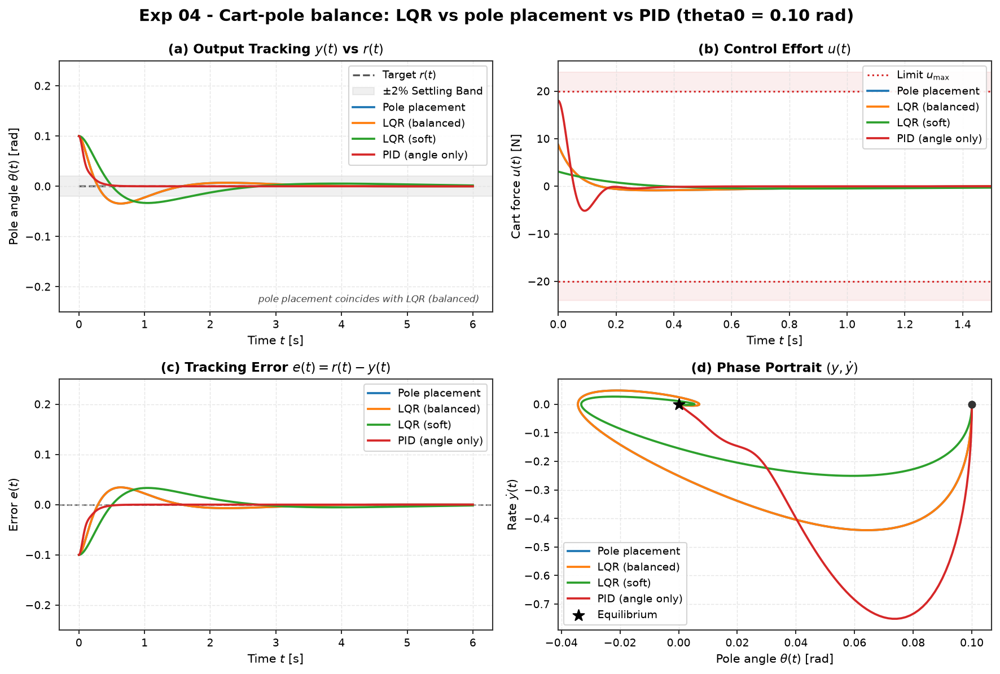

# Experiment 04 — Cart-pole: LQR vs pole placement vs PID

**Question.** On the *nonlinear* cart-pole, how do hand-placed pole feedback, LQR
(two weight choices), and a single-loop PID on the pole angle compare when
balancing from a tilted start — in settle time, cart excursion, control effort,
and whether the cart is kept on the rail?

Reference data: [`docs/references/cartpole-lqr-reference.md`](../references/cartpole-lqr-reference.md).
Theory: modules [04 and [05.

## Setup

- Plant: `aimct.systems.CartPole` (canonical params: `M=1, m=0.1, l=0.5, g=9.81`).
  Open-loop it has a double integrator on the cart and an unstable pole at
  `s ≈ +3.97` (the inverted pendulum).
- Start tilted: `x0 = [0, 0, 0.10, 0]` (θ₀ = 0.1 rad ≈ 5.7°), regulate θ → 0.
- Actuator saturation `|u| ≤ 20 N`. `dt = 2e-3`, `T = 6 s`, RK4.
- The linear controllers are designed on `CartPole.linearize()` (upright, u = 0)
  and run on the **true nonlinear** dynamics.
- Controllers:
  - **Pole placement** — Ackermann, poles set to LQR-set-1's closed-loop
    eigenvalues `{−15.62, −3.19, −1.31 ± 1.08j}`.
  - **LQR (balanced)** — `Q = diag(10, 1, 100, 10)`, `R = 0.1`.
  - **LQR (soft)** — `Q = diag(1, 0.1, 10, 1)`, `R = 1.0`.
  - **PID (angle only)** — one loop on θ, nothing controls the cart. Gains are
    negated (`kp = −180, kd = −22`) because the cart force enters `θ̈` with a
    negative sign (`B[3] < 0`).

Run: `python experiments/04_lqr_vs_pole_placement_cartpole/run.py`
Outputs (committed): `table.md`, `table.csv`, `metrics_full.csv`, `figure.png`.

## Results

| controller | settling θ [s] | RMSE θ | control energy | peak \|u\| [N] | peak \|cart x\| [m] |
| --- | --- | --- | --- | --- | --- |
| Pole placement  | 1.05 | 0.0171 | 2.34 | 8.71 | 0.162 |
| LQR (balanced)  | 1.05 | 0.0171 | 2.34 | 8.71 | 0.162 |
| LQR (soft)      | 1.70 | 0.0223 | 0.96 | 3.08 | 0.321 |
| PID (angle only)| 0.20 | 0.0110 | 8.76 | 18.0 | **0.823** |

Designed gains `K = [x, ẋ, θ, θ̇]`:

```
Pole placement : [-10.000, -12.870, -87.137, -23.223]
LQR (balanced) : [-10.000, -12.871, -87.138, -23.223]
LQR (soft)     : [ -1.000,  -2.047, -30.846,  -7.868]
```



## Takeaways

1. **Pole placement and LQR (balanced) produce the same controller.** Placing the
   closed-loop poles at the eigenvalues LQR chose reproduces the LQR gain to four
   significant figures. LQR is "pole placement where you specify a cost instead of
   guessing pole locations" — and on a 4-state system, guessing four good pole
   locations by hand is exactly the part LQR removes. Both match the golden gain
   `K₁` in the reference doc.
2. **Q/R is a dial between speed and effort.** Softening the weights (`LQR soft`)
   trades a 1.05 s → 1.7 s settle for **2.4× less control energy** and a peak
   force of 3 N instead of 9 N. Same method, same code, different point on the
   trade-off curve.
3. **A single PID balances the pole but loses the cart.** PID on θ alone drives
   the *angle* to zero fastest (0.2 s) — but it has no term for cart position, so
   the cart drifts to **0.82 m**, 5× the LQR excursion, and it needs the most
   force (18 N, near saturation). This is the concrete version of the module-03
   takeaway: single-loop PID cannot coordinate a multi-state, single-actuator
   system. Full-state feedback (LQR / pole placement) balances the pole *and*
   keeps the cart near the origin because it feeds back all four states.
4. **Linear design, nonlinear plant, θ₀ = 0.1 rad:** all four stay well inside the
   linear controllers' ~0.38 rad basin of attraction, so the linear laws work
   directly with no swing-up. Push θ₀ past that and the LQR laws fail — a good
   follow-up experiment.
