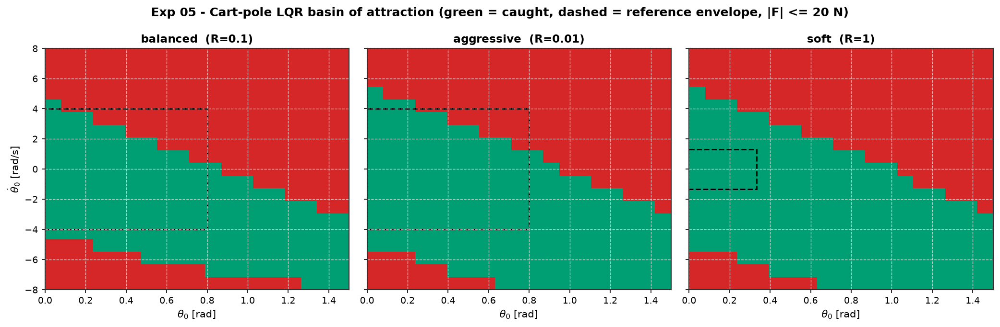
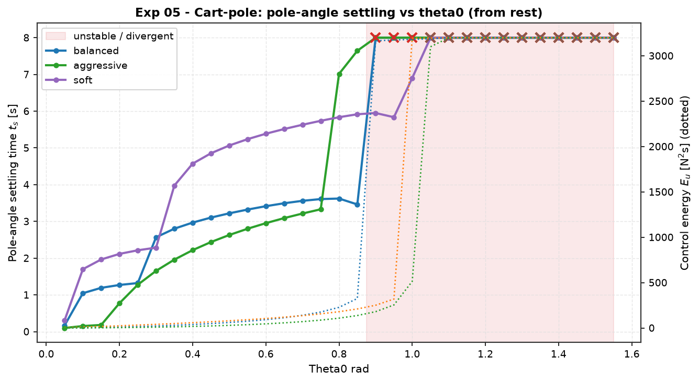
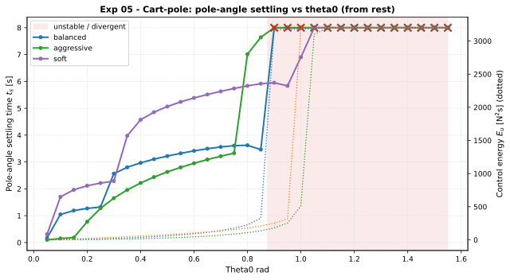

# Experiment 05 — Cart-pole basin of attraction for a linear LQR balance law

**Question.** A linear LQR controller `u = -K x`, with `K` designed on the
*upright linearisation*, is applied to the **true nonlinear** `CartPole` with no
swing-up assistance and the canonical ±20 N actuator. From how far off upright
can each of the three reference LQR tunings still catch the pole? How does the
measured recoverable set compare with the Lyapunov envelope in
[`docs/references/swingup-and-basin.md`](../references/swingup-and-basin.md) §3?

Companion theory: module 04 (state feedback / LQR), module 05 (optimal control).

## Setup

- Plant: `CartPole` (M=1.0, m=0.1, l=0.5, g=9.81). State `[x, ẋ, θ, θ̇]`, `θ = 0`
  upright. Open-loop pole at `s = +3.97` (RHP).
- Three tunings from
  [`cartpole-lqr-reference.md`](../references/cartpole-lqr-reference.md) §3;
  our from-scratch `solve_care` reproduces the reference gains to < 5e-5:

  | Tuning | `Q` | `R` | `K` (pole-angle gain in bold) |
  | :-- | :-- | :-: | :-- |
  | balanced | diag(10, 1, 100, 10) | 0.10 | [-10.0, -12.9, **-87.1**, -23.2] |
  | aggressive | diag(1, 0.1, 1000, 10) | 0.01 | [-10.0, -27.1, **-364.8**, -56.7] |
  | soft | diag(1, 0.1, 10, 1) | 1.0 | [-1.0, -2.0, **-30.8**, -7.9] |

- Actuator saturation `|F| ≤ 20 N` for every run.
- Two studies, both driven by `aimct.benchmarks` (`sweep` / `compare`):
  1. **θ₀ sweep from rest** (`θ̇₀ = 0`): recovery + pole-angle settling time vs θ₀.
  2. **θ₀ × θ̇₀ basin map** per tuning: shape of the recoverable set. *Caught* =
     the state stays finite **and** the mean `|θ|` over the last 10 % of the run
     is `< 0.10 rad`.

Run it (committed artifacts are the high-resolution `AIMCT_EXP_FULL=1` run):

```bash
AIMCT_EXP_FULL=1 python experiments/05_cartpole_basin_of_attraction/run.py
```

## Results

### Measured basin edges vs reference envelope

| Tuning | `R` | θ₀ edge (θ̇₀=0) | predicted | θ̇₀ edge (θ₀=0) | predicted |
| :-- | :-: | :-: | :-: | :-: | :-: |
| balanced | 0.1 | **0.83 rad (48°)** | 0.80 rad (46°) | **4.4 rad/s** | 4.0 rad/s |
| aggressive | 0.01 | 0.92 rad (53°) | 0.80 rad (46°) | 5.3 rad/s | 4.0 rad/s |
| soft | 1.0 | 1.00 rad (57°) | 0.33 rad (19°) | 5.3 rad/s | 1.3 rad/s |





(Full grid: `sweep.csv`, `sweep_summary.md`, `basin_edges.md`.)

## Takeaways

1. **The from-scratch LQR reproduces the reference balanced envelope.** Measured
   0.83 rad / 4.4 rad/s vs predicted 0.80 rad / 4.0 rad/s — within one grid cell.
   This is a cross-check of `solve_care` + the nonlinear `simulate` against an
   independent Lyapunov analysis.
2. **The Lyapunov envelope is an *inner* estimate — conservative, especially for
   `soft`.** The `soft` prediction (0.33 rad) is ~3× smaller than measured
   (1.00 rad). `x₀ᵀ P x₀ ≤ c*` is a guaranteed sub-level set, not the true basin;
   the gap is largest for the tuning whose `P` is least aligned with the
   nonlinear invariant set. *Flagged to famo for the reference doc.*
3. **From rest, all three tunings catch the pole to ~50–57°** with ±20 N, then
   enter a "Marginal" band (pole recovered, but the cart/angle has not settled
   to 2 % within the horizon) before finally being lost near the horizontal. The
   tunings barely differ in the from-rest angle limit.
4. **The tunings separate in the θ̇₀ direction and in transient cost.** Aggressive
   and soft tolerate a faster initial spin (≈5.3 vs 4.4 rad/s) because the larger
   pole-angle gain arrests `θ̇` sooner. Aggressive pays for it: peak force pegs
   the ±20 N limit across most of the grid (see `robustness_sweep.png`, right
   axis), while soft stays an order of magnitude lower in energy.
5. **Counter-intuitively, saturation *enlarges* the usable basin here.** An
   unsaturated linear law, extrapolated to 60°+, commands enormous force and the
   RK4 rollout blows up; clamping to ±20 N gives a gentler, recoverable
   trajectory. Basin-of-attraction claims for `u = -Kx` are meaningless without
   stating the actuator limit.

## Deviations / notes

- Horizon `T = 8 s` (1-D) / `6 s` (2-D), longer than the reference's 5 s, because
  the `soft` and `aggressive` outer closed-loop poles settle in 7–12 s. The
  *divergence* edge (what `max_recoverable` uses) is insensitive to `T`; the
  Stable/Marginal split is not.
- The `swingup-and-basin.md` §3.1 table and the `cartpole-lqr-reference.md` §4
  table give **different** envelopes for the same tunings (e.g. balanced 0.80 rad
  vs 0.38 rad). This experiment compares against §3.1. Both reference tables
  predate the code; reconciliation is tracked with lava/famo.


## Quantitative Benchmark Table

# Robustness sweep: theta0_rad

Controllers: balanced, aggressive, soft. 31 grid points [0.05 .. 1.55].

## Stability

| theta0_rad | balanced | aggressive | soft |
| :--- | :---: | :---: | :---: |
| 0.05 | Stable | Stable | Stable |
| 0.1 | Stable | Stable | Stable |
| 0.15 | Stable | Stable | Stable |
| 0.2 | Stable | Stable | Stable |
| 0.25 | Stable | Stable | Stable |
| 0.3 | Stable | Stable | Stable |
| 0.35 | Stable | Stable | Stable |
| 0.4 | Stable | Stable | Stable |
| 0.45 | Stable | Stable | Stable |
| 0.5 | Stable | Stable | Stable |
| 0.55 | Stable | Stable | Stable |
| 0.6 | Stable | Stable | Stable |
| 0.65 | Stable | Stable | Stable |
| 0.7 | Stable | Stable | Stable |
| 0.75 | Stable | Stable | Stable |
| 0.8 | Stable | Stable | Stable |
| 0.85 | Stable | Stable | Stable |
| 0.9 | Marginal | Marginal | Stable |
| 0.95 | Marginal | Marginal | Stable |
| 1 | Marginal | Marginal | Stable |
| 1.05 | Marginal | Marginal | Marginal |
| 1.1 | Marginal | Marginal | Marginal |
| 1.15 | Marginal | Marginal | Marginal |
| 1.2 | Marginal | Marginal | Marginal |
| 1.25 | Marginal | Marginal | Marginal |
| 1.3 | Marginal | Marginal | Marginal |
| 1.35 | Marginal | Marginal | Marginal |
| 1.4 | Marginal | Marginal | Marginal |
| 1.45 | Marginal | Marginal | Marginal |
| 1.5 | Marginal | Marginal | Marginal |
| 1.55 | Marginal | Marginal | Marginal |

## Settling time

| theta0_rad | balanced | aggressive | soft |
| :--- | :---: | :---: | :---: |
| 0.05 | 0.17 | 0.1 | 0.306 |
| 0.1 | 1.05 | 0.152 | 1.7 |
| 0.15 | 1.19 | 0.182 | 1.96 |
| 0.2 | 1.27 | 0.774 | 2.12 |
| 0.25 | 1.32 | 1.28 | 2.21 |
| 0.3 | 2.57 | 1.65 | 2.29 |
| 0.35 | 2.8 | 1.96 | 3.98 |
| 0.4 | 2.97 | 2.22 | 4.57 |
| 0.45 | 3.1 | 2.44 | 4.85 |
| 0.5 | 3.22 | 2.63 | 5.07 |
| 0.55 | 3.32 | 2.8 | 5.24 |
| 0.6 | 3.41 | 2.95 | 5.39 |
| 0.65 | 3.49 | 3.09 | 5.51 |
| 0.7 | 3.56 | 3.21 | 5.63 |
| 0.75 | 3.61 | 3.33 | 5.74 |
| 0.8 | 3.62 | 7.01 | 5.84 |
| 0.85 | 3.46 | 7.64 | 5.92 |
| 0.9 | 8 | 8 | 5.95 |
| 0.95 | 8 | 8 | 5.84 |
| 1 | 8 | 8 | 6.9 |
| 1.05 | 8 | 8 | 8 |
| 1.1 | 8 | 8 | 8 |
| 1.15 | 8 | 8 | 8 |
| 1.2 | 8 | 8 | 8 |
| 1.25 | 8 | 8 | 8 |
| 1.3 | 8 | 8 | 8 |
| 1.35 | 8 | 8 | 8 |
| 1.4 | 8 | 8 | 8 |
| 1.45 | 8 | 8 | 8 |
| 1.5 | 8 | 8 | 8 |
| 1.55 | 8 | 8 | 8 |


## Benchmark Visualizations


*Experiment 05 — Robustness Sweep*
