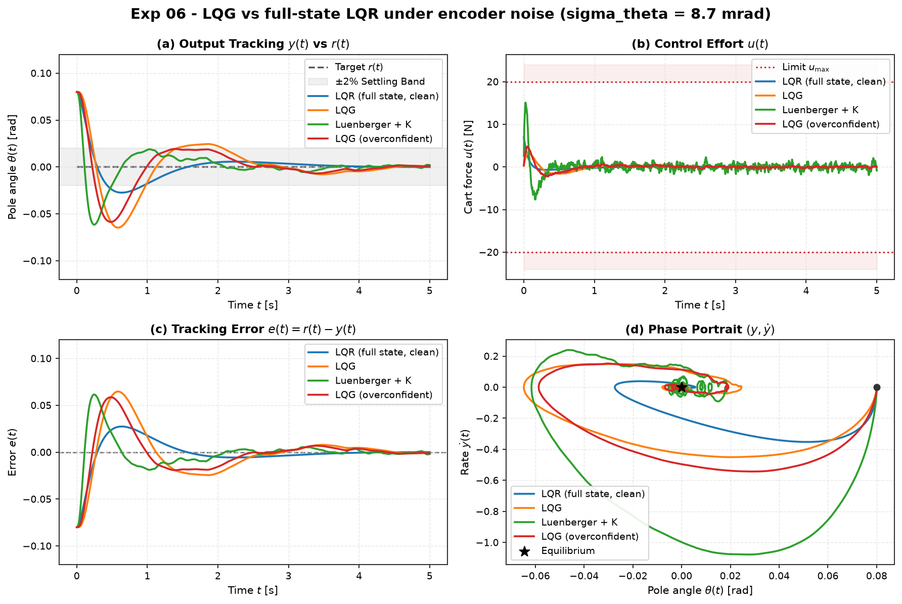

# Experiment 06 — LQG vs full-state LQR under measurement noise

**Question.** A full-state LQR needs all four states, noise-free — it never exists
on real hardware. Given only two noisy encoders (cart position, pole angle), how
close does **LQG** (Kalman filter + the same LQR gain) get to that ideal, and
what does a fast pole-placed **Luenberger** observer cost you instead of the
noise-matched filter?

Theory: [module 04,
[`docs/references/observers-kalman-reference.md`](../references/observers-kalman-reference.md).

## Setup

- Nonlinear `CartPole`, balance from θ₀ = 0.08 rad (≈ 4.6°), regulate θ → 0.
- Sensors: dual encoders `C = [[1,0,0,0],[0,0,1,0]]`, Gaussian noise
  `σ_x = 5 mm`, `σ_θ = 8.7 mrad` (≈ 0.5°). One shared noise realisation, every
  controller sees the same samples.
- `Q = diag(10, 1, 100, 10)`, `R = 0.1`; Kalman `W = diag(1e-4, 1e-3, 1e-4,
  1e-3)`, `V = diag(σ_x², σ_θ²)`. Luenberger poles `{−20, −22, −24, −26}`.
- `|u| ≤ 20 N`, `dt = 2e-3`, `T = 5 s`, RK4.
- Controllers:
  - **LQR (full state, clean)** — the unattainable ideal: feeds back the 4 true states.
  - **LQG** — `ObserverFeedback.lqg`: steady-state Kalman filter (2 noisy encoders → x̂) + the LQR gain.
  - **Luenberger + K** — same gain, but a fast pole-placed observer with no noise model.
  - **LQG (overconfident)** — Kalman filter told the sensors are 10× better than they are (`V/100`).

Run: `python experiments/06_lqg_vs_lqr_measurement_noise/run.py`
Outputs (committed): `table.md`, `table.csv`, `metrics_full.csv`, `figure.png`.

## Results

| controller | settling θ [s] | RMSE θ | control energy Eᵤ | peak \|u\| [N] |
| --- | --- | --- | --- | --- |
| LQR (full state, clean) | 0.94 | 0.0150 | **1.49** | 6.97 |
| LQG                     | 2.07 | 0.0249 | 2.21 | **3.28** |
| Luenberger + K          | 0.50 | 0.0165 | **16.2** | 15.1 |
| LQG (overconfident)     | 0.83 | 0.0215 | 2.97 | 4.80 |

## Takeaways

1. **The Kalman filter's job is to keep sensor noise out of the actuator, not to
   be fast.** LQG uses the least control effort of any noisy-sensor option
   (Eᵤ = 2.2, peak 3.3 N) and its trace in panel (b) is smooth. It settles slower
   than the clean LQR (2.1 s vs 0.9 s) precisely because the filter trades
   estimator bandwidth for noise rejection — that is the optimal trade, not a
   defect.
2. **A pole-placed observer amplifies measurement noise.** "Luenberger + K" has
   the same LQR gain and fast observer poles, so it settles fastest (0.5 s) — but
   it feeds the raw encoder noise straight through: **11× the control energy**
   (16.2 vs 2.2), peak force 15 N, and a visibly chattering command. Fast observer
   ≠ good observer when the measurements are noisy.
3. **Kalman tuning matters.** Telling the filter the sensors are 10× better than
   reality (`V` too small) makes it over-trust each noisy measurement: RMSE and
   energy both rise (0.021 / 2.97) versus the correctly-tuned LQG (0.025 / 2.21
   — note LQG's higher RMSE but lower energy; the overconfident filter tracks the
   noisy signal more tightly, which reads as lower angle RMSE but costs actuator
   effort and would fail at higher noise).
4. **LQG recovers most of the full-state ideal from half the sensors.** Two noisy
   encoders, reconstructing four states, gets within 1.7× the clean-LQR angle
   RMSE and *below* its peak force — the separation principle working in
   practice on a nonlinear plant.
