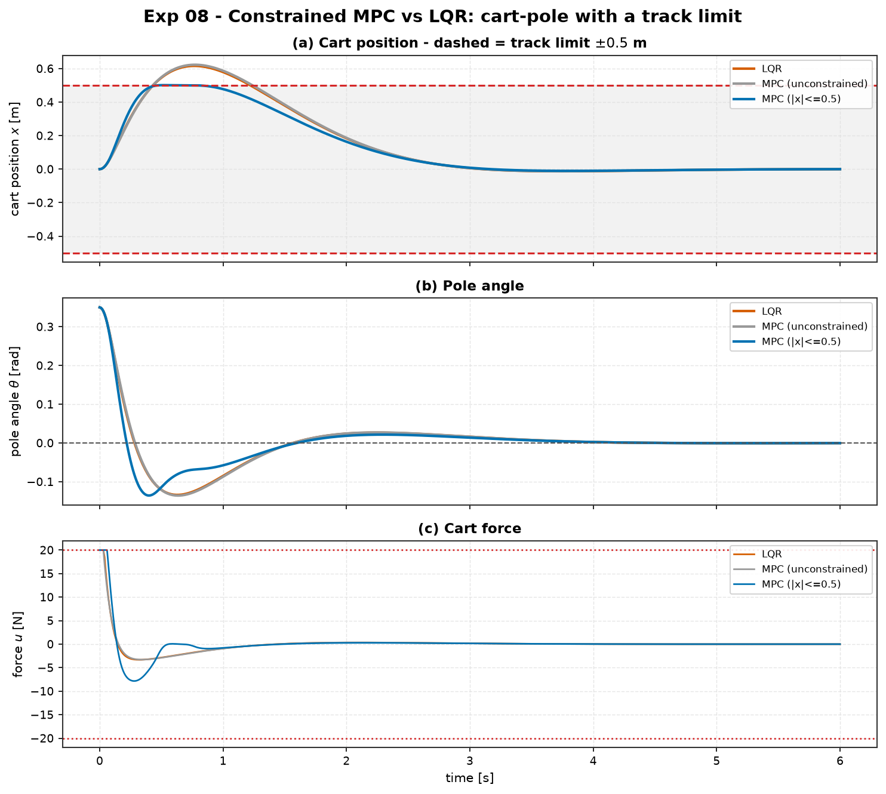
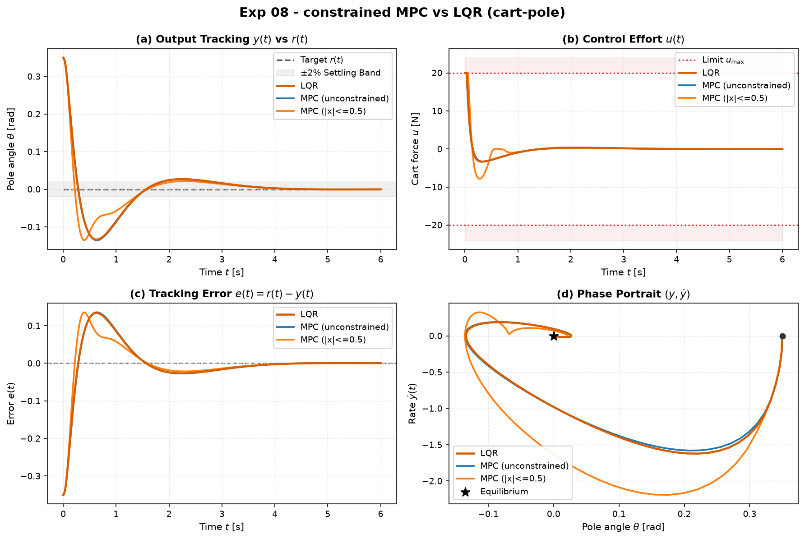

# Experiment 08 — Constrained linear MPC vs LQR on the cart-pole

**Question.** Balancing the cart-pole from a moderate tilt (`θ₀ = 0.35 rad`) with
a ±20 N actuator, the LQR recovery swings the cart out past the ±0.5 m track
limit. Can linear MPC with the **same** `Q`, `R` but an explicit cart-position
constraint plan a recovery that respects the limit — and what does it cost?

Companion theory:
[`modules/05-optimal-control/05-model-predictive-control-intro.md`.

## Setup

- Plant: nonlinear `CartPole` (M=1.0, m=0.1, l=0.5, g=9.81), `θ = 0` upright.
- Three controllers, **identical** weights `Q = diag(10,1,100,10)`, `R = 0.1`
  (`cartpole-lqr-reference.md` "balanced"):
  - **LQR** — `u = -Kx`, the analytic optimum; no notion of the track limit.
  - **MPC (unconstrained)** — condensed `N = 75` step QP, ZOH discretisation per
    `dt`, terminal cost `Qf` = discrete-ARE (so it reproduces LQR here).
  - **MPC (|x_cart| ≤ 0.5)** — same MPC plus the state box, enforced by a soft
    quadratic penalty (`soft_weight = 1e5`) with a from-scratch active-set QP.
- `|F| ≤ 20 N`, `dt = 10 ms`, `T = 6 s`, RK4. Same `x₀` for all.

```bash
python experiments/08_mpc_vs_lqr_constrained_cartpole/run.py
```

## Results

| controller | cart peak [m] | constraint violation [m] | θ settle [s] | control energy `∫u²` | peak `|F|` [N] |
| :-- | :-: | :-: | :-: | :-: | :-: |
| LQR | 0.616 | **0.116** | 2.79 | 28.8 | 20.0 |
| MPC (unconstrained) | 0.623 | **0.123** | 2.81 | 27.7 | 20.0 |
| MPC (\|x\| ≤ 0.5) | **0.501** | 0.001 | 2.56 | 46.3 | 20.0 |





## Takeaways

1. **LQR busts the track limit — by design it cannot know about it.** Recovering
   the pole from 0.35 rad, the LQR-optimal maneuver lets the cart travel to
   0.62 m, 23 % past the ±0.5 m rail. "Optimal" is only optimal for the cost it
   was given; a hard limit is not in `Q`, `R`.
2. **Unconstrained MPC reproduces LQR.** Cart peak 0.62 m, energy within 4 % of
   LQR — the condensed QP with a DARE terminal cost is the discrete LQR, so it
   inherits the same blindness. MPC's value here is *only* the constraint.
3. **Constrained MPC rides the limit.** The receding QP plans a recovery that
   holds `|x_cart| ≤ 0.5` (peak 0.501 m, 1 mm soft-penalty slack) while still
   bringing the pole upright — in fact ~0.2 s *sooner* (2.56 vs 2.79 s), because
   it commits harder force early rather than coasting the cart out and back.
4. **The cost is control effort, not stability.** Energy rises from 29 to 46
   (≈60 %) and the force sits at the ±20 N limit longer. That is the trade MPC
   makes explicit: honour the constraint, pay in actuator work.

## Notes

- `N = 75` (0.75 s look-ahead) is long enough for the constraint to be feasible
  over the horizon; with a much shorter horizon a hard-ish state constraint can
  make MPC myopically clamp the cart and lose the pole.
- The state box is *soft* (quadratic penalty on the active violation): the QP
  stays solvable if `x₀` already violates or the constraint is infeasible over
  the horizon, degrading gracefully instead of crashing. With `soft_weight = 1e5`
  the residual violation here is ~1 mm.


## Quantitative Benchmark Table

# Experiment 08 - constrained MPC vs LQR (cart-pole)

Balance from theta0 = 0.35 rad, |F| <= 20 N, track limit |x_cart| <= 0.5 m.

| controller | cart_peak_m | constraint_violation_m | theta_settle_s | control_energy | peak_force_N |
| --- | --- | --- | --- | --- | --- |
| LQR | 0.6162 | 0.1162 | 2.79 | 28.8 | 20.0 |
| MPC (unconstrained) | 0.6232 | 0.1232 | 2.81 | 27.7 | 20.0 |
| MPC (|x|<=0.5) | 0.5014 | 0.0014 | 2.56 | 46.3 | 20.0 |
