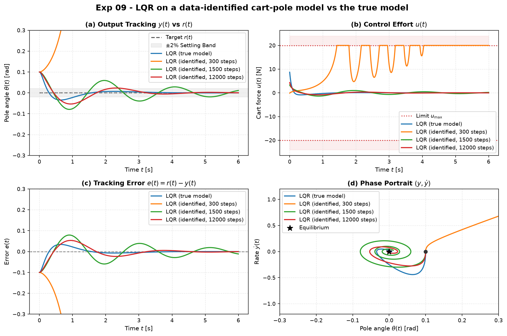

# Experiment 09 — designing a controller on a data-identified model

**Question.** If you don't have the equations of motion, can you identify a
linear model of the cart-pole from input/output data and design an LQR on it
that works on the real (nonlinear) plant? How much data do you need, and how
does model error propagate into closed-loop performance?

Uses [`aimct.sysid`. Theory:
[module 04, module 06 (learned dynamics).

## Setup

- **Data collection** (closed-loop): the true unstable cart-pole is rolled with
  `u = −K_mild·x + PRBS` (a *mild* stabiliser just to keep the state near
  upright, plus a piecewise-constant random excitation of ±8 N). Only the noisy
  state is logged — sensor noise std `[3 mm, 6 mm/s, 3 mrad, 6 mrad/s]`.
- **Identification**: `least_squares_id` fits `x_{k+1} = A_d x_k + B_d u_k`;
  `to_continuous` inverts the ZOH map (block-matrix `logm`).
- **Control**: design `LQR(Â, B̂, Q, R)` with `Q = diag(10,1,100,10)`, `R = 0.1`,
  run the resulting `u = −K̂·x` on the **true nonlinear** plant from θ₀ = 0.10 rad.
- Repeated over **6 noise seeds** per data length; the figure shows the median run.
- `|u| ≤ 20 N`, `dt = 2e-3`, `T = 6 s`.

Run: `python experiments/09_control_on_identified_model/run.py`
Outputs (committed): `table.md`, `table.csv`, `metrics_full.csv`, `figure.png`.

## Results

| data | A rel-Fro err | K̂ error (rel) | closed-loop RMSE(θ) | stable runs |
| --- | --- | --- | --- | --- |
| 300 steps (1 s)   | 5.9   | 0.99 | 26.8 (diverges) | **1 / 6** |
| 1 500 steps (3 s) | 0.42  | 0.53 | 0.034 | 4 / 6 |
| 12 000 steps (24 s) | 0.22 | 0.49 | 0.025 | **6 / 6** |

(true-model LQR: RMSE 0.0171, settle 1.05 s — the target.)

## Takeaways

1. **Too little noisy data → a useless model → the controller fails.** With 1 s of
   data the identified A is 590 % off; only 1 of 6 designs stabilised the real
   plant, and the median run spins the pole to ~60 rad (orange, off-frame in
   every panel). Model-based control is only as good as the model.
2. **More data buys reliability, not perfection.** By 24 s the identification is
   consistent enough that all 6 designs stabilise, with closed-loop angle RMSE
   1.5× the ideal — a slightly detuned but perfectly usable controller with no
   hand-derived equations.
3. **Closed-loop least-squares identification is biased.** The A-matrix error
   plateaus around 0.2 and K̂ stays ~0.5 off the true gain even with abundant
   data, because the excitation is correlated with the state through the
   stabilising feedback. The controller still works — LQR is robust to moderate
   model error — but the estimate does not converge to truth. Removing this bias
   needs open-loop excitation, instrumental-variable / prediction-error methods,
   or a dedicated closed-loop SysID estimator (a Phase-1 follow-up).
4. **LQR's built-in robustness is doing real work here.** A ~50 % gain error and
   a 20–40 % A-matrix error still give a stable, well-damped closed loop —
   consistent with LQR's guaranteed gain margin `[½, ∞)`. A tighter,
   less-robust design (e.g. aggressive pole placement) on the same identified
   model would not survive.
