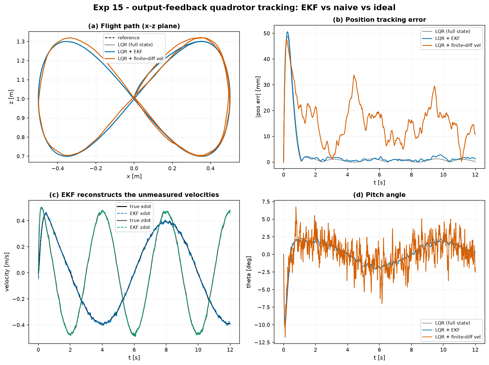

# Experiment 15 — Output-feedback quadrotor tracking with an EKF

**Question.** The planar quadrotor flies the
[Experiment-14](../14_quadrotor_figure8_tracking/) lemniscate, but the controller
no longer sees the true state — only **noisy position + attitude** `[x, z, θ]`
and a **gyro** `θ̇`. The two translational velocities `ẋ, ż` are *never measured*.
Can an extended Kalman filter reconstruct the full state well enough for
output-feedback tracking to match full-state LQR — and how does it compare with
naive finite-difference velocity?

Companion theory: module 04 (observers / Kalman filtering).

## Setup

- Plant: `PlanarQuadrotor` (Crazyflie 2.0), nonlinear dynamics.
- Reference: lemniscate (`A_x = 0.5 m`, `B_z = 0.3 m`, period 8 s) with
  differential-flatness feed-forward. `dt = 4 ms`, `T = 12 s`.
- **Sensors:** `y = [x, z, θ, θ̇] + noise`, `σ = [3 mm, 3 mm, 0.3°, 0.01 rad/s]`.
  `ẋ, ż` unmeasured.
- Same Bryson-scaled LQR gain for all three; only the state estimate differs:
  - **LQR (full state)** — the unattainable ideal, perfect state feedback.
  - **LQR + EKF** — `aimct.estimation.ExtendedKalmanFilter` fuses the 4 noisy
    channels with the nonlinear model (`f = quad.dynamics`, `h = x[[0,1,2,5]]`,
    analytic `H`, finite-diff `F`).
  - **LQR + finite-diff vel** — difference the noisy position channels for
    velocity, with a mild 1-pole low-pass.

```bash
python experiments/15_quadrotor_ekf_output_feedback/run.py
```

## Results

| controller | RMS pos err [mm] | max pos err [mm] | RMS pitch [°] | control energy ∫‖Δu‖² | RMS velocity-estimate err [m/s] |
| :-- | :-: | :-: | :-: | :-: | :-: |
| LQR (full state) | 9.04 | 49.0 | 1.26 | 0.0024 | — |
| **LQR + EKF** | **9.51** | 50.6 | 1.25 | 0.0026 | **0.008** |
| LQR + finite-diff vel | 18.32 | 47.4 | 1.89 | 0.358 | 0.332 |



## Takeaways

1. **The EKF makes output feedback essentially free.** RMS position error 9.5 mm
   vs the full-state ideal's 9.0 mm — a **5 % penalty** for never measuring the
   velocities. Pitch tracking and control energy are indistinguishable from the
   ideal.
2. **It reconstructs the unmeasured states to 8 mm/s.** `ẋ, ż` are inferred
   purely from the noisy position history *through the model* — the EKF's
   velocity estimate tracks the truth to 0.008 m/s RMS (panel c).
3. **Naive differencing is not a substitute.** Differencing 3 mm position noise
   at `dt = 4 ms` injects ~1 m/s of velocity noise; even with a low-pass the
   velocity estimate is 40× worse (0.33 m/s), which doubles the position error
   and — because the controller chases the noise — inflates control energy
   **150×** (0.36 vs 0.0024). On a real Crazyflie this is the difference between
   a clean flight and burning the motors.
4. **This is what "modern control" buys.** A linear regulator plus a
   model-based estimator recovers the full-state performance from a realistic,
   partial, noisy sensor suite — the standard architecture for every real drone.

## Notes

- `aimct.estimation.ExtendedKalmanFilter` uses one internal RK4 step of the
  supplied continuous dynamics (matching `aimct.simulate`), an analytic
  measurement Jacobian here and a finite-difference transition Jacobian, and the
  Joseph-form covariance update. It exposes the same `predict / update / step /
  reset` surface as `DiscreteKalmanFilter`, so it also drops straight into
  `aimct.controllers.ObserverFeedback`.
- Pitch stays small (< 3°) so no angle wrapping is needed; the EKF's `residual`
  hook is there for tasks where it is.


## Quantitative Benchmark Table

# Experiment 15 - output-feedback quadrotor tracking (EKF)

Noisy [x, z, theta] + gyro; velocities unmeasured. sigma = [0.003, 0.003, 0.005235987755982988, 0.01] (m, m, rad, rad/s).

| controller | rms_pos_err_mm | max_pos_err_mm | rms_pitch_deg | ctrl_energy | rms_vel_est_err |
| --- | --- | --- | --- | --- | --- |
| LQR (full state) | 9.04 | 49.0 | 1.256 | 0.0024 | -- |
| LQR + EKF | 9.51 | 50.58 | 1.248 | 0.0026 | 0.0078 |
| LQR + finite-diff vel | 18.32 | 47.4 | 1.888 | 0.3578 | 0.3316 |
