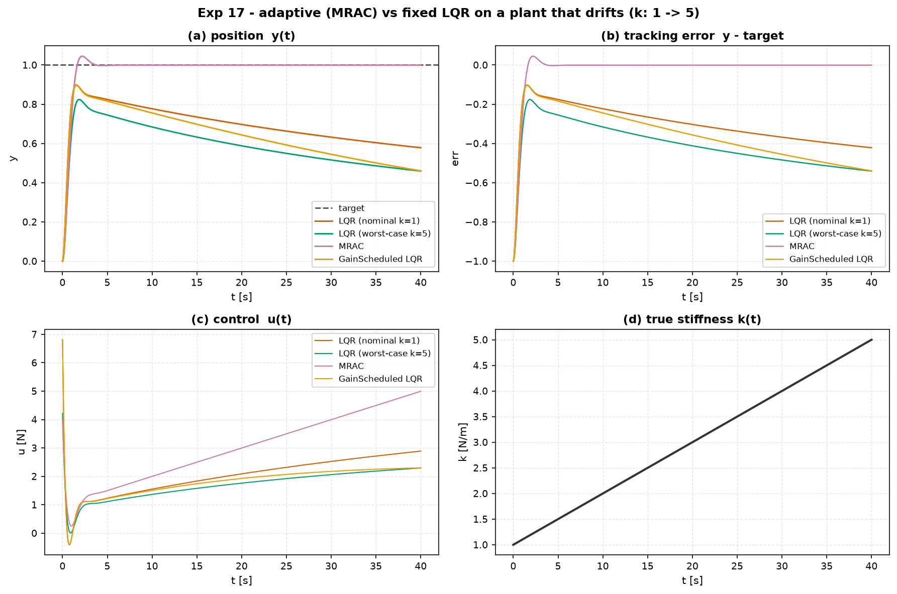

# Experiment 17 — adaptive vs fixed control when the plant drifts

**Question.** A controller is tuned for a plant; then the plant changes — an
actuator ages, a robot picks up a payload, a spring hardens. How much does a
fixed LQR degrade, and does model-reference adaptive control hold performance
*without ever identifying the new plant*?

Uses [`aimct.controllers.MRAC` / `GainScheduledLQR`.
Theory: module 08 (adaptive control).

## Setup

- Plant: `MassSpringDamper` (m = 1, c = 0.4) whose **stiffness `k` ramps 1 → 5
  linearly over the 40 s episode**.
- Reference model (MRAC's target): `A_m = [[0,1],[−4,−2.8]]`, `B_m = [[0],[4]]`
  (ω_n = 2, ζ = 0.7, unity DC gain), unit step command.
- Controllers:
  - **LQR (nominal k = 1)** — designed once for the initial plant.
  - **LQR (worst-case k = 5)** — designed for the final plant (conservative).
  - **MRAC** — direct, matched-uncertainty, `φ(x) = [x; 1]`, `Γ = 80`.
  - **GainScheduled LQR** — the "k is measurable" option: LQR gains over
    `k ∈ [1, 5]`, blended by the true current stiffness.
- `dt = 2 ms`, `T = 40 s`, `|u| ≤ 60 N`.

Run: `python experiments/17_adaptive_vs_fixed_changing_plant/run.py`
Outputs (committed): `table.md`, `table.csv`, `figure.png`.

## Results

RMS tracking error to the target, in an early window (`k ≈ 2`) and a late one
(`k ≈ 4–5`), both past MRAC's adaptation transient:

| controller | RMS err early | RMS err late | final err | ctrl energy |
| --- | --- | --- | --- | --- |
| LQR (nominal k=1)   | 0.257 | 0.401 | 0.422 | 181 |
| LQR (worst-case k=5)| 0.358 | 0.519 | 0.541 | 123 |
| **MRAC**            | **0.0008** | **0.0008** | **0.0008** | 414 |
| GainScheduled LQR   | 0.292 | 0.508 | 0.540 | 142 |

## Takeaways

1. **MRAC holds ~1 mrad tracking error through a 5× stiffness change** — its
   error line (panel b) is dead flat while every fixed controller's droops from
   −0.15 to −0.55 as the plant stiffens. The adaptation is *visible in panel c*:
   MRAC ramps its control effort up linearly to match the growing stiffness; the
   fixed LQRs barely change theirs, which is exactly why they lose the target.
2. **Part of the gap is structure, part is adaptation — and the experiment
   separates them.** MRAC has a reference-model feed-forward that the plain
   regulator LQRs lack, so it starts with an advantage. But the *drift* — error
   growing over time as `k` changes — is what adaptation specifically fixes: a
   frozen version of MRAC's own baseline law droops just like the LQRs (see
   `tests/test_adaptive.py::test_mrac_beats_a_fixed_baseline...`).
3. **Gain scheduling needs the parameter measured; MRAC doesn't.** The scheduled
   LQR here is *given* the true `k` and still droops — because it is a regulator
   without integral action, its steady offset `≈ k/(k + K_pos)` grows with `k`.
   MRAC never sees `k` at all and tracks anyway.
4. **Adaptation isn't free:** MRAC spends ~2.5× the control energy of the fixed
   LQRs, and it has a real transient (the first ~5 s, panel b) while `θ̂`
   converges. On a plant that *doesn't* change, that cost buys nothing — which is
   the engineering-judgment point.
