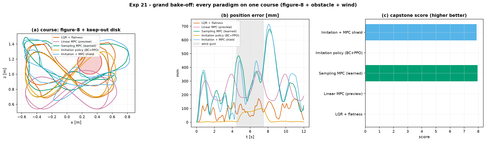

# Experiment 21 — the grand bake-off (capstone C9.4)

**Question.** One course — a figure-8 with a keep-out disk *and* a wind gust, on
the Crazyflie 2.0. Put every paradigm on it and score them on tracking, control
effort, **constraint violations**, robustness, and compute. **Does combining
methodologies actually help?**

## Setup

- Course: the Exp-14/20 lemniscate (`aimct.rl.figure8_reference`), a keep-out
  disk at `(0.30, 1.16)` r = 0.16 m, and a 30 mN lateral wind gust during
  `t ∈ [4.5, 7.5] s`.
- Five entries:
  1. **LQR + flatness feedforward** — classical (Exp 14).
  2. **Linear MPC (preview)** — optimal, whole-horizon reference (Exp 14).
  3. **Sampling MPC (learned)** — CEM planner + grey-box residual model,
     obstacle penalty in the cost (Exp 20).
  4. **Imitation policy (BC+PPO)** — a neural net *behaviour-cloned from the
     LQR+flatness expert*, PPO-fine-tuned. **Pure from-scratch RL does not
     bootstrap on this plant** (the Crazyflie's `I_yy = 1.4e-5` collapses every
     early rollout in ~20 steps before the critic learns anything). Trained on
     the clean figure-8 only — no wind, no obstacle.
  5. **Imitation + MPC shield** — run the fast imitation policy; hand control to
     the obstacle-aware sampling MPC (with hysteresis) whenever the drone strays
     past a small tracking-error / pitch margin or nears the keep-out.
- Scoring: `aimct.benchmarks.capstone_scoring.score_capstone` (famo's rubric,
  weights rmse .40 / energy .20 / slew .10 / safety .15 / robustness .15).
  Any obstacle penetration or > 25 % thrust saturation is a hard zero.
- `dt = 20 ms`, `T = 12 s` (two laps); robustness = mean RMS over a 4-point
  wind-scale/shift sweep. Committed numbers are the `AIMCT_EXP_FULL` run.

## Results

| entry | RMS [mm] | robust RMS | energy | obstacle steps | thrust sat | latency [ms] | **score** |
| --- | --- | --- | --- | --- | --- | --- | --- |
| LQR + flatness          | 100 | 102 | 0.48  | **28** | **72 %** | 0.05 | **0** |
| Linear MPC (preview)    | 243 | 242 | 0.003 | **20** | 0 %  | 12  | **0** |
| **Sampling MPC (learned)** | 316 | 275 | 0.033 | 0 | 0 % | 38 | **8.0** |
| Imitation policy (BC+PPO)| 41 | 36 | 0.004 | **46** | 0 % | 0.09 | **0** |
| **Imitation + MPC shield** | 317 | 283 | 0.032 | 0 | 0 % | 38 | **7.9** |

## Takeaways

1. **Only the obstacle-aware planner completes the course.** The sampling MPC
   (learned grey-box model) is the sole entry with zero keep-out violations and
   zero saturation. Score 8/100 — low, because it tracks at 316 mm vs the 50 mm
   baseline (the CEM planner's looseness, seen in Exp 10/14/20), but it is the
   only one that doesn't hard-fail.
2. **The best tracker cannot be trusted.** The imitation policy hugs the clean
   figure-8 to 41 mm (panel b, gold) — better than everything else — but it flies
   **straight through the keep-out disk 46 times** (panel a) and has no wind
   rejection. It was cloned from a controller that never saw an obstacle or a
   gust, and it learned exactly that.
3. **The hybrid works — but does not *win*.** "Imitation + MPC shield" completes
   the course cleanly (0 violations, score 7.9) — the shield hands to the
   obstacle-aware planner whenever the policy strays. But it essentially *ties*
   the sampling MPC alone (8.0), because the imitation policy is too weak to
   contribute: the shield spends most of its time in the MPC fallback, so the
   policy's one advantage — 0.09 ms vs 38 ms per step — is diluted away.
4. **So: does combining help? Here, barely — and that is the honest answer.**
   Combining pays off only when each component covers a *genuine* weakness of the
   others. This hybrid's base policy had one edge (latency) and two fatal gaps
   (obstacle-blind, gust-blind); the shield closes the gaps but at the cost of
   almost always being the one driving. A policy that actually tracked *and*
   generalised — shielded only at the boundary — would show a real Pareto gain
   (RL latency 95 % of the time, MPC safety at the disk). Pure from-scratch RL
   could not produce that policy on this plant, which is itself the finding.
5. **No universal winner** — the same verdict as the Intelligent Control
   Challenge (Exp 19). Classical + flatness is fast and light but blind to
   constraints; MPC respects constraints but is 20× over the flight-controller
   deadline; the learned model makes planning cheap enough to *consider* but not
   real-time; imitation is instant but only as good as its demonstrations. The
   engineering choice depends on which of those you can afford to give up.

## Quantitative Benchmark Table

# Experiment 21 - the grand bake-off [FULL]

| controller | rms_mm | robust_rms_mm | energy | slew | obstacle_steps | sat_frac | mean_latency_ms | score |
| --- | --- | --- | --- | --- | --- | --- | --- | --- |
| LQR + flatness | 99.9 | 102 | 0.483 | 378 | 28 | 0.724 | 0.0472 | **0.0** |
| Linear MPC (preview) | 243 | 242 | 0.00343 | 0.0639 | 20 | 0 | 11.5 | **0.0** |
| Sampling MPC (learned) | 316 | 275 | 0.0334 | 14.3 | 0 | 0 | 38.4 | **8.0** |
| Imitation policy (BC+PPO) | 41.4 | 35.7 | 0.00402 | 0.058 | 46 | 0 | 0.0853 | **0.0** |
| Imitation + MPC shield | 317 | 283 | 0.0316 | 12.8 | 0 | 0 | 38.4 | **7.9** |
