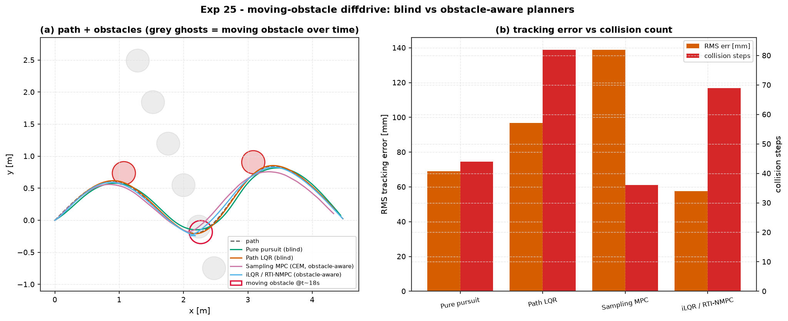

# Experiment 25 — a moving obstacle on the differential-drive path

**Question.** Two Experiment-22 blind trackers (pure pursuit, path LQR — no
notion an obstacle exists) and two receding-horizon planners with an
obstacle-penalty cost (sampling MPC / CEM, iLQR / RTI-NMPC) follow the same
waypoint path through a field of three disks — two static, one **moving**,
crossing the path mid-route at a speed comparable to the robot's own cruise
speed. Does a planner need to re-plan against a target that was not there
when it started? And does a gradient method cope with a non-convex obstacle
cost as well as a derivative-free one does?

Companion: [Experiment 22](../22_diffdrive_path_following/) (the blind
trackers), [Experiments 20/21](../20_quadrotor_obstacle_nmpc/) (the same
quartic obstacle-penalty pattern on the quad), [Experiment 26](../26_harder_reference_paths/)
(iLQR vs CEM on a harder *smooth* path — the mirror image of this one).

## Setup

The Exp-22 waypoint spline, re-timed to the 0.15 m/s cruise speed. Three
disks (radius 0.18 m, `2 × robot half-width` roughly): two static, offset
0.15 m off the path normal at the points the blind trackers pass closest (so
a blind trajectory still clips them, a ~0.2–0.3 m lateral deviation clears
them); one **moving**, crossing the path near `t ≈ 18 s` at the robot's own
cruise speed. Both receding-horizon planners get the identical soft quartic
barrier `W_obs · max(0, r² − d²)²` in their cost, `W_obs = 1×10⁴`, horizon
70 steps (3.5 s) — the same penalty shape Experiments 20/21 used for the
quad's static obstacle. iLQR's copy is an **exact analytic** gradient/Hessian
(finite-difference-verified against the barrier at import time); `SamplingMPC`
only accepts a scalar action box, so CEM plans in normalised `[-1, 1]` actions,
rescaled to `[v_cmd, ω_cmd]`.

```bash
python experiments/25_diffdrive_moving_obstacle/run.py
AIMCT_EXP_FULL=1 python experiments/25_diffdrive_moving_obstacle/run.py
```

## Results (`AIMCT_EXP_FULL=1`)

| controller | rms err (mm) | collision steps | ctrl energy | latency median (ms) |
| :-- | :-: | :-: | :-: | :-: |
| **Pure pursuit** (blind) | 69.1 | 44 | 1.12 | 0.02 |
| **Path LQR** (blind) | 96.9 | 82 | 1.44 | 0.06 |
| **Sampling MPC (CEM)** | 138.9 | **36** | 8.25 | 112 |
| **iLQR / RTI-NMPC** | **57.6** | 69 | 1.29 | 111 |

Real-time budget: 50 ms/step (740-step, 37 s run).



## Takeaways

1. **CEM is the only entry that meaningfully avoids.** It cuts a visibly wider
   arc through the obstacle field (panel a) and posts the fewest collision
   steps (36, vs 44–82 for the entries that never even look for an obstacle)
   — but at 6–7× the tracking error and **7× the control energy** of everyone
   else. A derivative-free population search does not care whether the
   barrier is convex; it just samples around it.
2. **iLQR reacts, but not enough to clear it.** Its tracking error is the
   *best* of the four (57.6 mm — better than blind pure pursuit) and its
   energy stays blind-baseline low, yet its collision count (69) sits between
   the two blind entries rather than dropping to CEM's level. The quartic
   barrier is **not locally convex near an obstacle's centre** (its Hessian
   in the along-obstacle direction goes negative at deep penetration), and a
   Riccati backward pass wants a locally convex cost model — Tassa
   regularisation keeps the solve numerically stable, but a single RTI
   iteration per step does not have room to fight its way to a genuinely
   avoiding trajectory the way an unconstrained gradient descent eventually
   would with more iterations. iLQR "sees" the obstacle in its cost, it just
   cannot act on it as forcefully as CEM does.
3. **This is the mirror image of Experiment 26.** There, on a *smooth* cost,
   iLQR beat CEM by 32×–840× at a fraction of the compute. Here, on a
   *non-convex* obstacle cost, CEM is the one that actually solves the task
   the planner was asked to solve (avoid the obstacle), and iLQR's structural
   weakness with non-smooth costs — flagged all the way back in Experiment 21
   — shows up concretely rather than as a remark.
4. **The moving obstacle does not visibly break either planner differently
   from the static ones** — both re-plan every control step from the measured
   state (CEM re-samples fresh, iLQR re-linearises via RTI), so a target that
   "is not there yet" when the horizon starts is simply absent from the
   penalty until it enters the horizon window, then treated identically to a
   static one. The interesting split here is convexity, not motion.
5. **Neither aware planner would make the real-time budget as configured.**
   Median latency is ~112 ms against a 50 ms/step budget — both would need a
   smaller sample count / shorter horizon (or, for iLQR, `rti_iters` tuned
   down further) to actually run in real time; the numbers above show what
   the two search strategies find given the compute, not what either would
   ship in a vehicle without a budget pass — the same "over budget" flag
   Experiment 26 raised for CEM alone, here true for both.


## Quantitative Benchmark Table

# Experiment 25 - a moving obstacle on the differential-drive path

3 obstacles (2 static + 1 moving, crosses the path near t~18 s), 37 s run, 50 ms step.

| controller | rms_err_mm | max_err_mm | completion_pct | collision_steps | ctrl_energy | lat_median_ms | lat_p95_ms |
| --- | --- | --- | --- | --- | --- | --- | --- |
| Pure pursuit (blind) | 69.05 | 107.8 | 100 | 44 | 1.118 | 0.0246 | 0.0368 |
| Path LQR (blind) | 96.86 | 230 | 100 | 82 | 1.442 | 0.0551 | 0.06712 |
| Sampling MPC (CEM, obstacle-aware) | 138.9 | 258 | 100 | 36 | 8.246 | 112.3 | 146.4 |
| iLQR / RTI-NMPC (obstacle-aware) | 57.63 | 229.1 | 100 | 69 | 1.292 | 111.3 | 141.7 |
