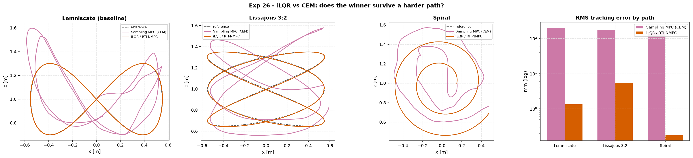

# Experiment 26 — does the Exp-24 winner survive a harder path?

**Question.** Experiment 24 found iLQR/RTI-NMPC beating sampling MPC (CEM) by
~2 orders of magnitude on the figure-8 — a smooth, low-curvature, obstacle-free
reference. Is that a fair fight, or just the easiest track iLQR ever sees? The
same two planners, the same cost, the same 20-step horizon, run on two harder
paths — plus the lemniscate baseline, recomputed here so all three rows are
directly comparable.

Companion: [Experiment 24](../24_ilqr_vs_sampling_mpc/) (iLQR/RTI-NMPC vs CEM),
[`aimct.trajectories`.

## The two harder tracks

| path | why it's harder |
| :-- | :-- |
| **Lissajous 3:2** | coprime frequency ratio (`x = A sin(3ωt)`, `z = z₀ + B sin(2ωt)`) → sharp velocity reversals at the lobes, a strictly harder stress than the lemniscate's 2:1 special case |
| **Spiral** | outward Archimedean spiral — curvature demand *increases monotonically* as the radius grows, the mirror image of a tightening turn |

The thrust feed-forward needs jerk/snap of the reference; `aimct.trajectories`
gives `(pos, vel, acc)` only, so this experiment recovers jerk/snap by
central-differencing the trajectory's own analytic acceleration
(`flat_reference()` in `run.py`) — generic across any `Trajectory` subclass, no
change to `aimct.trajectories` needed.

```bash
python experiments/26_harder_reference_paths/run.py
AIMCT_EXP_FULL=1 python experiments/26_harder_reference_paths/run.py   # committed numbers
```

## Results (`AIMCT_EXP_FULL=1`)

| path | Sampling MPC (CEM) rms (mm) | iLQR / RTI-NMPC rms (mm) | iLQR advantage | CEM median latency (ms) | iLQR median latency (ms) |
| :-- | :-: | :-: | :-: | :-: | :-: |
| Lemniscate (baseline) | 202.2 | **1.34** | 151× | 28.5 | **16.6** |
| Lissajous 3:2 | 172.8 | **5.41** | 32× | 29.7 | **16.6** |
| Spiral | 147.6 | **0.18** | 840× | 30.6 | **16.4** |

Real-time budget: **20 ms/step**.



## Takeaways

1. **The winner survives — decisively, on every path tried.** iLQR/RTI-NMPC
   beats CEM by 32×–840× RMS tracking error across all three references, using
   4–14× *less* control energy every time. Experiment 24's result was not a
   lemniscate artefact.
2. **The Lissajous is the closest CEM gets.** iLQR's error grows 4× versus the
   lemniscate (1.3 → 5.4 mm) — the sharp lobe reversals genuinely tax the
   linearised backward pass, which has to track a fast-changing curvature with
   only one RTI iteration per step. CEM barely notices (202 → 173 mm): it was
   already too loose to be sensitive to the extra difficulty.
3. **The spiral is iLQR's best case, not its worst.** Monotonically *easing*
   curvature is gentle on a single-iteration gradient method — 0.18 mm, its
   tightest tracking of the three. CEM's population-based search gets no such
   benefit from an easy path (148 mm — barely better than the harder two);
   without gradients, easy curvature does not mean an easy search.
4. **CEM's real cost shows up as a latency violation, not just error.** In the
   `AIMCT_EXP_FULL` configuration (500 samples) CEM's median per-step solve is
   **28–31 ms — over the 20 ms real-time budget on every path** — while iLQR
   stays at ~16.5 ms regardless of path shape (the RTI cost is dominated by one
   fixed-size Riccati sweep, not by how hard the path is). A CEM-driven
   controller here is not merely worse; on this budget it is not deployable
   at this sample count without either shrinking the population or dropping
   frames.
5. **Verdict for Experiment 21's remark stands, generalised.** "CEM is loose
   and slow" was not an artefact of one easy reference — it holds across a
   sharp-reversal path and an easing-curvature path alike. Reach for CEM /
   sampling MPC when the cost is **non-smooth** (obstacle penalties, contact,
   black-box dynamics) where gradients are unavailable or misleading; for a
   smooth model and a smooth cost, a gradient method wins by two-plus orders of
   magnitude at *lower* compute, on any reference geometry tried so far.


## Quantitative Benchmark Table

# Experiment 26 - does the Exp-24 winner survive a harder path?

20-step / 0.4 s horizon, 20 ms real-time budget, same Q/R/Qf as Exp 24 on every path.

## Lemniscate (baseline)

| controller | rms_pos_err_mm | max_pos_err_mm | ctrl_energy | lat_median_ms | lat_p95_ms | lat_cold_ms |
| --- | --- | --- | --- | --- | --- | --- |
| Sampling MPC (CEM) | 202.2 | 439.1 | 0.02982 | 28.53 | 34.82 | 27.1 |
| iLQR / RTI-NMPC | 1.336 | 2.404 | 0.004082 | 16.59 | 21.82 | 33.78 |

## Lissajous 3:2

| controller | rms_pos_err_mm | max_pos_err_mm | ctrl_energy | lat_median_ms | lat_p95_ms | lat_cold_ms |
| --- | --- | --- | --- | --- | --- | --- |
| Sampling MPC (CEM) | 172.8 | 314.6 | 0.01925 | 29.74 | 35.35 | 30.85 |
| iLQR / RTI-NMPC | 5.413 | 9.907 | 0.001339 | 16.56 | 21.42 | 62.05 |

## Spiral

| controller | rms_pos_err_mm | max_pos_err_mm | ctrl_energy | lat_median_ms | lat_p95_ms | lat_cold_ms |
| --- | --- | --- | --- | --- | --- | --- |
| Sampling MPC (CEM) | 147.6 | 248.8 | 0.02589 | 30.55 | 39.9 | 28.69 |
| iLQR / RTI-NMPC | 0.1754 | 0.3839 | 0.0003826 | 16.43 | 21.24 | 31.75 |
