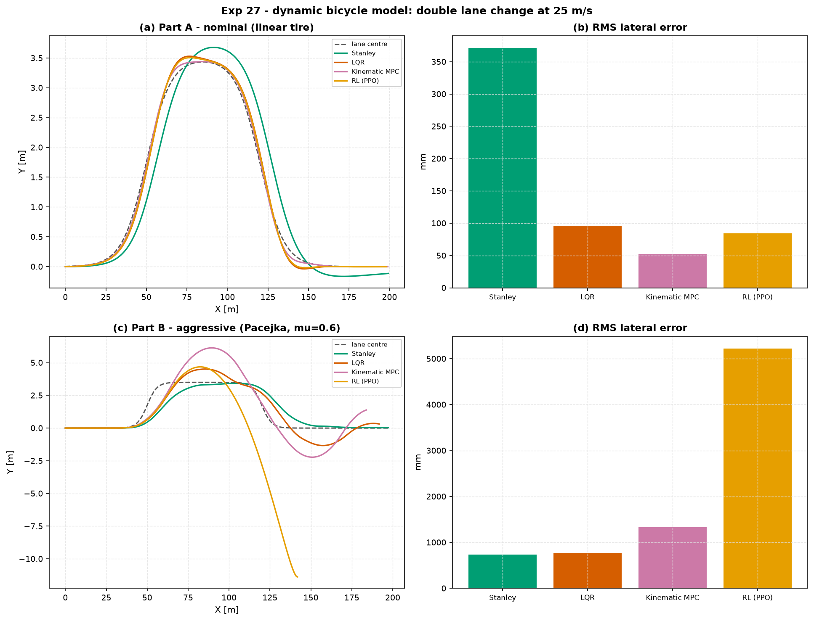

# Experiment 27 — double lane change on the dynamic bicycle model

**Question.** Four controllers — Stanley, LQR, a kinematic-model MPC, and a
from-scratch RL policy — steer the same *dynamic* vehicle (lateral tire
forces, not just kinematics) through an ISO-3888-style double lane change at
25 m/s (~90 km/h). Part A is the gentle nominal manoeuvre every controller's
design or training assumed. Part B swaps in a sharper lane change and a
low-mu Pacejka tire — the same controller instances, never told anything
changed. Who degrades gracefully, and who does not?

Companion: [`aimct.systems.BicycleVehicle`
(linear vs. Pacejka tire models), [Experiment 02](../02_linearization_validity/)
(linearisation validity — this is the same question on a real vehicle),
[Experiment 21 / C9.3](../21_grand_capstone_bakeoff/) (the behaviour-cloned
RL-policy pattern this experiment's RL entry reuses).

## Setup

`BicycleVehicle` — state `[X, Y, ψ, vₓ, v_y, r]`, input `[δ, aₓ]` — is a
mid-size-sedan single-track model (Rajamani-textbook parameters) with a
choice of tire model: **linear** (`Fy = -Cα·α`, valid at small slip) or the
**Pacejka "Magic Formula"** (saturating, eventually *falling* at large slip —
a real loss of grip). All four controllers hold cruise speed with an
identical simple `aₓ` P-controller; the comparison is purely about steering.

| controller | idea |
| :-- | :-- |
| **Stanley** | heading + cross-track steering law, no vehicle model at all |
| **LQR** | linearised about the cruise equilibrium (the *linear-tire* model) |
| **Kinematic MPC** | `LinearMPC` on the **kinematic** bicycle (no tire slip: `Ẏ = vₓ sin ψ`, `ψ̇ = vₓ tan δ / L`), steering the real dynamic vehicle |
| **RL (PPO)** | behaviour-cloned from the LQR expert + a light PPO fine-tune (kept only if it doesn't regress) — plain from-scratch PPO plateaus on this task exactly as it did on the Exp-21/C9.3 quad policy |

```bash
python experiments/27_bicycle_double_lane_change/run.py
AIMCT_EXP_FULL=1 python experiments/27_bicycle_double_lane_change/run.py
```

## Results (`AIMCT_EXP_FULL=1`)

### Part A — nominal (linear tire, gentle lane change)

| controller | rms err (mm) | max err (mm) | peak steer (°) |
| :-- | :-: | :-: | :-: |
| Stanley | 371 | 846 | 1.8 |
| LQR | 96.1 | 187 | 3.0 |
| **Kinematic MPC** | **52.5** | **118** | 3.2 |
| RL (PPO) | 84.3 | 167 | 2.9 |

### Part B — aggressive (Pacejka tire, μ = 0.6, sharper lane change; controllers unchanged)

| controller | rms err (mm) | max err (mm) | peak steer (°) |
| :-- | :-: | :-: | :-: |
| **Stanley** | **734** | **1973** | 12.4 |
| LQR | 768 | 1712 | 30 (saturated) |
| Kinematic MPC | 1326 | 2633 | 30 (saturated) |
| RL (PPO) | **5223** | **11 380** | 30 (saturated) |



## Takeaways

1. **When the model is valid, the model wins.** On the gentle nominal
   manoeuvre, kinematic MPC — which does not even *have* a tire model —
   tracks tightest (52.5 mm), because at this slip level (peak front slip
   angle ≈ 1.7°, deep in the linear regime) tire dynamics genuinely don't
   matter; the geometry alone predicts the vehicle well. Stanley, the only
   model-free entry, is worst by 4–7×.
2. **The ranking completely inverts under stress.** Sharpen the manoeuvre and
   drop the tire to a low-μ Pacejka curve — a swap none of the controllers
   are told about — and Stanley becomes the *best* entry (734 mm), while
   kinematic MPC, which was best in Part A precisely because it ignores tire
   forces, is now second-worst (1326 mm): the assumption that bought it
   precision in Part A is exactly what breaks under load. This is
   Experiment 02's linearisation-validity lesson, one level up: a model that
   is locally accurate can be a liability outside where it was valid, and a
   model-free law that never made the assumption has nothing to unlearn.
3. **LQR degrades the most gracefully of the model-based entries.** It also
   assumed the (wrong) linear tire, but its steering saturates at the true
   30° limit rather than blowing past it, and its RMS error (768 mm) tracks
   Stanley's closely rather than kinematic MPC's much larger degradation —
   feedback on the *true* measured state, even through a wrong internal
   model, still corrects toward the reference every step.
4. **The behaviour-cloned RL policy is catastrophically brittle
   out-of-distribution.** It matches LQR almost exactly in Part A (84.3 vs.
   96.1 mm — cloning worked) but *fails an order of magnitude worse than
   everyone else* in Part B (5223 mm RMS, 11.4 m peak — it drives off the
   road, see panel c). LQR, cloned from the same wrong linear-tire
   assumption, degrades to "merely" 768 mm because it still closes the loop
   on the live state error every step; the frozen policy has memorised a
   state→action mapping with no such structural guarantee once the
   input distribution it was trained on no longer describes the world it is
   deployed in. A perfect student of a model-based controller inherits its
   blind spot *and loses its self-correcting property* — the sharpest
   sim-to-real warning in this repository so far.
5. **Bottom line for picking a controller here:** kinematic MPC or LQR for
   routine driving where tire forces stay small; a model-free law like
   Stanley — or a controller with an explicit tire-force margin/robustness
   term — for anything that might approach the friction limit; and a
   behaviour-cloned policy only inside the exact conditions it was cloned
   under, never as a substitute for the feedback structure of the controller
   it imitates.


## Quantitative Benchmark Table

# Experiment 27 - double lane change on the dynamic bicycle model

## Part A - nominal (25 m/s, 3.5 m shift over ~70 m, linear tire, 8 s)

| controller | rms_err_mm | max_err_mm | final_err_mm | peak_delta_deg | ctrl_energy | status |
| --- | --- | --- | --- | --- | --- | --- |
| Stanley | 371.4 | 845.6 | 114.6 | 1.767 | 0.01138 | OK |
| LQR | 96.06 | 187.1 | 0.05542 | 2.973 | 0.02903 | OK |
| Kinematic MPC | 52.53 | 117.8 | 0.2261 | 3.215 | 0.02785 | OK |
| RL (PPO) | 84.31 | 166.9 | 2.707 | 2.914 | 0.01489 | OK |

## Part B - aggressive (6 m sharpness, Pacejka tire, mu=0.6, controllers unaware of the swap)

| controller | rms_err_mm | max_err_mm | final_err_mm | peak_delta_deg | ctrl_energy | status |
| --- | --- | --- | --- | --- | --- | --- |
| Stanley | 733.7 | 1973 | 32.65 | 12.37 | 0.5062 | OK |
| LQR | 767.8 | 1712 | 314.6 | 30 | 7.897 | OK |
| Kinematic MPC | 1326 | 2633 | 1382 | 30 | 16.01 | OK |
| RL (PPO) | 5223 | 1.138e+04 | 1.138e+04 | 30 | 2.682 | OK |
