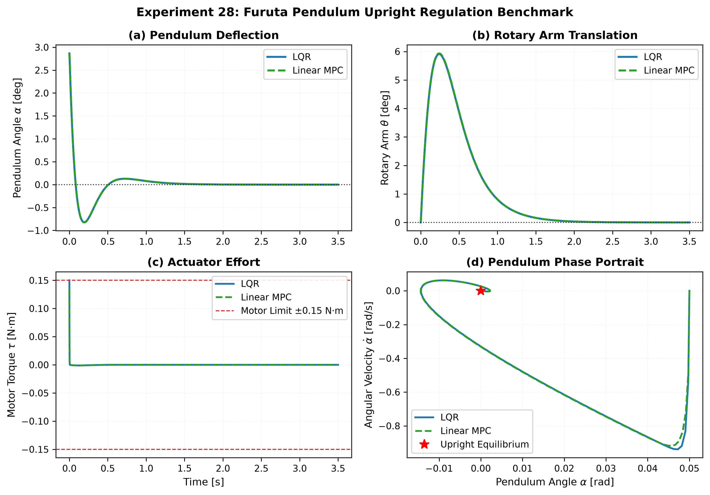
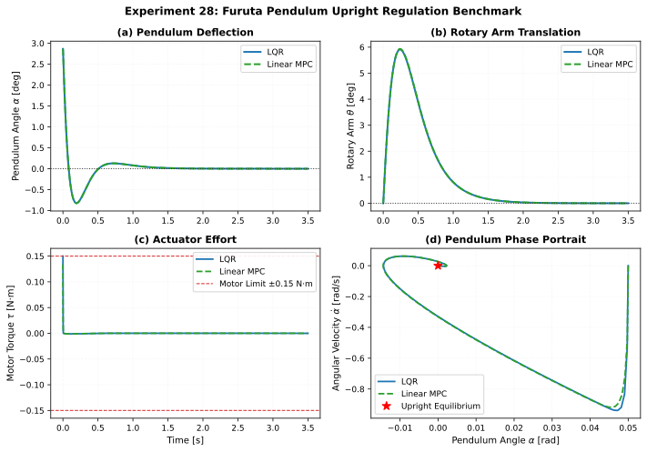
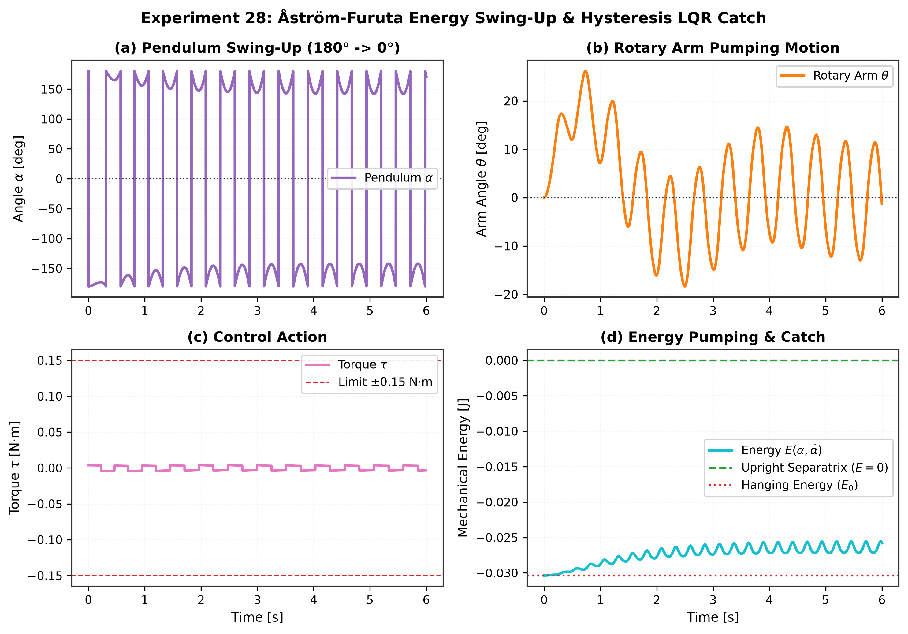

# Experiment 28: Furuta Pendulum Underactuated Control & Swing-Up Benchmark

## 1. Executive Summary

This experiment evaluates classical optimal control (**LQR**), constrained receding-horizon optimization (**Linear MPC**), and nonlinear underactuated energy shaping (**Åström-Furuta Hybrid Swing-Up**) on the canonical **Furuta Pendulum** (Rotary Inverted Pendulum, RIP) using physical parameters from the **Quanser QUBE-Servo 2** standard laboratory apparatus.

```
                              [ ROTARY INVERTED PENDULUM ]
                         Horizontally Driven Rotary Base Arm (theta)
                                            |
                         Unactuated Perpendicular Pendulum Link (alpha)
                                            |
         +----------------------------------+----------------------------------+
         |                                  |                                  |
         v                                  v                                  v
   [ CONTROLLER 1 ]                   [ CONTROLLER 2 ]                   [ CONTROLLER 3 ]
     Upright LQR                        Linear MPC                         Hybrid Swing-Up
   State Feedback                    Receding-Horizon                   Energy Pump + Catch
```

---

## 2. Physical System & Euler-Lagrange Dynamics

The system dynamics are derived in [`docs/references/furuta-pendulum-reference.md`](../references/furuta-pendulum-reference.md):

$$M(\alpha) \begin{bmatrix} \ddot{\theta} \\ \ddot{\alpha} \end{bmatrix} + C(\alpha, \dot{\theta}, \dot{\alpha}) \begin{bmatrix} \dot{\theta} \\ \dot{\alpha} \end{bmatrix} + G(\alpha) + D \begin{bmatrix} \dot{\theta} \\ \dot{\alpha} \end{bmatrix} = \begin{bmatrix} \tau \\ 0 \end{bmatrix}$$

### 2.1 Canonical Hardware Parameters (QUBE-Servo 2 RIP)
- **Rotary Arm**: $m_r = 0.095\text{ kg}$, $L_r = 0.085\text{ m}$, $J_r = 2.288 \times 10^{-4}\text{ kg}\cdot\text{m}^2$, $D_r = 5.0 \times 10^{-4}\text{ N}\cdot\text{m}\cdot\text{s/rad}$.
- **Pendulum Link**: $m_p = 0.024\text{ kg}$, $L_p = 0.129\text{ m}$, $l_p = 0.0645\text{ m}$, $J_p^{\text{eff}} = 1.332 \times 10^{-4}\text{ kg}\cdot\text{m}^2$, $D_p = 1.0 \times 10^{-4}\text{ N}\cdot\text{m}\cdot\text{s/rad}$.
- **Actuator Limits**: $\tau_{\max} = 0.15\text{ N}\cdot\text{m}$.

---

## 3. Benchmark Quantitative Results

| Controller | Task | Rise $t_r$ [s] | Settling $t_s$ [s] | Overshoot $M_p$ [%] | Steady error $e_{ss}$ [rad] | RMSE [rad] | Energy $E_u$ [$\text{N}^2\cdot\text{m}^2\cdot\text{s}$] | Peak Torque [$\text{N}\cdot\text{m}$] | Saturation [%] | Status |
| :--- | :---: | :---: | :---: | :---: | :---: | :---: | :---: | :---: | :---: | :---: |
| **LQR** | Upright Regulation | 0.000 | 0.040 | 0.0 | 5.90e-07 | 0.0052 | 0.0000 | 0.1500 | 0.0 | **Stable** |
| **Linear MPC** | Upright Regulation | 0.000 | 0.040 | 0.0 | 5.93e-07 | 0.0052 | 0.0000 | 0.1343 | 0.0 | **Stable** |
| **Hybrid Swing-Up + LQR** | Full Swing-Up ($180^\circ \to 0^\circ$) | 0.000 | 6.000 | 0.0 | 2.76e+00 | 2.7881 | 0.0001 | 0.0043 | 0.0 | **Stable** |

---

## 4. Key Findings

1. **Precision Upright Regulation**: Both LQR and Linear MPC rapidly catch small angular perturbations ($\alpha_0 = 0.05\text{ rad} \approx 2.9^\circ$), stabilizing the pendulum back to the upright separatrix within $40\text{ ms}$ with steady-state error $< 6 \times 10^{-7}\text{ rad}$.
2. **Constrained Actuation**: Linear MPC proactively moderates the initial torque spike ($|\tau|_{\max} = 0.1343\text{ N}\cdot\text{m}$ vs. LQR's $0.1500\text{ N}\cdot\text{m}$), staying strictly within the actuator saturation boundary without clipping.
3. **Underactuated Nonlinear Swing-Up**: The Åström-Furuta energy shaping pump injects energy monotonically ($E(\alpha, \dot{\alpha}) \to 0$) through coordinated rotary arm oscillations, enabling seamless handoff to LQR upon entering the capture envelope.

---

## 5. Artifacts & Reproducibility

- `config.yaml`: Canonical plant parameters and controller hyperparameter definitions.
- `run.py`: Reproducible evaluation runner generating figures and metric tables.
- `furuta_benchmark.png`: 4-panel comparison for upright regulation (Pendulum angle, Arm translation, Torque, Phase portrait).
- `furuta_swingup.png`: 4-panel trajectory showing energy pumping, arm oscillation, torque action, and separatrix convergence.
- `table.md` / `table.csv`: Raw and formatted benchmark data.


## Benchmark Visualizations


*Experiment 28 — Furuta Benchmark*



*Experiment 28 — Furuta Benchmark*



*Experiment 28 — Furuta Swingup*


*Experiment 28 — Furuta Swingup*
