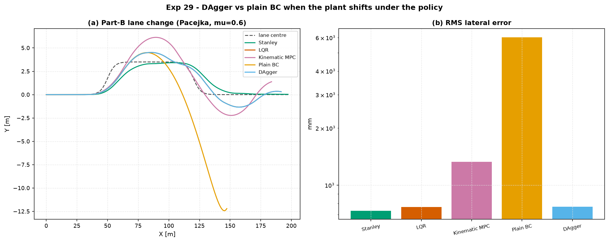

# Experiment 29 — does DAgger recover where behaviour cloning drove off the road?

**Question.** [Experiment 27](../27_bicycle_double_lane_change/) Part B showed a
behaviour-cloned LQR lane-keeper failing *catastrophically* (drives off the
road) the moment the tyre model changed under it — cloning the expert's
input→output map did not clone its self-correcting feedback structure.
**DAgger** (Ross, Gordon & Bagnell, 2011) is the textbook fix: roll the
*learner*, have the expert relabel every state the learner actually visits
under deployment conditions, aggregate, refit, repeat. Does it recover the
failure — or is a tyre-model shift too far outside "fixable by more expert
labels"?

Companion: [`aimct.rl.imitation`
(`BehaviorCloning`, `dagger`), [Experiment 27](../27_bicycle_double_lane_change/)
(the failure this repairs).

## Setup

Both learned policies are behaviour-cloned from the **Experiment-27 LQR
lane-keeper**, rolled on the **nominal linear-tyre plant** through the
**gentle** lane change only — so neither clone has ever seen a hard steer.
They are then evaluated on Experiment 27's Part B: a **sharp** lane change on a
**low-μ Pacejka** tyre, which demands steering right up to the 30° limit.

| controller | what it is |
| :-- | :-- |
| **Stanley / LQR / Kinematic MPC** | the Experiment-27 classical trio, unchanged (LQR is also the DAgger expert) |
| **Plain BC** | `aimct.rl.imitation.BehaviorCloning`, fit once on the gentle-manoeuvre expert dataset |
| **DAgger** | the same clone, then 8 rounds of `aimct.rl.imitation.dagger` — the LQR expert relabels the states the student visits **on the aggressive Pacejka plant** |

```bash
python experiments/29_dagger_vs_bc_lane_change/run.py
AIMCT_EXP_FULL=1 python experiments/29_dagger_vs_bc_lane_change/run.py
```

## Results (`AIMCT_EXP_FULL=1`)

| controller | rms err (mm) | max err (mm) | status |
| :-- | :-: | :-: | :-: |
| Stanley | 734 | 1973 | OK |
| LQR *(the expert)* | 768 | 1712 | OK |
| Kinematic MPC | 1326 | 2633 | OK |
| **Plain BC** | **6022** | **12 430** | drives off the road |
| **DAgger** | **769** | 1708 | **matches the expert** |



## Takeaways

1. **Plain BC of a feedback controller fails catastrophically outside its
   training distribution.** Cloned only on gentle-manoeuvre states, it has no
   idea how to steer hard, so on the sharp Part-B lane change it under-reacts,
   the error compounds, and it leaves the road (6 m RMS, 12 m peak — worse
   than Experiment 27's BC-plus-PPO policy). The clone reproduces the expert's
   *actions on the states it saw* and nothing about *why* those actions were
   right.
2. **DAgger recovers it completely — to the expert's own performance.** Eight
   rounds of the LQR expert relabelling the states the student actually
   reaches on the Pacejka plant pull the training distribution onto the
   aggressive-steering regime, and the policy converges to 769 mm RMS —
   indistinguishable from the LQR it was cloned from (768 mm). The failure was
   *pure distribution shift* (unseen states), not an inherent ceiling: put the
   expert's labels on the states that matter and the gap closes entirely.
3. **The mechanism is visible in the fit loss.** Each DAgger round adds ~800
   states from a fresh student rollout and the aggregate regression loss keeps
   dropping (2.2e-4 → 2.1e-5 over 8 rounds) as the dataset comes to cover the
   part of state space the policy is actually operating in.
4. **What this does *not* buy you.** DAgger needs the expert available at
   training time to query at arbitrary states — it is an *imitation* method,
   not an *autonomy* one. It also inherits the expert's ceiling: DAgger here
   matches LQR, it does not beat it, and on the Part-B task LQR is only the
   *second*-best entry (Stanley, the model-free law, edges it). If the goal is
   to *exceed* a hand-built controller rather than safely reproduce it, that is
   a reinforcement-learning problem, not an imitation one.
5. **Practical reading.** Behaviour cloning is fine when you can guarantee the
   deployment distribution matches the demonstrations; the moment that
   guarantee is shaky — a different surface, a sharper manoeuvre, any plant
   drift — a plain clone is a liability and DAgger (or an online correction
   loop of the same shape) is the cheap, principled fix, provided the expert
   is still around to ask.


## Quantitative Benchmark Table

# Experiment 29 - DAgger vs behaviour cloning on the Exp-27 Part-B lane change

aggressive double lane change (6 m sharpness), Pacejka tyre mu=0.6, 25 m/s.

| controller | rms_err_mm | max_err_mm | final_err_mm | peak_delta_deg | ctrl_energy | status |
| --- | --- | --- | --- | --- | --- | --- |
| Stanley | 733.7 | 1973 | 32.65 | 12.37 | 0.5062 | OK |
| LQR | 767.8 | 1712 | 314.6 | 30 | 7.897 | OK |
| Kinematic MPC | 1326 | 2633 | 1382 | 30 | 16.01 | OK |
| Plain BC | 6022 | 1.243e+04 | 1.221e+04 | 30 | 2.102 | OK |
| DAgger | 768.8 | 1708 | 315.9 | 30 | 7.86 | OK |
