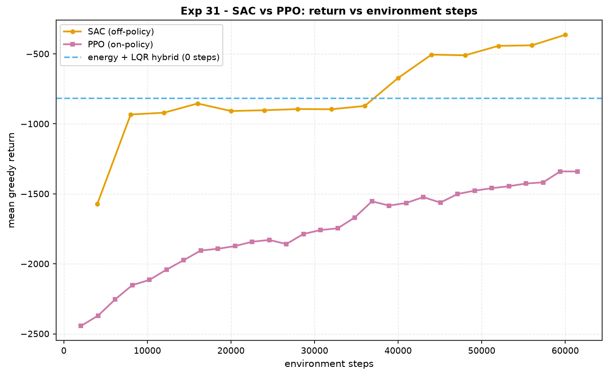

# Experiment 31 — SAC vs PPO: the sample-efficiency axis

**Question.** PPO is *on-policy* — every gradient step throws its rollouts
away. SAC is *off-policy* — a replay buffer lets it reuse every transition
many times, and that is supposed to buy a large factor in **environment
steps** (the quantity that costs money on real hardware) to reach a given
return. How large, on the pendulum swing-up, and where does each land
relative to a classical controller that needs *zero* environment steps?

Companion: [`aimct.rl.sac` (from-scratch SAC —
squashed-Gaussian actor, twin critics, auto-tuned temperature),
[`aimct.rl.ppo`,
[Experiments 07 / 11](../07_cartpole_swingup_hybrid/) (the energy-shaping +
LQR swing-up hybrid).

## Setup

`aimct.rl.make("pendulum-swingup")` — `Pendulum`, torque ±4 N·m, 250 steps per
episode, reward `-(angle_error² + 1e-3·torque²)` per step (a fully upright,
still policy scores ≈ 0; hanging scores ≈ −2500). The x-axis of every plot is
**environment steps**, not wall-clock and not gradient steps.

| method | what |
| :-- | :-- |
| **SAC** | off-policy, `(128,128)` nets, replay buffer 50 k, auto temperature to entropy target `−1` |
| **PPO** | on-policy, `(64,64)` nets, 2048-step rollouts |
| **Energy + LQR hybrid** | Åström energy pump to the upright separatrix + an LQR catch near the top — zero training |

```bash
python experiments/31_sac_vs_ppo_sample_efficiency/run.py
AIMCT_EXP_FULL=1 python experiments/31_sac_vs_ppo_sample_efficiency/run.py
```

## Results (`AIMCT_EXP_FULL=1`, 60 000-step budget)

| method | final eval return | env steps to reach −966 |
| :-- | :-: | :-: |
| **SAC** | **−364** | **8 000** |
| PPO | −1340 | not reached in 60 000 |
| Energy + LQR hybrid | −816 | 0 (no training) |

("−966" = the hybrid's return minus 150 — "within striking distance of the
classical law".)



## Takeaways

1. **SAC reaches the classical controller's performance ~15–20× faster than
   PPO — in environment steps.** SAC clears the −966 bar at **8 000** steps;
   PPO is still 370 return short of it at **60 000** and climbing slowly
   (extrapolating its curve, it needs well over 100 k). The mechanism is
   exactly the textbook one: PPO discards each batch of rollouts after one
   update, SAC's replay buffer reuses every transition dozens of times, and on
   a task where each environment step is the expensive resource that ratio is
   the whole ballgame.
2. **SAC then *beats* the hand-built hybrid.** By 37 k steps it crosses the
   energy-shaping + LQR reference line, and by 60 k it reaches −364 versus the
   hybrid's −816 — it has found a swing-up that spends less time off-upright
   than the two-mode classical law. This is the counterpoint to
   [Experiment 29](../29_dagger_vs_bc_lane_change/): imitation inherits the
   expert's ceiling, reinforcement learning does not.
3. **The learning curve is not monotone-smooth.** SAC jumps to ≈ −900 by 8 k,
   then *plateaus* for ~30 k steps before a second improvement phase down to
   −364. The plateau is a real feature — the entropy temperature has annealed
   to ≈ 0.05 and the policy is exploiting a "swing up, then hold roughly
   upright" solution; the later gain is it refining the catch and the
   approach. A fixed step budget that stopped at 30 k would have badly
   under-sold SAC here.
4. **The temperature auto-tunes as advertised.** `alpha` falls from ≈ 0.74 at
   4 k steps (wide exploration, the policy knows nothing) to ≈ 0.05 by 16 k
   and holds there — the entropy-target mechanism trades exploration for
   exploitation on its own, no schedule to tune.
5. **When to reach for which.** If you have a good analytic model and the task
   fits a classical pattern, the hybrid is free and instant — start there.
   If you must learn from interaction and every rollout is cheap (a fast
   simulator), PPO's simplicity is fine. If interaction is the bottleneck —
   real hardware, a slow simulator, a safety-limited rig — SAC's replay reuse
   is worth the extra moving parts (twin critics, target nets, temperature),
   and it can exceed a hand-tuned controller given the budget.


## Quantitative Benchmark Table

# Experiment 31 - SAC vs PPO: sample efficiency on pendulum swing-up

pendulum swing-up, 60000 env-step budget, greedy eval every 4000.

'steps to threshold' = env steps to first reach return >= -966 (the hybrid's return minus 150).

| method | final eval return | steps to threshold |
| --- | --- | --- |
| SAC | -363.6 | 8000 |
| PPO | -1339.9 | n/a |
| Energy + LQR hybrid | -815.8 | 0 (no training) |
