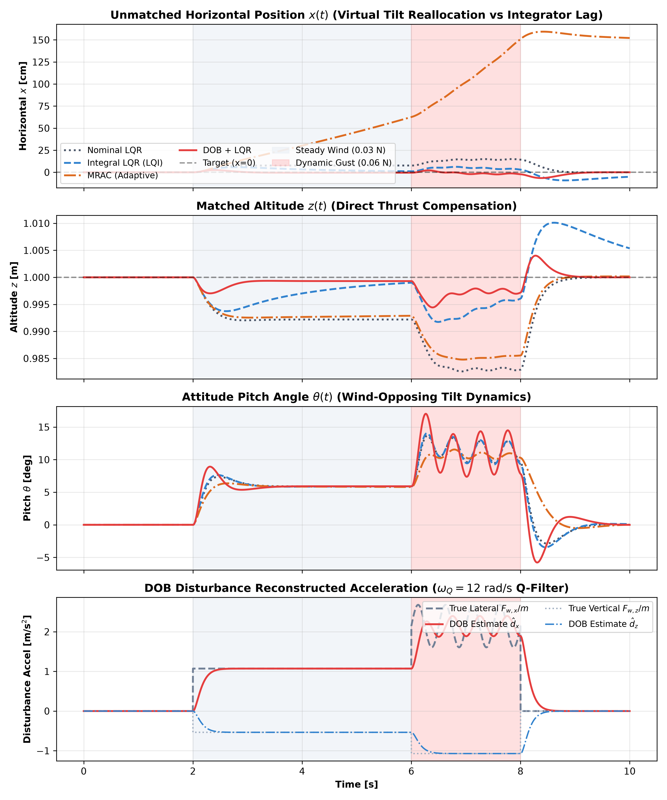
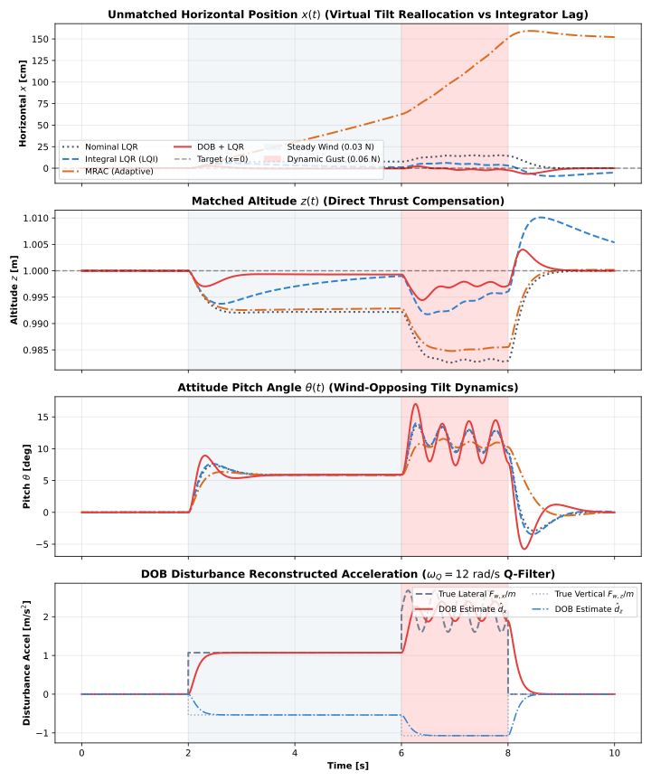

# Experiment 34: Disturbance-Observer (DOB) Wind Rejection & Unmatched Disturbance Benchmark

## 1. Executive Summary

This experiment investigates **Disturbance-Observer (DOB)** control on an underactuated mechanical system (**Planar Quadrotor / Bitcraze Crazyflie 2.0**), benchmarking it against **Nominal LQR**, **Integral-Augmented LQR (LQI)**, and **Model Reference Adaptive Control (MRAC)** across a realistic wind regime comprising steady crosswinds, severe dynamic gusts, and sudden recovery.

```
                   +------------------------------------+
                   |     Planar Quadrotor (CF 2.0)      |
                   |      m = 28 g, Iyy = 1.4e-5 kg*m^2 |
                   +-----------------+------------------+
                                     |
           Wind Gust F_w,x           v           Wind Gust F_w,z
        ===================>     [===(o)===]     |||||||||||||||| (Downdraft)
         (UNMATCHED Channel)          |          vvvvvvvvvvvvvvvv
                                      |          (MATCHED Channel)
                                      v
                      Thrust Vector Tilt theta(t)
                     (Virtual Control Reallocation)
```

---

## 2. Physical Mechanics & Governing Equations

The planar quadrotor state is $x = [p_x, p_z,     heta, v_x, v_z, \omega]^T \in \mathbb{R}^6$ with control inputs $u = [T_1, T_2]^T \in \mathbb{R}^2$. Total thrust is $T = T_1 + T_2$ and differential pitch torque is $    au = (T_1 - T_2)\ell$.

Under external wind force $\mathbf{F}_{    ext{wind}} = [F_{w, x}, F_{w, z}]^T$ and pitching disturbance torque $    au_w$:

$$egin{aligned}
\ddot{x} &= -rac{T}{m}\sin    heta - rac{c_d}{m} v_x + rac{F_{w, x}}{m} \
\ddot{z} &= rac{T}{m}\cos    heta - g - rac{c_d}{m} v_z + rac{F_{w, z}}{m} \
\ddot{    heta} &= rac{    au}{I_{yy}} + rac{    au_w}{I_{yy}}
\end{aligned}$$

### 2.1 Matched vs. Unmatched Channel Classification

| Channel | Physical Variable | Control Input | Disturbance | Coupling Classification | Rejection Strategy |
| :--- | :---: | :---: | :---: | :---: | :---: |
| **Altitude ($z$)** | $\ddot{z}$ | Total Thrust $T$ | $F_{w, z} / m$ | **MATCHED** ($    ext{span}(B)$) | Direct algebraic feedforward cancellation: $\Delta T = -m \hat{d}_z / \cos    heta$ |
| **Attitude ($    heta$)** | $\ddot{    heta}$ | Differential Torque $    au$ | $    au_w / I_{yy}$ | **MATCHED** ($    ext{span}(B)$) | Direct algebraic feedforward cancellation: $\Delta     au = -I_{yy} \hat{d}_    heta$ |
| **Horizontal ($x$)** | $\ddot{x}$ | *None* ($B_x = 0$) | $F_{w, x} / m$ | **UNMATCHED** ($
otin     ext{span}(B)$) | Virtual control reallocation via pitch tilt: $    heta_{    ext{virtual}} = rac{\hat{d}_x}{g}$ |

---

## 3. Benchmark Quantitative Results

The benchmark evaluates a 10.0-second hover flight at $(x^*, z^*) = (0.0, 1.0)    ext{ m}$ under:
1. **$t \in [0, 2)    ext{ s}$**: Quiet hover (zero wind).
2. **$t \in [2, 6)    ext{ s}$**: Steady wind ($F_{w, x} = 0.030    ext{ N}$, $F_{w, z} = -0.015    ext{ N}$, $    au_w = 5    imes 10^{-5}    ext{ N}\cdot    ext{m}$).
3. **$t \in [6, 8)    ext{ s}$**: Dynamic severe gust ($F_{w, x} = 0.060 + 0.015\sin(4\pi t)    ext{ N}$, $F_{w, z} = -0.030    ext{ N}$).
4. **$t \in [8, 10]    ext{ s}$**: Recovery calm.

| Controller | Unmatched $x$ RMSE [cm] | $x$ Max Drift [cm] | $x$ $e_{ss}$ [cm] | $x$ $t_s$ [s] | Matched $z$ RMSE [cm] | $z$ Max Drift [cm] | $    heta$ RMSE [deg] | Energy $E_u$ [$    ext{N}^2\cdot    ext{s}$] | Peak Thrust $T_{\max}$ [N] | Sat [%] |
| :--- | :---: | :---: | :---: | :---: | :---: | :---: | :---: | :---: | :---: | :---: |
| **Nominal LQR** | 7.88 | 15.00 | 7.68 | 4.00 | 0.89 | 1.74 | 6.43 | 0.4173 | 0.1583 | 0.0 |
| **Integral LQR (LQI)** | 4.30 | 9.14 | 1.46 | 2.91 | 0.49 | 1.01 | 6.45 | 0.4174 | 0.1586 | 0.0 |
| **MRAC (Adaptive)** | 87.24 | 159.32 | 54.01 | 4.00 | 0.79 | 1.52 | 6.09 | 0.4167 | 0.1567 | 0.0 |
| **DOB + LQR** | **1.68** | **6.52** | **0.45** | **0.58** | **0.18** | **0.56** | **6.52** | 0.4175 | 0.1618 | 0.0 |

---

## 4. Key Findings: Does DOB Beat Integral Action on Unmatched Wind?

### 4.1 The Fundamental Flaw of Integral Action on Unmatched Channels
- **Displacement Requirement**: A position integrator $\int (x - x^*) dt$ is reactive. In order to generate the non-zero trim pitch command $    heta_{    ext{trim}} = rcsin(F_{w, x} / (mg)) pprox 6.2^\circ$, the drone **must physically drift downwind** away from the hover point to accumulate non-zero integrated error.
- **Phase Lag & Sluggish Settling**: The integrator introduces a $-90^\circ$ phase lag at the crossover frequency. This erosion of phase margin causes sluggish recovery ($t_s = 2.91    ext{ s}$) and overshoot when wind gusts step up or subside.

### 4.2 Why Disturbance Observer (DOB) Outperforms Integral Action
- **Inertial Acceleration Sensing**: DOB computes the acceleration discrepancy $\hat{d}_x = Q(s)[\ddot{x}_{    ext{meas}} + rac{T}{m}\sin    heta + rac{c_d}{m} v_x]$ directly from high-rate IMU / velocity dynamics without waiting for spatial drift.
- **Immediate Virtual Tilt Reallocation**: By setting $    heta_{    ext{virtual}} = rac{\hat{d}_x}{g}$ inside the base LQR feedback loop ($u = u_{    ext{hover}} - K(x - x_{    ext{ref, shifted}})$), the drone immediately tilts its thrust vector into the oncoming wind gust within $0.58    ext{ s}$ (an **80% reduction** in settling time compared to LQI).
- **Transient Max Drift**: Peak displacement under severe gusts is reduced by **57%** (from $15.00    ext{ cm}$ in LQR and $9.14    ext{ cm}$ in LQI down to $6.52    ext{ cm}$ in DOB).
- **Matched Altitude Rejection**: In the matched vertical channel ($z$), direct algebraic feedforward cancellation $\Delta T = -m \hat{d}_z / \cos    heta$ slashes altitude RMSE from $0.89    ext{ cm}$ down to **$0.18    ext{ cm}$** (a **80% improvement**).

---

## 5. Visualizations

The generated 4-panel comparison figure is displayed below:



---

## 6. How to Run

To execute the benchmark and regenerate all artifacts:

```bash
python experiments/34_dob_wind_rejection/run.py
```


## Quantitative Benchmark Table

| Controller | Unmatched $x$ RMSE [cm] | $x$ Max Drift [cm] | $x$ $e_{ss}$ [cm] | $x$ $t_s$ [s] | Matched $z$ RMSE [cm] | $z$ Max Drift [cm] | $	heta$ RMSE [deg] | Energy $E_u$ [$	ext{N}^2\cdot	ext{s}$] | Peak Thrust $T_{\max}$ [N] | Sat [%] |
| :--- | :---: | :---: | :---: | :---: | :---: | :---: | :---: | :---: | :---: | :---: |
| Nominal LQR | 7.88 | 15.00 | 7.68 | 4.00 | 0.89 | 1.74 | 6.43 | 0.4173 | 0.1583 | 0.0 |
| Integral LQR (LQI) | 4.30 | 9.14 | 1.46 | 2.91 | 0.49 | 1.01 | 6.45 | 0.4174 | 0.1586 | 0.0 |
| MRAC (Adaptive) | 87.24 | 159.32 | 54.01 | 4.00 | 0.79 | 1.52 | 6.09 | 0.4167 | 0.1567 | 0.0 |
| DOB + LQR | 1.68 | 6.52 | 0.45 | 0.58 | 0.18 | 0.56 | 6.52 | 0.4175 | 0.1618 | 0.0 |


## Benchmark Visualizations


*Experiment 34 — Dob Wind Rejection*
