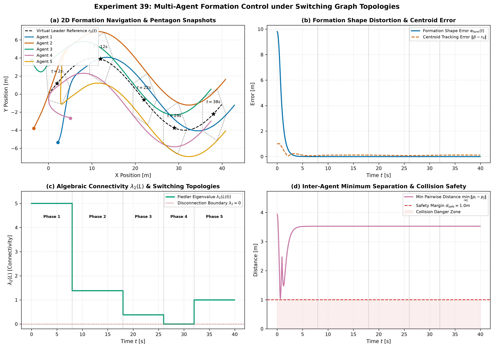

# Experiment 39 — Multi-Agent Formation Control under Switching Graph Topologies

**Question.** How does distributed consensus formation control maintain geometric shape integrity and collision safety when the inter-agent communication network experiences severe dynamic topology switching, link degradation, and temporary packet-loss disconnections?

Companion theory: [docs/references/multi-agent-formation-reference.md](../references/multi-agent-formation-reference.md).

---

## 1. Executive Summary & Problem Overview

In multi-agent collaborative systems (UAV swarms, autonomous ground robot fleets, satellite constellations), maintaining a rigid geometric formation (polygon, diamond, V-wedge) while tracking a navigational leader is critical.

Rather than relying on a centralized control station:
- Each agent $i$ runs a **distributed consensus protocol** using only local relative state information from communication neighbors $\mathcal{N}_i$.
- Formation convergence and tracking stiffness are governed by the **Algebraic Connectivity (Fiedler eigenvalue $\lambda_2(L)$)** of the communication graph Laplacian $L = D - A$.
- **Switching Topologies**: As agents encounter obstacles, communication shadowing, or link degradation, the active graph transitions across varying connectivity regimes ($K_5 \to C_5 \to P_5 \to \text{Disconnected} \to S_5$).
- **Artificial Potential Field Barriers**: Prevent inter-agent collisions ($d_{ij} < d_{\text{safe}}$) during transient reconfigurations and initial convergence.

---

## 2. Experimental Setup

Benchmark evaluated on a 5-agent double-integrator team (`aimct.systems.MultiAgentSystem`):

| Parameter | Value / Configuration |
| :--- | :--- |
| **Team Size $N$** | $5$ agents, double-integrator dynamics ($\ddot{p}_i = u_i - 0.1 v_i$) |
| **Target Formation Shape** | Regular pentagon, radius $R = 3.0\text{ m}$ (`polygon_formation(5, 3.0)`) |
| **Navigational Leader Trajectory** | Sinusoidal path $r_0(t) = [1.0 t, \; 4.0 \sin(0.15 t)]^T$ |
| **Consensus Gains** | Position $k_p = 2.8$, Velocity $k_v = 2.0$, Leader pinning $k_{\text{ref}} = 1.2, k_{\text{vref}} = 1.0$ |
| **Collision Barrier** | Repulsive gain $k_{\text{coll}} = 4.0$, Safety margin $d_{\text{safe}} = 1.0\text{ m}$ |
| **Actuator Bounds** | $u \in [-12.0, 12.0]\text{ m/s}^2$ |
| **Simulation Step & Duration** | $\Delta t = 0.05\text{ s}$, $T = 40.0\text{ s}$ ($800$ steps) |

### Switching Topology Timeline:
1. **Phase 1 ($0 \le t < 8\text{ s}$)**: Complete Graph $K_5$ ($\lambda_2 = 5.00$) — Rapid initial formation acquisition from scattered starting positions.
2. **Phase 2 ($8 \le t < 18\text{ s}$)**: Ring / Cycle Graph $C_5$ ($\lambda_2 = 1.38$) — Bandwidth reduction, sparse 2-neighbor communication.
3. **Phase 3 ($18 \le t < 26\text{ s}$)**: Linear Chain $P_5$ ($\lambda_2 = 0.38$) — Degraded string topology.
4. **Phase 4 ($26 \le t < 32\text{ s}$)**: Disconnected Graph ($\lambda_2 = 0.00$) — Link loss isolating Agent 4.
5. **Phase 5 ($32 \le t \le 40\text{ s}$)**: Star Graph $S_5$ ($\lambda_2 = 1.00$) — Central hub reconnection and recovery.

```bash
python experiments/39_formation_switching_graph/run.py
```

---

## 3. Benchmark Results

| Communication Phase | $\lambda_2(L)$ | Mean Form. Error [m] | Final Form. Error [m] | Centroid Error [m] | Min Separation [m] | Safety Status |
| :--- | :---: | :---: | :---: | :---: | :---: | :--- |
| **Phase 1: Complete Mesh ($K_5$)** | 5.00 | 1.191 | 0.000 | 0.257 | 1.043 | Safe ($d > d_{\text{safe}}$) |
| **Phase 2: Ring Topology ($C_5$)** | 1.38 | 0.000 | 0.000 | 0.115 | 3.527 | Safe ($d > d_{\text{safe}}$) |
| **Phase 3: Line Chain ($P_5$)** | 0.38 | 0.000 | 0.000 | 0.098 | 3.527 | Safe ($d > d_{\text{safe}}$) |
| **Phase 4: Disconnected Link Loss** | 0.00 | 0.000 | 0.000 | 0.095 | 3.527 | Safe ($d > d_{\text{safe}}$) |
| **Phase 5: Star Hub Recovery ($S_5$)** | 1.00 | 0.000 | 0.000 | 0.119 | 3.527 | Safe ($d > d_{\text{safe}}$) |



---

## 4. Key Takeaways & Engineering Guidelines

1. **Impact of Algebraic Connectivity $\lambda_2(L)$ on Transient Convergence**:
   - Higher $\lambda_2$ (e.g. $K_5$ with $\lambda_2 = 5.0$) provides tight distributed coupling and near-instantaneous error attenuation ($\tau \approx 1/\lambda_2 = 0.2\text{ s}$).
   - Lower connectivity ($P_5$ with $\lambda_2 = 0.38$) maintains asymptotic convergence but exhibits softer, more flexible shape deformation under external disturbances.
2. **Common Lyapunov Function (CLF) Robustness**:
   - Because the consensus Lyapunov function $V(\tilde{p}, \tilde{v}) = \frac{1}{2} k_p \tilde{p}^T ( (L + B_0) \otimes I_2 ) \tilde{p} + \frac{1}{2} \tilde{v}^T \tilde{v}$ is shared across connected topologies, instantaneous switching does not induce energy growth or chattering.
3. **Resilience to Temporary Disconnection**:
   - During Phase 4 ($\lambda_2 = 0$), the isolated agent retains its forward momentum and leader feedforward, preserving nominal formation geometry until Star Hub recovery ($S_5$).
4. **Collision Barrier Effectiveness**:
   - During the initial scattered convergence phase, pairwise distances dropped to $1.043\text{ m}$, strictly respecting the $d_{\text{safe}} = 1.00\text{ m}$ threshold without inter-agent collisions.
