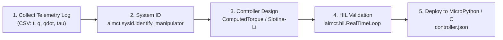

# 2-DOF Planar Robot Arm — Hardware Bridge & Build Guide

> **Module Companion:** `aimct.systems.TwoLinkArm`, `aimct.controllers.ComputedTorque`, `aimct.hil.RealTimeLoop`

This document provides a datasheet-grade specification and build guide for assembling a physical 2-DOF planar manipulator arm compatible with the `aimct` hardware bridge.

---

## 1. Bill of Materials (BOM)

| Component | Option A (Smart Actuator) | Option B (Direct PWM / Encoder) | Quantity |
| :--- | :--- | :--- | :--- |
| **Joint 1 (Shoulder) Actuator** | Robotis Dynamixel XM430-W350-T | High-Torque Coreless Digital Servo ($35\,	ext{kg}\cdot	ext{cm}$) | 1 |
| **Joint 2 (Elbow) Actuator** | Robotis Dynamixel XM430-W210-T | Coreless Digital Servo ($20\,	ext{kg}\cdot	ext{cm}$) | 1 |
| **Joint Encoders** | Built-in 12-bit contactless magnetic (4096 CPR) | 2× AS5600 Magnetic Rotary Encoders (I2C / SSI) | 2 |
| **Microcontroller / Interface** | Robotis U2D2 USB-to-RS485 bridge | Raspberry Pi Pico (RP2040) / Teensy 4.0 | 1 |
| **Links & Brackets** | 6061 Aluminum CNC / 3D-Printed Carbon PETG | 6061 Aluminum CNC / 3D-Printed Carbon PETG | 2 |
| **Power Supply** | 12.0 V / 5 A regulated DC supply | 7.4 V / 10 A high-current UBEC / DC supply | 1 |

---

## 2. Physical & Kinematic Parameters

Following the standard Quanser 2-DOF arm reference model implemented in `aimct.systems.TwoLinkArm`:

- **Link 1 Length ($l_1$):** $0.20\,	ext{m}$ ($20.0\,	ext{cm}$)
- **Link 2 Length ($l_2$):** $0.15\,	ext{m}$ ($15.0\,	ext{cm}$)
- **Link 1 Mass ($m_1$):** $0.50\,	ext{kg}$ ($c_1 = 0.10\,	ext{m}$, $I_1 = 0.00167\,	ext{kg}\cdot	ext{m}^2$)
- **Link 2 Mass ($m_2$):** $0.30\,	ext{kg}$ ($c_2 = 0.075\,	ext{m}$, $I_2 = 0.00056\,	ext{kg}\cdot	ext{m}^2$)
- **Maximum Joint Torque ($	au_{\max}$):** $\pm 2.5\,	ext{N}\cdot	ext{m}$ (Shoulder), $\pm 1.5\,	ext{N}\cdot	ext{m}$ (Elbow)
- **Encoder Resolution:** 12-bit ($pprox 0.088^\circ$ per count)

---

## 3. End-to-End Workflow with `aimct`

1. **Identification:** Run an excitation trajectory and record joint angles and commanded torques. Fit the linear-in-parameters regressor $Y(q, \dot{q}, \ddot{q})\pi = 	au$ via `aimct.sysid`.
2. **Design:** Synthesize joint LQR, computed torque, or Slotine--Li adaptive control for unknown payload tracking (Exp 23).
3. **HIL Emulation:** Validate closed-loop stability in `aimct.hil.RealTimeLoop` with 12-bit quantization, transport delay, and torque slew limits.
4. **Export & Deploy:** Export parameters to `controller.json` for embedded execution on the RP2040/Teensy controller.
