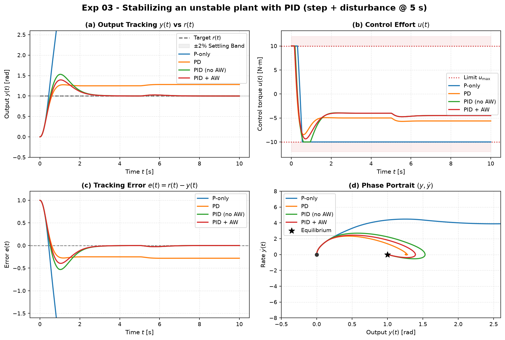

# Experiment 03 — PID stabilizes an open-loop unstable plant

**Question.** Can PID asymptotically stabilize an open-loop unstable plant (a
right-half-plane pole), reject a step disturbance, and stay recoverable under
actuator saturation — and what does each term (P, D, I, anti-windup) actually buy?

Companion theory: [`modules/03-classical-control/04-worked-example-unstable-system.md`](../../modules/03-classical-control/04-worked-example-unstable-system.md).

## Setup

Plant (state `[y, ẏ]`), open-loop poles at `s = ±ω₀`:

```
ÿ − ω₀² y = u + d        ω₀ = 2  (pole at s = +2 is unstable)
```

- Unit step reference `r = 1`, zero initial state.
- Step **input disturbance** `d = 0.5` applied at `t = 5 s`.
- Actuator saturation `|u| ≤ 10` (tightened from the note's 25 so that integrator
  windup genuinely occurs — see "Deviations" below).
- `dt = 1e-3`, `T = 10 s`, RK4. Design target `ωₙ = 4`, `ζ = 0.707` ⇒
  `Kp = ωₙ² + ω₀² = 20`, `Kd = 2ζωₙ ≈ 5.66`, `Ki = 15`, filtered derivative `N = 10`.

Run it:

```bash
python experiments/03_pid_stabilizes_unstable/run.py
```

Outputs (committed): `table.md`, `table.csv`, `figure.png`.

## Results

| controller | rise_time | settling_time | overshoot % | steady-state error | IAE | ITAE | control energy | saturation % |
| --- | --- | --- | --- | --- | --- | --- | --- | --- |
| P-only      | 0.28 | — (diverges) | 9.5e9 | 6.0e7 | 4.8e7 | 4.5e8 | 984 | 97.6 |
| PD          | 0.39 | — (biased)   | 28.2  | **0.281** | 2.81 | 13.6 | 316 | 1.6 |
| PID (no AW) | 0.33 | 6.16 | 53.1 | 3.9e-5 | 0.927 | 1.04 | 262 | 5.5 |
| PID + AW    | 0.36 | 6.16 | **39.4** | 3.9e-5 | **0.798** | **0.876** | **245** | 1.6 |



## Takeaways

1. **P-only cannot stabilize it.** Closed loop is `s² + (Kp − ω₀²)`; for `Kp > ω₀²`
   the poles sit on the imaginary axis (zero damping), and once the actuator
   saturates on this RHP plant the response diverges. Proportional feedback alone
   has no phase lead to damp an unstable pole.
2. **D buys damping, not accuracy.** PD places both poles in the LHP and the system
   is stable, but the closed-loop DC gain from `r` is `Kp / (Kp − ω₀²) = 20/16 =
   1.25`, so PD tracks the unit step with a **permanent 25 % offset** (plus extra
   error from the disturbance). No free integrator in the plant ⇒ finite loop gain
   at DC ⇒ steady-state error.
3. **I removes the offset.** PID drives steady-state error to ~0 for both the step
   and the disturbance, at the cost of extra overshoot from the integral state.
4. **Anti-windup matters under saturation.** Same gains, only conditional
   integration added: overshoot 53 % → 39 %, IAE 0.93 → 0.80, time spent saturated
   5.5 % → 1.6 %. The phase portrait (panel d) shows the tighter spiral into the
   equilibrium.

## Deviations from the theory note

- The note's table lists **0.000 steady-state error for PD**. That is inconsistent
  with the note's own closed-loop polynomial: PD on this plant has a 25 % reference
  offset (DC gain 1.25), which this experiment reproduces. The note prose in §2.3
  only accounts for the *disturbance* offset, not the *reference* offset.
- The note uses `u_max = 25`, at which the PID here never saturates and anti-windup
  is a no-op. We use `u_max = 10` so the anti-windup comparison is meaningful.

Flagged to lava for reconciliation of the note.
