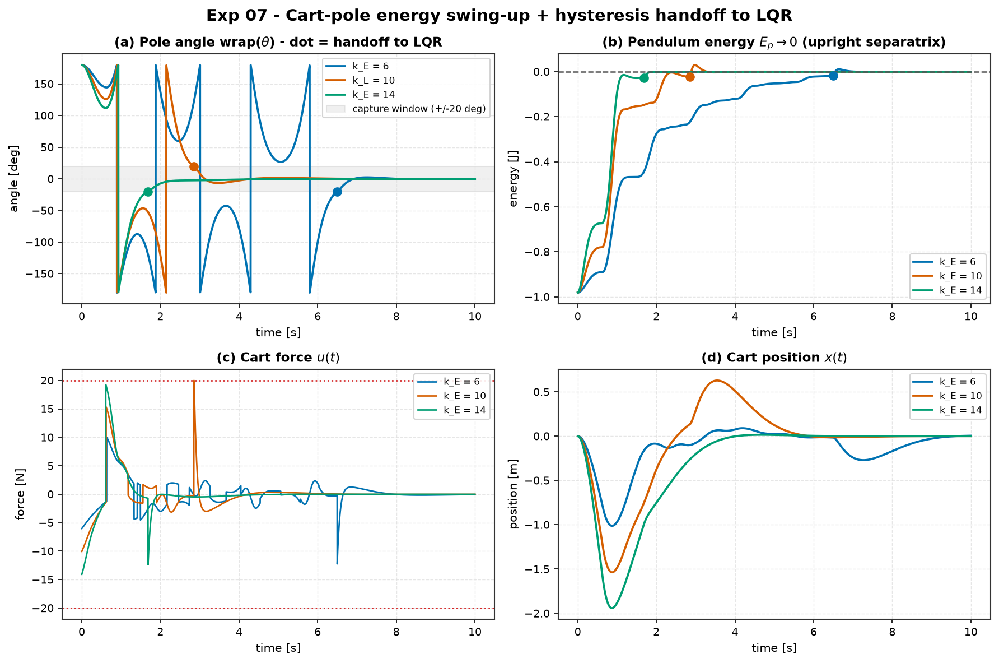
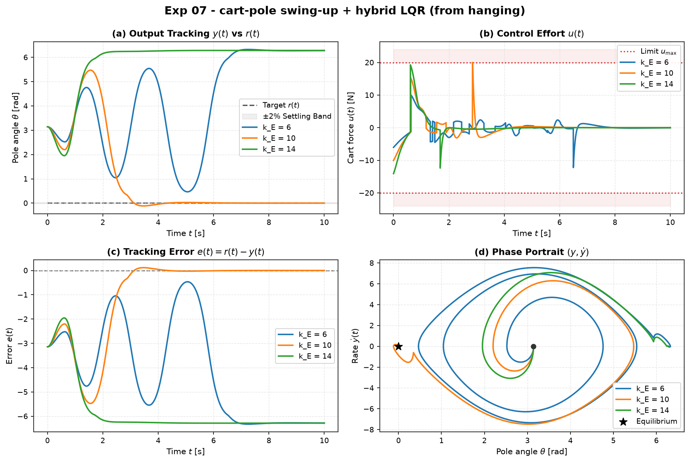

# Experiment 07 — Cart-pole swing-up from hanging + hybrid handoff to LQR

**Question.** From the stable downward rest (`θ₀ = π`), can an energy-shaping
swing-up pump the pendulum to the upright separatrix and a hysteresis switch hand
off cleanly to a balancing LQR? What does the energy-pump gain `k_E` trade
between swing-up time and control effort / cart travel?

Companion theory:
[`swingup-and-basin.md`](../../docs/references/swingup-and-basin.md) §1.2 (Spong
energy shaping), §2 (hysteresis switch).

## Setup

- Plant: nonlinear `CartPole` (M=1.0, m=0.1, l=0.5, g=9.81), `θ = 0` upright.
- **Swing-up** — `EnergyShapingSwingUp`: commands a cart acceleration
  `ẍ_des = k_E · E_p · sign(θ̇ cosθ) − k_x x − k_ẋ ẋ` (with `E_p` the pendulum
  energy relative to the upright separatrix, `0` upright, `−2mgl` hanging), so
  `Ė_p = m l k_E |E_p| |θ̇ cosθ| ≥ 0` while `E_p < 0`. Mapped to a motor force by
  partial feedback linearisation. Cart-centring gains `k_x = 2`, `k_ẋ = 1.5`.
- **Handoff** — `HybridSwingUpLQR`: switch to LQR when `|wrap(θ)| ≤ 0.35 rad`
  (≈20°) **and** `|θ̇| ≤ 1.5 rad/s`; fall back to swing-up if `|wrap(θ)| > 0.60`
  rad (≈34°). The wider release angle is the hysteresis band.
- **Balance** — LQR, "balanced" tuning `Q = diag(10,1,100,10)`, `R = 0.1`.
- Actuator `|F| ≤ 20 N`, `dt = 2 ms`, `T = 10 s`, RK4.
- Three energy-pump gains compared: `k_E ∈ {6, 10, 14}`.

```bash
python experiments/07_cartpole_swingup_hybrid/run.py
```

## Results

| `k_E` | t_capture [s] | t_settle [s] | switches | control energy `∫u²` | peak `|F|` [N] | cart excursion [m] | balanced |
| :-- | :-: | :-: | :-: | :-: | :-: | :-: | :-: |
| 6 | 6.50 | 7.45 | 1 | 52.3 | 12.2 | 1.01 | ✅ |
| 10 | 2.85 | 4.06 | 1 | 87.3 | 20.0 | 1.54 | ✅ |
| 14 | 1.69 | 3.34 | 1 | 107.2 | 19.3 | 1.94 | ✅ |





## Takeaways

1. **Energy shaping works from hanging.** For every gain `E_p` climbs (in
   envelope) from `−2mgl ≈ −0.98 J` to ~0, the state enters the capture window,
   and the LQR balances it — final `|wrap(θ)| < 2°`, cart back near the origin.
2. **One clean switch, no chattering.** Every run switches swing-up → balance
   exactly once; the hysteresis band (0.35 → 0.60 rad) means a slight overshoot
   past the capture angle does not bounce control back to swing-up.
3. **`k_E` trades time against effort and cart travel — monotonically.** Doubling
   the pump gain (6 → 14) cuts swing-up time ~4× (6.5 → 1.7 s) but roughly
   doubles the control energy (52 → 107), pushes peak force to the ±20 N limit,
   and nearly doubles the cart excursion (1.0 → 1.9 m, vs a ±2.4 m rail).
4. **`k_E ≈ 10` is the practical knee.** It captures in under 3 s while just
   touching the force limit; `k_E = 14` buys ~1 s more at the cost of a cart
   swing that would risk the rail on a shorter track.

## Notes

- The swing-up force map's gravity term sign is consistent with
  `aimct.systems.CartPole` (`θ = 0` upright), which is the opposite of
  `swingup-and-basin.md` §1.2 (written for a downward-zero angle). See the
  `aimct.controllers.swingup` module docstring.
- `sign(θ̇ cosθ)` is defined as `+1` at exact hanging rest so the pump has an
  initial direction to break the `θ̇ = 0` symmetry.
