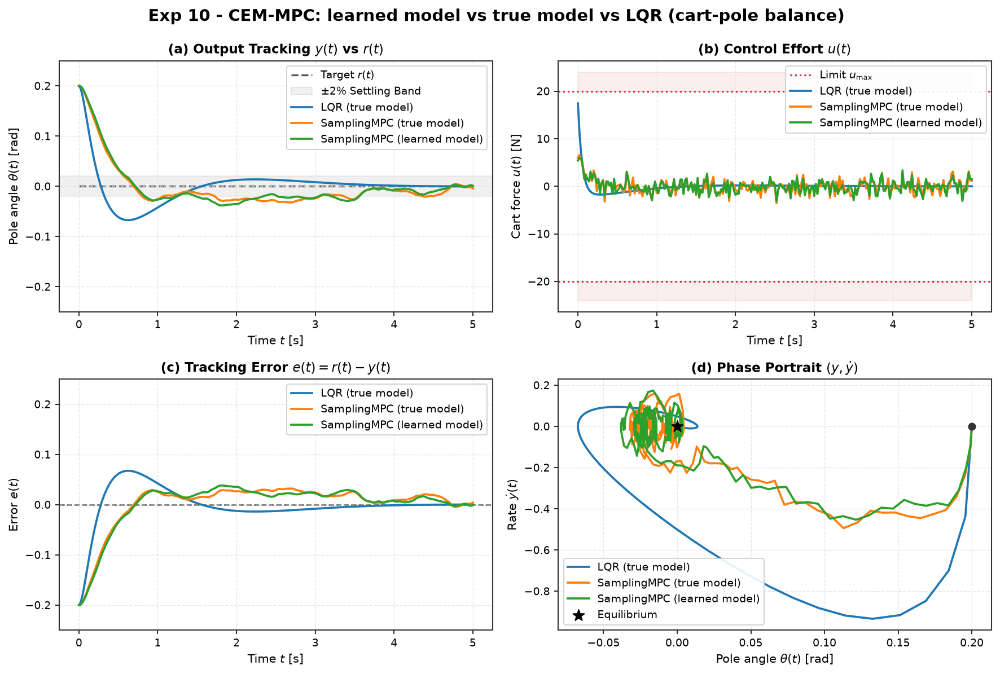

# Experiment 10 — MPC planning with a learned model vs the true model

**Question.** A sampling MPC needs only a one-step model `f(x, u)`. If we fit that
model from data with a small neural net instead of using the equations of motion,
does the planner still balance the cart-pole — and how much performance do we
lose to model error, compared with the same planner on the true model and with a
plain LQR?

Uses [`aimct.ml`](../../src/aimct/ml) (from-scratch MLP + `LearnedDynamics`) and
[`aimct.controllers.SamplingMPC`](../../src/aimct/controllers/sampling_mpc.py)
(cross-entropy-method planner).

## Setup

- **Learned model**: excite the true cart-pole near upright in closed loop (mild
  stabiliser + ±8 N PRBS), log 4000 steps (80 s). Fit a **residual MLP**
  `[5 → 64 → 64 → 4]` (4 804 params, hand-written backprop + Adam) predicting the
  standardised state increment `x_{k+1} − x_k`. Held-out prediction error:
  **1-step 4.5e-4, 30-step 2.5e-2**.
- **Planner**: CEM, horizon 30 (0.6 s), 600 samples, 60 elite, 4 iters. Running
  cost `xᵀ diag(1, 0.1, 20, 1) x + 0.02 u²`, plus a **CARE terminal cost `xᵀP x`**
  so the short horizon is still stabilising. The learned planner's terminal `P`
  comes from a least-squares linear model fit to the *same data* — no equations
  of motion anywhere in its pipeline.
- Balance the true nonlinear cart-pole from θ₀ = 0.2 rad, `|u| ≤ 20 N`,
  `dt = 0.02`, `T = 5 s`. LQR (`Q = diag(10,1,100,10)`, `R = 0.1`) as the
  analytic baseline.

Run: `python experiments/10_planning_learned_vs_true_model/run.py`
Outputs (committed): `table.md`, `table.csv`, `metrics_full.csv`, `figure.png`.

## Results

| controller | settling θ [s] | RMSE θ | control energy | peak \|u\| [N] |
| --- | --- | --- | --- | --- |
| LQR (true model)            | 1.26 | **0.0374** | 8.42 | 17.4 |
| SamplingMPC (true model)    | 4.44 | 0.0448 | 10.8 | 6.6 |
| SamplingMPC (learned model) | 3.56 | 0.0462 | 10.2 | 6.0 |

## Takeaways

1. **The learned model costs the planner essentially nothing.** True-model and
   learned-model CEM planners are within 3 % on angle RMSE (0.045 vs 0.046) and
   6 % on control energy, and their trajectories are visually indistinguishable
   (orange vs green in every panel). A 4 800-parameter MLP trained on 80 s of
   data reproduces the cart-pole well enough (1-step error 4e-4) that planning
   through it ≈ planning through the exact equations.
2. **No hand-derived physics anywhere.** Data → MLP one-step model → CEM plan →
   stable balance. The only analytic ingredient, the terminal cost, is itself
   built from a least-squares model fit to the same data.
3. **Sampling MPC is looser than the analytic optimum — and that gap is the
   planner, not the model.** Both CEM planners settle in 3.5–4.5 s vs LQR's
   1.3 s, with a dithery low-amplitude command (±3 N vs LQR's single 17 N
   spike). CEM trades a bang-bang optimal move for a hedged average over elite
   samples. The learned model does not widen this gap.
4. **The terminal cost is what makes a short horizon work.** Without `xᵀP x` the
   0.6 s horizon is far too short for an unstable plant and *both* planners fail
   (an earlier run: RMSE > 1, marginal). This is the same principle as
   `LinearMPC`'s DARE terminal weight — a finite horizon needs a stand-in for
   the cost beyond its end.

## Follow-ups

- Full swing-up from hanging: vanilla CEM with a quadratic cost does not discover
  energy pumping — needs a shaped cost or a longer horizon (Experiment 12).
- Learned-model planning under process/measurement noise, and with a
  deliberately under-capacity net, to find where model error *does* bite.
