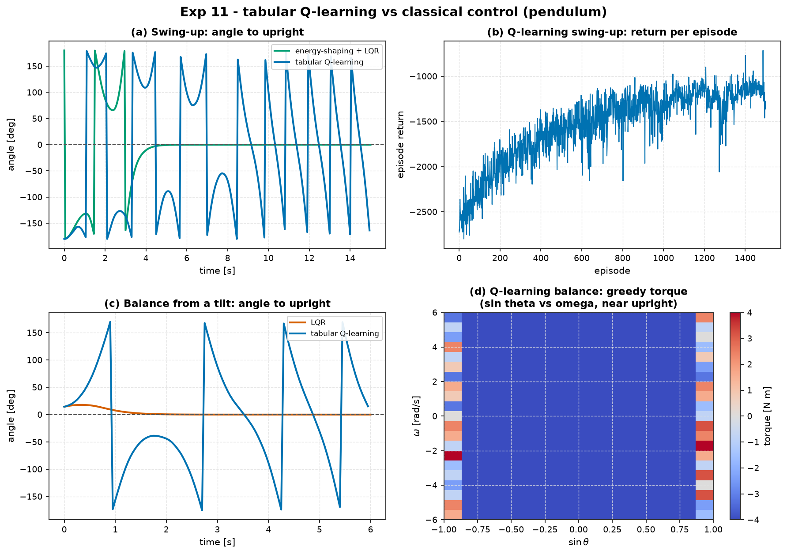

# Experiment 11 — Tabular Q-learning vs classical control (pendulum)

**Question.** On the same nonlinear pendulum (torque `|u| ≤ 4`), how does
from-scratch tabular Q-learning compare with classical control on **swing-up**
from hanging and **balancing** from a tilt — in final performance, control
effort, the **environment samples** needed to learn, and the interpretability of
the result?

Companion theory:
[`swingup-and-basin.md`](../../docs/references/swingup-and-basin.md) §1.1,
module 07 (reinforcement learning).

## Setup

- Plant: nonlinear `Pendulum` (m=1, L=1, b=0.1, g=9.81), `θ = 0` hanging,
  `θ = π` upright. `dt = 0.05`, `|u| ≤ 4`.
- **Classical swing-up** — energy pumping `u = -k_E·sign(θ̇)·E(θ,θ̇)` (E measured
  against the upright separatrix), switching to the LQR when `|θ−π| < 0.4` and
  `|θ̇| < 3`. *3 numbers.*
- **Classical balance** — LQR on the upright linearisation, `Q = diag(10,1)`,
  `R = 0.5`. *2 numbers (the gain `K`).*
- **RL** — tabular Q-learning, ε-greedy (1.0→0.05), obs `(cosθ, sinθ, θ̇)`,
  state grid `15×15×25` (swing-up) / `15×15×21` (balance), 11 torque levels.
  Trained 1500 episodes (swing-up) / 900 (balance) — **450 k / 180 k env steps**.

```bash
AIMCT_EXP_FULL=1 python experiments/11_qlearning_vs_classical/run.py
```

## Results

| controller | task | min err [rad] | held upright | t to upright [s] | final err [rad] | control energy | train samples | params |
| :-- | :-- | :-: | :-: | :-: | :-: | :-: | :-: | :-: |
| energy-shaping + LQR | swing-up | 0.00 | ✅ | 4.0 | 0.00 | 45.9 | **0** | **3** |
| tabular Q-learning | swing-up | 0.02 | ❌ | 9.1 | 1.48 | 101.2 | 450 000 | 61 875 |
| LQR | balance | 0.00 | ✅ | 0.85 | 0.00 | 11.7 | **0** | **2** |
| tabular Q-learning | balance | 0.05 | ❌ | 3.45 | 1.53 | 40.4 | 180 000 | 51 975 |



## Takeaways

1. **Q-learning does discover both behaviours.** From nothing but a scalar reward
   and interaction, the tabular agent learns to pump the pendulum to vertical
   (min error 0.02 rad) and, in the balance task, to catch a tilt — genuine
   model-free control.
2. **But it does not match the classical laws on any axis that matters here.**
   Slower to upright (9.1 s vs 4.0 s), ~2× the control energy on swing-up, and
   crucially it **does not hold** upright — the coarse `(cosθ, sinθ, θ̇)` grid
   has ~0.4 rad/s per velocity bin near vertical, far too coarse for the tight
   feedback a balance needs, so the greedy policy limit-cycles around the top
   (final error ~1.5 rad).
3. **The sample cost is enormous.** 180 k–450 k environment steps — 2.5–6 hours
   of real pendulum time at `dt = 0.05` — to reach a policy the LQR gets for
   free from a 2×2 linearisation.
4. **And the result is opaque.** The classical controllers are 2–3 numbers you
   can read, bound, and prove things about. The Q-tables are 50 k–60 k numbers
   with no structure to inspect (panel d shows one 2-D slice of the balance
   policy — plausible but uncertifiable).
5. **Engineering verdict.** When a usable model exists, classical control wins
   decisively: less effort, tighter performance, provable, tiny. Q-learning's
   value is precisely the case this experiment *doesn't* have — **no model, or a
   model too wrong to design against** — where paying in samples to learn from
   interaction is the only option. Finer discretisation, function approximation
   (Experiment 10's learned-model planning, or a neural policy), or reward
   shaping would close the performance gap; none of them recover the
   interpretability.

## Notes

- Torque `±4` (not the `±2.5` of the energy-shaping reference) so that *tabular*
  Q-learning can reach vertical within a CI-feasible episode budget; both the
  classical and RL controllers use the same limit here, so the comparison is
  fair.
- The default `run.py` trains for only 250 / 200 episodes (~17 s) to keep CI's
  per-experiment smoke fast; the committed table and figure are the
  `AIMCT_EXP_FULL=1` run.
