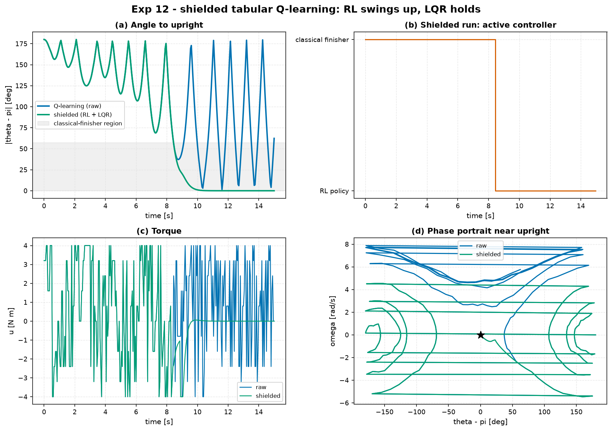

# Experiment 12 — Shielded tabular Q-learning (pendulum)

**Question.** The tabular Q-learning agent from
[Experiment 11](../11_qlearning_vs_classical/) swings the pendulum *up* but its
coarse `(cosθ, sinθ, ω)` grid limit-cycles near vertical — it whips through the
top at 3–5 rad/s, far outside any ±4 N·m LQR basin, and settles at
`|θ−π| ≈ 1.4 rad`. Can a **safety shield** turn this "almost works" policy into
one that provably completes and holds the swing-up, by delegating the endgame to
a classical controller?

Companion theory: module 08 (AI + control / safety shields).

## Setup

- Plant: nonlinear `Pendulum` (m=1, L=1, b=0.1, g=9.81), `θ = 0` hanging.
  Torque `|u| ≤ 4`, `dt = 0.05`.
- **Base** — the Experiment-11 tabular Q-learning swing-up agent (same config:
  `15×15×25` grid, 11 torque levels, 1500 training episodes).
- **Shield** — `aimct.hybrid.ShieldedController(base, fallback, is_safe=…)`,
  switch blend:

  ```
  is_safe(x) = |wrap(θ − π)| > 1.0 rad        # True  → RL policy drives
                                              # False → classical finisher drives
  ```

- **Fallback** — energy shaping `u = −1.5·sign(ω)·E(θ,ω)` with an LQR catch
  (`Q = diag(50,2)`, `R = 0.5`) near upright — the Experiment-11 classical law.

```bash
AIMCT_EXP_FULL=1 python experiments/12_shielded_qlearning/run.py
```

## Results

| controller | min err [rad] | final err [rad] | held upright | t to upright [s] | control energy | shield active |
| :-- | :-: | :-: | :-: | :-: | :-: | :-: |
| tabular Q-learning (raw) | 0.03 | 1.41 | ❌ | 10.3 | 105.4 | 0 % |
| shielded (RL + classical finisher) | 0.00 | **0.00** | ✅ | 9.3 | 68.0 | 44 % |



## Takeaways

1. **The shield fixes what the RL policy can't do.** Raw Q-learning reaches
   vertical exactly once (min error 0.03 rad) then limit-cycles at 1.4 rad
   forever. The same policy under the shield **holds upright to 0.00 rad** — the
   fallback engages the moment the state comes within 1.0 rad of vertical and
   the energy-shaping + LQR finisher completes and stabilises it.
2. **It costs *less* control energy, not more.** 68 vs 105 (∫u²): the classical
   finisher is efficient where the Q-table's coarse policy was thrashing.
3. **The RL policy still does the bulk of the work.** The shield's fallback is
   active only 44 % of the run — all of it in the final approach. The gross
   swing-up (the part with a large, forgiving basin) is left to the learned
   policy.
4. **This is the module-08 pattern.** A learned controller with no guarantees,
   made safe by a classical controller with guarantees, switched by a cheap
   state predicate — and every switch is logged (`intervention_log`,
   `intervention_rate`) so the hand-off is auditable. Neither half alone solves
   the task within the torque limit; together they do.

## Notes

- A bare bounded-torque LQR fallback *cannot* rescue this agent: by the time the
  raw policy is near vertical it is moving at 3–5 rad/s, well outside the LQR's
  ~0.4 rad / ~1 rad/s recoverable set. The fallback therefore has to be a
  swing-up-capable classical law (energy shaping + LQR), not just the linear
  regulator — an honest constraint the shield design has to respect.
- `aimct.hybrid.ShieldedController` also offers `blend="filter"` (minimal-
  deviation action projection against a one-step model prediction); this
  experiment uses the simpler `"switch"` blend.
- The default `run.py` trains only 250 episodes (~11 s) for CI smoke; the
  committed table and figure are the `AIMCT_EXP_FULL=1` run.
