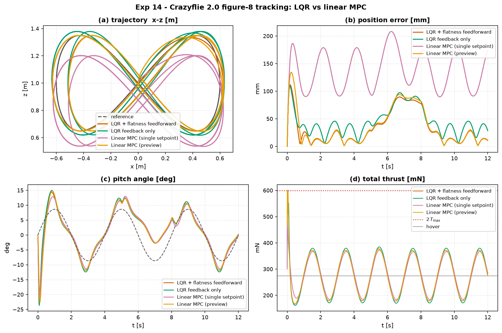

# Experiment 14 — a real drone flies a figure-8 (Crazyflie 2.0)

**Question.** Can a controller designed only on the *hover linearisation* fly the
true nonlinear planar quadrotor around an aggressive figure-8 — through a wind
gust — and what does differential-flatness feed-forward buy over plain feedback?

Real-world system:
[`aimct.systems.PlanarQuadrotor`](../../src/aimct/systems/quadrotor.py) with
**Bitcraze Crazyflie 2.0** parameters (28 g, `I_yy = 1.4e-5`, 46 mm arm, ~2.2 : 1
thrust-to-weight). 6 states `[x, z, θ, ẋ, ż, θ̇]`, 2 rotor-group thrusts in
`[0, 0.30] N`.

## Setup

- **Trajectory**: lemniscate `x_r = 0.6 sin(ωt)`, `z_r = 1.0 + 0.35 sin(2ωt)`,
  period 4 s → ~3.7 m/s peak speed, ~15° peak commanded pitch. Aggressive for a
  nano-drone.
- **Feed-forward** (differential flatness): the drone is flat in `(x, z)`, so the
  reference pitch and thrust follow in closed form from the trajectory's
  derivatives — `θ_r = −ẍ_r/g`, collective thrust `= m(g + z̈_r)`, differential
  thrust `= I_yy·θ̈_r/ℓ`.
- **Wind gust**: a 30 mN lateral force (≈ 11 % of weight) during `t ∈ [5, 8] s`.
- **Cost** (Bryson-scaled — the input matrix `B` is badly scaled, pitch-torque
  gain ~3300 vs thrust ~36, so an unscaled `R` yields a nonsensical LQR):
  `Q = diag(1/[0.1,0.1,0.2,0.5,0.5,3.0]²)`, `R = diag(1/[0.15,0.15]²)`.
- `dt = 4 ms`, `T = 12 s` (three laps), RK4.
- Controllers: **LQR + flatness feed-forward**, **LQR feedback-only**,
  **Linear MPC (single setpoint)** (one tiled target, `N = 25`, input box), and
  **Linear MPC (preview)** — the whole reference trajectory over the horizon
  (`N = 40`), re-solved at 250 Hz in hover-deviation coordinates.

Run: `python experiments/14_quadrotor_figure8_tracking/run.py`
Outputs (committed): `table.md`, `table.csv`, `figure.png`.

## Results

| controller | RMS pos err | max pos err | RMS pitch | ctrl energy | thrust sat |
| --- | --- | --- | --- | --- | --- |
| LQR + flatness feed-forward | **43.5 mm** | 112 mm | 4.3° | 0.033 | 0.7 % |
| LQR feedback only           | 51.0 mm | 109 mm | 4.4° | 0.038 | 0.7 % |
| Linear MPC (single setpoint)| 142 mm | 208 mm | 4.3° | 0.026 | 0.1 % |
| **Linear MPC (preview)**    | 47.9 mm | 134 mm | 4.5° | 0.033 | 0.6 % |

## Takeaways

1. **A hover-linearised LQR flies the full nonlinear drone around a 3.7 m/s
   figure-8 to ~4 cm RMS** (< 7 % of the path amplitude), rides out an 11 %-of-
   weight side gust with a ~9 cm transient, and stays inside the thrust envelope
   (one startup spike aside). Linear design carries a long way on a well-behaved
   flat system.
2. **Differential-flatness feed-forward cuts tracking error ~15 %** (43.5 vs
   51 mm) and lowers the error *floor* between gusts (panel b): pre-computing the
   pitch/thrust the trajectory demands means feedback only has to correct model
   error and disturbances, not reconstruct the whole manoeuvre from lag.
3. **Give the MPC the trajectory, not a point, and the gap closes.** A
   single-setpoint linear MPC optimises toward one tiled target, so on a fast
   curved path it perpetually cuts the corner (142 mm, panel a shows the
   shrunken loop). The **reference-preview MPC** — same `LinearMPC`, but `x_ref`
   / `u_ref` are now the whole reference *trajectory* sampled over the horizon —
   tracks to **47.9 mm**, essentially matching the flatness LQR (43.5 mm). It
   needs the flatness feed-forward supplied in **hover-deviation** coordinates
   (the MPC's model is the hover linearisation, which omits the gravity offset);
   with an absolute feed-forward it drifts. The remaining ~4 mm over the LQR is
   the price of a finite 160 ms horizon.
4. **Cost scaling is not optional on a real system.** The quadrotor's `B` spans
   two orders of magnitude between its channels; the Bryson rule
   (`Q_ii = 1/x_i,max²`, `R_jj = 1/u_j,max²`) turns a limit-cycling gain into a
   well-damped one. This is the first benchmark system where that mattered.

## Follow-ups

- Experiment 15 (toku): output-feedback tracking with an **EKF** fusing noisy
  `[x, z, θ]` + gyro (no velocity measurement).
- Nonlinear MPC via `SamplingMPC` on the quad.
