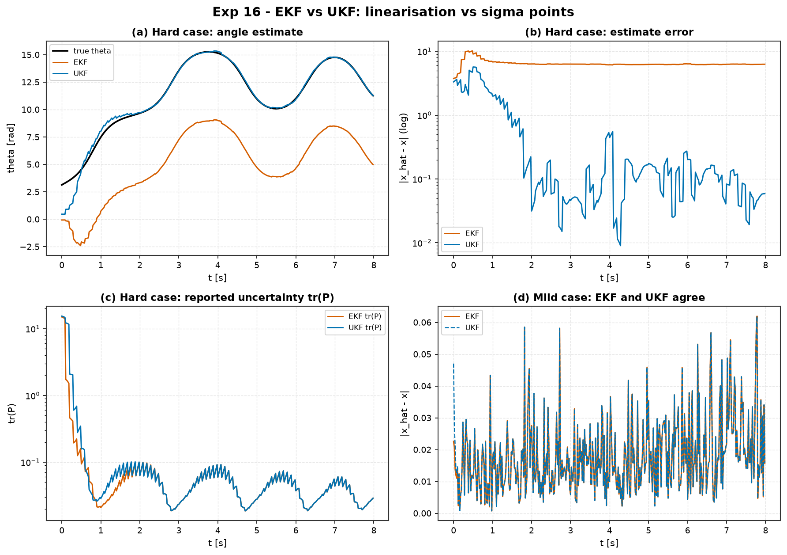

# Experiment 16 — EKF vs UKF: linearisation vs sigma points

**Question.** Both filters fuse a noisy nonlinear measurement of the pendulum
with the model. The **EKF** linearises `f` and `h` once about the current
estimate; the **UKF** propagates `2n+1` sigma points through the true `f` and
`h`. When does the EKF's single linearisation cost you the estimate, and when is
the UKF's extra cost wasted?

Companion theory: module 04 (observers / Kalman filtering);
[Experiment 15](../15_quadrotor_ekf_output_feedback/) applied the EKF to the quad.

## Setup

Two regimes on `aimct.systems.Pendulum`, `dt = 20 ms`, process noise
`Q = diag(1e-5, 1e-3)`, 400 steps:

| | **Hard** | **Mild** |
| :-- | :-- | :-- |
| measurement `h(x)` | `[sin θ, cos θ]` (curved) | `[sin θ, θ̇]` |
| true `x₀` | `[3.1, 2.0]` | `[3.0, 0.4]` |
| estimate `x̂₀` | `[0, 0]` (~π rad off) | `[2.75, 0]` (good) |
| prior `P₀` | `diag(15, 15)` (broad) | `diag(0.2, 0.2)` |
| measurement noise / cadence | σ = 0.1, every 5th step | σ = 0.03, every step |
| UKF spread | α = 1.0 | α = 0.5 |

```bash
python experiments/16_ekf_vs_ukf/run.py
```

## Results

| case | filter | RMS err | final err | recovered |
| :-- | :-- | :-: | :-: | :-: |
| hard | EKF | 6.51 | **6.28** | ❌ |
| hard | **UKF** | 1.38 | **0.07** | ✅ |
| mild | EKF | 0.021 | 0.026 | ✅ |
| mild | UKF | 0.021 | 0.026 | ✅ |



## Takeaways

1. **The EKF gets trapped in the wrong basin.** From a π-off initial guess with
   a broad prior and a curved `[sin θ, cos θ]` sensor, the EKF linearises `h`
   about the (wrong) estimate, the linear update pulls it toward a
   mirror-image solution, and it **never recovers** — final error 6.3 rad
   (≈ 2π). Worse, it shrinks its covariance around that wrong estimate (panel
   c): confidently wrong.
2. **The UKF's sigma points see the whole measurement map.** Spreading `2n+1`
   points across the broad prior and pushing them through the true `sin`/`cos`
   captures the fold the EKF misses; the estimate converges to **0.07 rad** and
   `tr(P)` stays honest until it does.
3. **But the UKF is not free, and often buys nothing.** In the mild case — a
   good initial guess, a tight prior, a weak nonlinearity — the EKF and UKF are
   **identical to three decimals**, and the UKF paid `2n+1 = 5` nonlinear
   evaluations per step for it.
4. **Engineering rule.** Reach for the UKF when the nonlinearity *over your
   uncertainty* is real: a poor initial estimate, a sparse or broad prior, a
   strongly curved measurement. Otherwise the EKF's single evaluation is the
   right call — which is why Experiment 15's quad, with a near-linear
   `[x, z, θ, θ̇]` sensor suite and a good hover initialisation, used an EKF and
   lost nothing.

## Notes

- The scaled UKF with a very small `α` (≈ 1e-3) reduces to the EKF but is
  numerically delicate (weights of order `±1/α²` on near-coincident points);
  `α` in `[0.5, 1]` is the useful range for actually capturing curvature.
