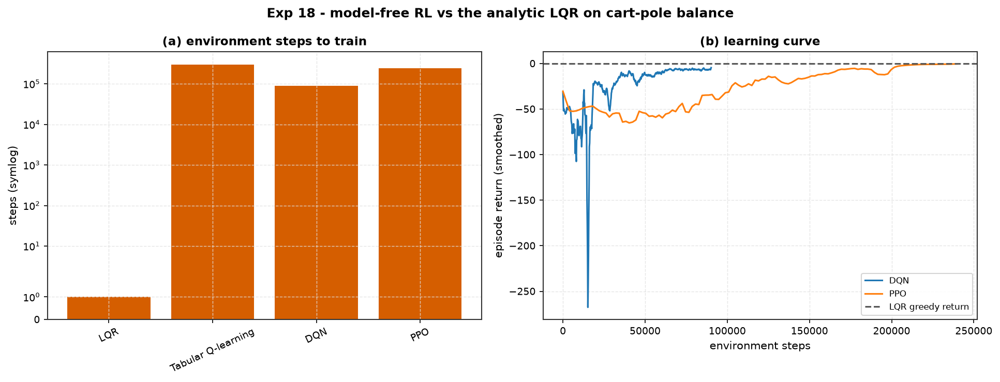

# Experiment 18 — the RL zoo vs LQR on cart-pole balance

**Question.** At the reinforcement-learning frontier: what does model-free
learning actually *cost* — in environment interactions, parameters, and
wall-clock — and does it beat the analytic controller it is replacing?

Uses [`aimct.rl`](../../src/aimct/rl): `QLearning`, from-scratch `DQN` and `PPO`,
plus Stable-Baselines3 PPO as a library cross-check.

## Setup

- Task: `aimct.rl.make("cartpole-balance", max_steps=200)` — reward
  `−(xᵀQx + uᵀRu)` per step, terminates on `|θ| > 0.8` or `|x| > 2.4`. Balancing
  perfectly scores ≈ 0; tipping over scores strongly negative.
- Agents: **LQR** (`Q = diag(10,1,100,10)`, `R = 0.1`, on the hover linearization),
  **Tabular Q-learning** (15⁴ state bins, 7 action bins), **DQN** (MLP
  `[4,64,64,5]`, replay + target net), **PPO** (Gaussian actor + MLP critic,
  GAE + clip), **PPO (SB3)** with default hyper-parameters.
- Greedy evaluation: 20 fixed seeds, mean return + mean episode length held.
- Committed numbers are the `AIMCT_EXP_FULL=1` run.

## Results

| agent | greedy return | held /200 | env steps | train s | params |
| --- | --- | --- | --- | --- | --- |
| **LQR (analytic)**     | **−0.3** | **200** | **0** | **0** | **4** |
| Tabular Q-learning     | −55.5 | 92 | 300,000 | 7 | 354,375 |
| DQN (from scratch)     | −2.6 | 200 | 90,000 | 69 | 4,805 |
| PPO (from scratch)     | −0.3 | 200 | 240,000 | 73 | 4,545 |
| PPO (Stable-Baselines3)| −44.9 | 53 | 120,000 | 130 | 9,091 |

## Takeaways

1. **The analytic controller is free and optimal here.** LQR: four numbers, zero
   environment interactions, a greedy return of −0.3 and a full 200/200 hold. It
   *is* the optimal controller for the quadratic cost on the linearised plant —
   there is nothing for a learner to beat, only to re-discover.
2. **From-scratch DQN and PPO re-discover it — at a price.** Both reach the LQR
   line (return −2.6 / −0.3, full hold), but only after **90 k–240 k environment
   steps**, ~1 min of training, and a ~4.6 k-parameter network. The learning
   curves (panel b) show DQN converging faster but with a violent early dip;
   PPO's climb is smoother and slower.
3. **Coarse tabular Q-learning hits a ceiling.** Even at 300 k steps the 15⁴ grid
   only holds the pole ~92/200 steps — the discretisation chatters near upright,
   the same limit-cycle wall seen in Experiment 11. A 350 k-entry table that
   still can't balance vs LQR's four numbers.
4. **Library defaults are not magic.** SB3 PPO with stock hyper-parameters
   under-performs on this task at 120 k steps — its defaults are tuned for the
   standard `+1`-per-step CartPole-v1 reward, not this dense negative-quadratic
   cost on a ±20 N action box. Matching it would need reward/observation
   normalisation and re-tuned learning rates. The from-scratch agents look good
   here partly *because* they were tuned for this exact environment.
5. **The whole point.** This is the project's thesis at the RL frontier: model-free
   learning spends samples, parameters, and compute to approximate what a model
   gives you in closed form. Its value is the case where you *don't* have the
   model — not this one.
