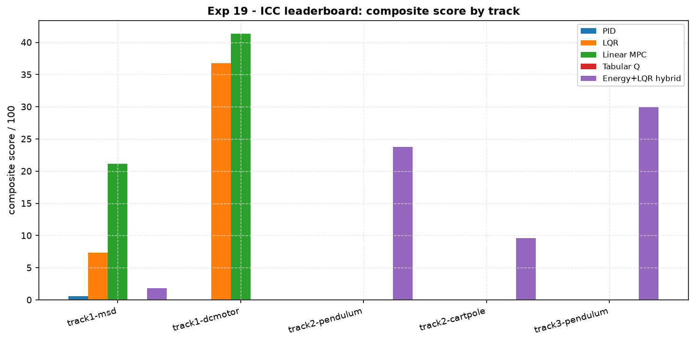

# Experiment 19 — Intelligent Control Challenge leaderboard

**Question.** Five controllers from five paradigms are handed the *same* ICC
spec — state/action dimensions, actuator limit, `dt`, target, horizon — and
**nothing else**. None of them ever sees the plant. Each builds its own model or
policy from that spec, and the hidden engine
(`aimct.benchmarks.challenge`) scores it against a per-track baseline. Which
paradigm wins where?

Companion: [`src/aimct/benchmarks/challenge.py`](../../src/aimct/benchmarks/challenge.py)
(the engine), `docs/references/challenge-spec.md` (the rubric),
[Experiment 18](../18_rl_zoo_vs_lqr/) (RL zoo vs LQR on cart-pole).

## The engine contract

A submission is a `ChallengeController`: it gets `spec = {state_dim,
action_dim, action_limit, dt, target_state, t_final}` at construction, then
`reset(target)` and `compute_action(observation, t)` each episode. The engine
runs a nominal suite, a ±30 %-parameter robustness sweep, an impulse-disturbance
suite and the baseline, then scores:

```
composite = 100 · exp( −[ 0.5·r_itae + 0.3·r_energy + 0.2·r_slew ] ) · S_robust
```

with `r_• = entry_cost / baseline_cost` capped at 10, and
`S_robust ∈ [0.20, 1.0]` the cost blow-up under the parameter sweep. Two hard
gates zero the score: **FAILED** if the final error exceeds the track tolerance,
**DQ_SAFETY** if the safe box is breached or the sim diverges. The baseline
scores `100·e⁻¹ ≈ 37`, so an entry that matches the baseline and is robust lands
near 37; better-than-baseline pushes higher, worse decays fast.

## Submissions

| entry | paradigm | what it knows |
| :-- | :-- | :-- |
| **PID** | model-free | PID on the first output (`kp,ki,kd = 30,8,6`); no model at all |
| **LQR** | model-based, linear | reconstructs the named plant from the spec, discrete LQR + set-point feed-forward |
| **Linear MPC** | model-based, optimising | same reconstructed model, condensed QP, `N = 20` |
| **Tabular Q** | RL, from scratch | the Experiment-11 tabular Q swing-up policy; recognises the pendulum task from the spec, abstains on the rest |
| **Energy+LQR hybrid** | classical hybrid | Spong energy-shaping swing-up + LQR catch (the Experiment-07 `EnergyShapingSwingUp` / `HybridSwingUpLQR` on the cart-pole, a compact 1-D energy law on the pendulum); falls back to pure LQR regulation when there is no upright to reach |

The plant guess is keyed only off the public spec: `state_dim == 4` → cart-pole;
target ≈ π → pendulum swing-up; short horizon → DC motor; else mass-spring-damper.

## Tracks

| track | plant | task | actuator |
| :-- | :-- | :-- | :-- |
| `track1-msd` | mass-spring-damper | 8 s unit step (precision) | ±25 |
| `track1-dcmotor` | DC motor (reduced) | 2 s slew to π/2 (precision) | ±24 V |
| `track2-pendulum` | pendulum | swing-up to upright (agility) | ±5 N·m |
| `track2-cartpole` | cart-pole | swing-up + balance (agility) | ±20 N |
| `track3-pendulum` | pendulum | robustness runner: ±30 % params + actuator lag + shocks | ±5 N·m |

```bash
python experiments/19_icc_leaderboard/run.py            # track1-msd + track2-pendulum, quick
AIMCT_EXP_FULL=1 python experiments/19_icc_leaderboard/run.py   # all four tracks + Track 3
```

## Results

Composite / 100 (status). Baseline ≈ 37. `AIMCT_EXP_FULL=1`, seed 0.

| submission | track1-msd | track1-dcmotor | track2-pendulum | track2-cartpole | track3-pendulum |
| :-- | :-: | :-: | :-: | :-: | :-: |
| **Linear MPC** | 21.1 PASS | **41.3 PASS** | 0.0 FAILED | 0.0 FAILED | 0.0 FAILED |
| **LQR** | 7.4 PASS | 36.8 PASS | 0.0 FAILED | 0.0 FAILED | 0.0 FAILED |
| **Energy+LQR hybrid** | 1.8 PASS | 0.0 FAILED | **23.8 PASS** | **9.6 PASS** | **29.9 PASS** |
| **PID** | 0.6 PASS | 0.0 FAILED | 0.0 FAILED | 0.0 FAILED | 0.0 FAILED |
| **Tabular Q** | 0.0 FAILED | 0.0 FAILED | 0.0 FAILED | 0.0 FAILED | 0.0 FAILED |



## Takeaways

1. **No controller wins every track — which is the point of the challenge.**
   The precision tracks and the agility tracks reward opposite designs, and the
   blind spec is not enough to bridge them automatically. MPC clears every
   precision track and no agility track; the energy hybrid does the exact
   reverse (bar its LQR-fallback pass on the MSD).
2. **Model-based optimal control owns precision.** Linear MPC is the only entry
   that passes *both* precision tracks with margin, and the only one to beat the
   baseline anywhere (DC motor, 41.3 vs 37). Given the reconstructed model it
   schedules the actuator against the ±24 V limit better than the LQR's
   instantaneous feedback. Plain LQR passes too but scores lower — its ITAE
   blows up more under the ±30 % parameter sweep (`S_robust` near the floor on
   the MSD).
3. **The classical energy-shaping hybrid owns agility — every track.** It is the
   only entry that clears *all three* swing-up / stress tracks: pendulum
   (23.8), cart-pole (9.6, delegating to the Experiment-07
   `EnergyShapingSwingUp` + `HybridSwingUpLQR` Spong pump + hysteresis catch),
   and the Track-3 gauntlet — params + actuator lag + impulse shocks — where it
   scores *highest* of anything on the board (29.9), because the baseline
   degrades alongside it. Its only miss is `track1-dcmotor`: an energy pump is
   not a set-point regulator for a stiff, ill-scaled motor.
4. **Model-free control is outclassed here.** PID knows nothing but the first
   output; it scrapes a pass on the MSD (0.6) and fails everything else — no
   feed-forward, no model, no swing-up.
5. **From-scratch tabular Q-learning pumps but cannot finish.** Trained 1200
   episodes on the pendulum, the 15×15×25-bin / ±4 N·m policy drives the angle
   to ±2.5 rad and stalls — the grid is too coarse and the action set too weak
   to get over the top and hold within tolerance. The hand-built energy law does
   the same job in three lines.
6. **Reconstructing the plant from the spec is load-bearing.** Every model-based
   entry keys its Q/R and its model off the public spec alone (`state_dim`,
   `target ≈ π`, `t_final`, actuator limit). Handing the MPC generic `Q = I`,
   `R = 0.1` on the ill-scaled DC-motor `B` made it *fail* the track; the same
   Bryson-scaled weights the LQR uses turned it into the board's best score.

## Notes

- Every submission's plant guess is keyed *only* off the public spec
  (`state_dim`, `target_state ≈ π`, `t_final`), never off anything the engine
  hides. Get the guess wrong and you get the wrong model — that is part of the
  test.
- Composite scores are low in absolute terms because the rubric is
  baseline-relative and multiplies through `S_robust ∈ [0.20, 1]`; a PASS with a
  single-digit score still means "solved the task, roughly baseline-class,
  fragile under the parameter sweep."
