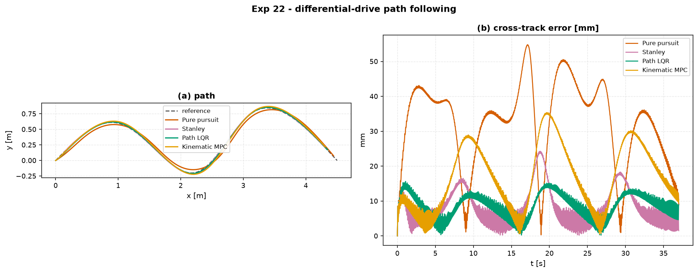

# Experiment 22 — differential-drive robot: waypoint path following

**Question.** Four path-followers drive the *same* differential-drive robot
(unicycle kinematics plus a first-order speed / yaw-rate actuator lag,
TurtleBot3-Burger parameters) along the *same* spline through five waypoints at
a 0.15 m/s cruise. A geometric law, a lateral-control law, and two model-based
laws — what does each design actually trade?

Companion: [`aimct.systems.DifferentialDriveRobot`](../../src/aimct/systems/diffdrive.py),
[`aimct.trajectories`](../../src/aimct/trajectories.py),
[`aimct.benchmarks.track_trajectory`](../../src/aimct/benchmarks/tracking.py).

## Setup

The spline through `[[0,0], [1,0.6], [2.2,-0.2], [3.2,0.8], [4.5,0]]` is
**re-timed** so its time parametrisation is traversed at the cruise speed —
`traj(t)` is then where the robot *should* be at time `t`, and the along-track
(`rms_err`) metric is meaningful, not just the geometric cross-track error.

| controller | idea |
| :-- | :-- |
| **Pure pursuit** | steer toward a point 0.45 m ahead on the path; `omega = 2 v sin(alpha) / L_d` |
| **Stanley** | `omega = k (psi_e - atan2(k_e · e_cross / v))` — heading error + cross-track |
| **Path LQR** | LQR on the `[y, theta, v, omega]` error of the model linearised about a straight path, plus a path-curvature feed-forward `omega_ff = kappa · v` |
| **Kinematic MPC** | condensed linear MPC (`N = 25`) on the same error model, with a curvature-preview feed-forward over the horizon |

```bash
python experiments/22_diffdrive_path_following/run.py
```

## Results

| controller | rms_err (mm) | max_err (mm) | rms cross-track (mm) | completion % | ctrl energy |
| :-- | :-: | :-: | :-: | :-: | :-: |
| **Pure pursuit** | **69.5** | **107** | 34.6 | **98.4** | **1.95** |
| **Stanley** | 111 | 257 | 9.7 | 95.5 | 2.41 |
| **Path LQR** | 96.5 | 230 | **9.2** | 96.2 | 2.28 |
| **Kinematic MPC** | 128 | 290 | 19.2 | 94.9 | 2.37 |



## Takeaways

1. **Pure pursuit chases the *point*, not the *path*.** It has the lowest
   along-track error and the lowest peak error, is the cheapest, and gets
   furthest around the course in the allotted time — because it always steers at
   a target ahead of it. The price is a steady 30–50 mm cross-track bias on the
   curves: with a fixed look-ahead it geometrically **cuts every corner**
   (visible in panel a near `x = 2.2` and `x = 3.4`).
2. **Stanley hugs the *path*, not the *schedule*.** It drives the cross-track
   error to ~10 mm but it has no notion of *where along* the path it should be,
   so it lags the timed reference (111 mm along-track) and finishes 4–5 % short.
3. **Path LQR is the balanced choice.** Cross-track as tight as Stanley
   (9.2 mm) — in fact the tightest here — along-track between pure pursuit and
   Stanley, and the lowest energy of the model-based three. The curvature
   feed-forward does the anticipation; the LQR gain does the regulation.
4. **The MPC horizon buys nothing here.** On a smooth, unconstrained path with
   no obstacles and an actuator that never saturates, `LinearMPC` collapses to
   very nearly the LQR move — and it tracks slightly *worse* (tuning, and the
   preview model is the straight-path linearisation). This is the same lesson as
   Experiments 14 and 21: MPC earns its cost when a **constraint is active**,
   which this benign path does not exercise. A cluttered map with keep-out
   regions is where the kinematic MPC would pull ahead.
5. **The actuator lag matters.** With `tau = 50 ms` on both channels the robot
   cannot turn instantly; every controller's peak error occurs at the sharpest
   curvature (the reversal near `x = 2.2`), where the commanded yaw rate leads
   the achieved one by a lag time constant.
