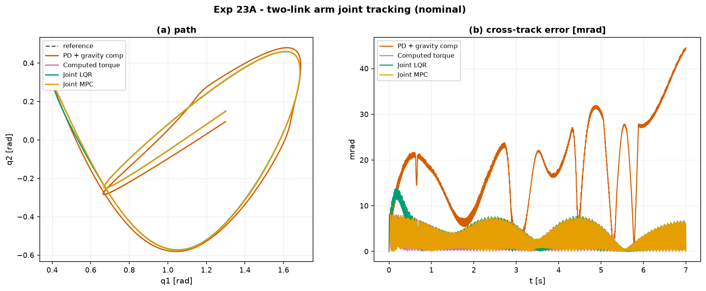
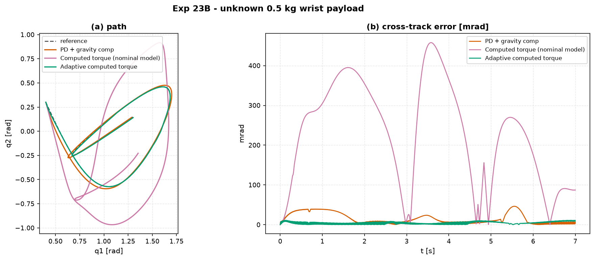

# Experiment 23 — two-link arm: joint tracking + payload adaptation

**Question.** Four torque-level controllers track the same joint-space spline on
the planar two-link arm (Euler–Lagrange, real link masses / inertias). Then the
true arm picks up an **unknown 0.5 kg wrist payload** while every controller
still believes the nominal model — which laws survive the parametric error, and
can a one-parameter adaptive law claw the tracking back?

Companion: [`aimct.systems.TwoLinkArm`](../../src/aimct/systems/twolink_arm.py),
[`aimct.benchmarks.track_trajectory`](../../src/aimct/benchmarks/tracking.py),
[Experiment 17](../17_adaptive_vs_fixed_changing_plant/) (adaptive vs fixed on a
drifting plant).

> The tracking harness reports position-style metrics; here "position" is the
> joint vector `(q1, q2)`, so the figures use `space="joint"` (q1/q2 in rad,
> cross-track in **mrad**) and the raw `*_mm` columns in `tracking.md` /
> `payload.md` read as **milliradians**.

## Controllers

| controller | law |
| :-- | :-- |
| **PD + gravity comp** | `tau = Kp e + Kd de + G(q)` — no inertia model |
| **Computed torque** | `tau = M(q)(ddq_r + Kp e + Kd de) + C dq + G + b dq` — full model cancellation |
| **Joint LQR** | inverse-dynamics feed-forward + LQR on the `[q, dq]` error (model linearised about `q1 = 1`) |
| **Joint MPC** | feedback-linearise to `e'' = a`, then `LinearMPC` (N = 20) picks the virtual accel `a` |
| **Adaptive computed torque** | Slotine–Li: computed torque on the *nominal* model plus `mhat · Y1(q, dq)`, with `mhat' = -gamma · Y1·s` (`s` the sliding variable) |

```bash
python experiments/23_twolink_arm_tracking/run.py
```

## Part A — nominal model

| controller | rms err (mrad) | max err (mrad) | completion % | ctrl energy |
| :-- | :-: | :-: | :-: | :-: |
| PD + gravity comp | 32.2 | 54.5 | 99.4 | 891 |
| Computed torque | 4.3 | 29.6 | 100 | **164** |
| **Joint LQR** | **2.6** | **12.0** | 100 | 165 |
| Joint MPC | 10.0 | 50.5 | 100 | 164 |



## Part B — unknown 0.5 kg wrist payload (controllers use the 0 kg model)

| controller | rms err (mrad) | max err (mrad) | completion % | ctrl energy |
| :-- | :-: | :-: | :-: | :-: |
| PD + gravity comp | 30.7 | 46.4 | 99.7 | 472 |
| Computed torque (nominal model) | **393.8** | 519 | 36.9 | 493 |
| **Adaptive computed torque** | **4.9** | 10.2 | 100 | 764 |

Adaptive payload estimate: `mhat = 0.76 kg` (true 0.5 kg).



## Takeaways

1. **Feed-forward the inertia and the error collapses 7×.** PD + gravity comp
   knows the gravity load but not `M(q)` or the Coriolis terms, so it lags
   every fast segment (32 mrad RMS) and needs the stiffest gains — and so the
   most torque (5× the energy of the model-based laws). Computed torque, joint
   LQR and joint MPC all add the full inverse-dynamics feed-forward and land at
   2–10 mrad for a third of the effort.
2. **Joint LQR edges out plain computed torque.** Same feed-forward, but the LQR
   gain is the optimal linear error-feedback about the mid-trajectory
   configuration rather than a hand-tuned diagonal PD — 2.6 vs 4.3 mrad.
3. **The MPC horizon again buys nothing.** With no torque limit binding and no
   obstacle, the receding-horizon virtual-accel MPC tracks *worse* than the
   one-step LQR (10 vs 2.6 mrad) — its value is constraint handling, which this
   trajectory never triggers. Same lesson as Experiments 14, 21 and 22.
4. **Model cancellation is only as good as the model.** Give computed torque the
   wrong mass and it is the *worst* controller in the room — 394 mrad RMS,
   completes only 37 % of the path, flails half a metre off the reference
   (panel a). It confidently subtracts inertia and gravity terms that are now
   wrong, and injects the error it was supposed to cancel.
5. **High-gain PD is quietly robust.** PD + gravity comp barely notices the
   payload (32 → 31 mrad): it never inverted the model, so there is nothing for
   the parametric error to corrupt — only the gravity term is slightly off.
   Robustness by *not modelling*.
6. **One adaptive parameter recovers everything.** The Slotine–Li law carries a
   single scalar `mhat`, drives it with the sliding variable, and pulls the
   tracking error back to 4.9 mrad — as good as nominal computed torque — while
   the true payload is never measured. Note `mhat → 0.76 kg`, not `0.5`:
   adaptive control guarantees **tracking** convergence, not **parameter**
   convergence — the trajectory is not persistently exciting enough to identify
   the mass, only enough to null the error. This is the Experiment-17 result on
   a real manipulator: adapt the controller, don't identify the plant.
