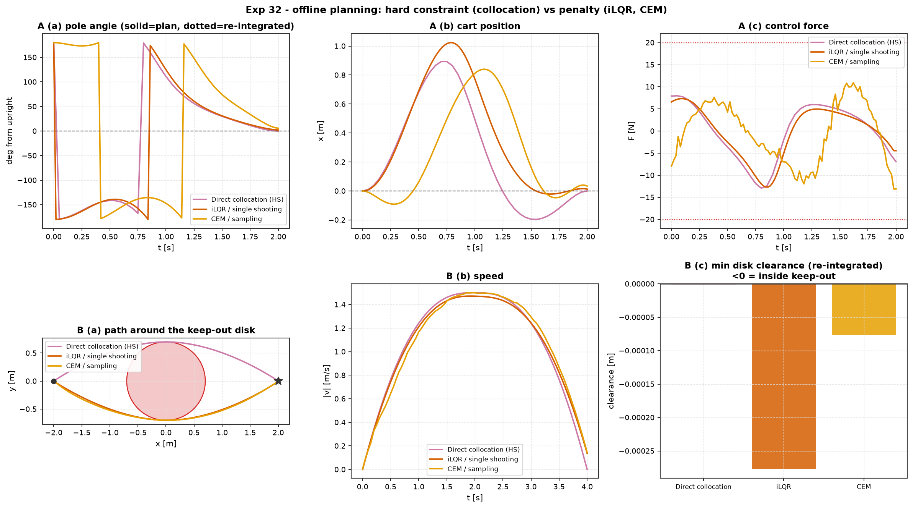

# Experiment 32 — direct collocation vs shooting vs sampling (offline)

**Question.** Experiments [24](../24_ilqr_vs_sampling_mpc/),
[25](../25_diffdrive_moving_obstacle/) and [26](../26_harder_reference_paths/)
raced **iLQR** (indirect / single shooting) against **CEM** (sampling) as
*online* receding-horizon controllers. Every one of those rests on solving a
finite-horizon optimal-control problem, and there is a third way to do that the
repo did not have: **direct transcription** — make the state *and* the input at
every knot decision variables of one nonlinear program, and enforce the
discretised dynamics as equality constraints. The thing direct transcription
can express that the other two cannot is a **hard constraint** — "end exactly
here", "stay out of there" — instead of a penalty weight. This experiment tests
that on two offline problems.

Companion: [`aimct.planning.DirectCollocation`](../../src/aimct/planning/collocation.py)
(new — Hermite-Simpson collocation, SLSQP),
[`aimct.controllers.iLQR`](../../src/aimct/controllers/ilqr.py),
[`aimct.controllers.SamplingMPC`](../../src/aimct/controllers/sampling_mpc.py).

In every row: **collocation** takes the boundary / keep-out condition as a
*hard constraint*; **iLQR** and **CEM** take it as a *penalty* (a large terminal
`Qf`, or a quartic keep-out barrier in a custom cost). `*_rolled` metrics
re-integrate the returned `u` through the true dynamics with a fine RK4 (FOH for
collocation, ZOH for iLQR / CEM) — the honest *"does the plan actually fly"*
check.

```bash
python experiments/32_direct_collocation_vs_ilqr/run.py
AIMCT_EXP_FULL=1 python experiments/32_direct_collocation_vs_ilqr/run.py   # committed numbers
```

---

## Task A — minimum-effort cart-pole swing-up (hard *terminal* constraint)

```
min  ∫₀ᵀ u² dt
s.t. ẋ = f(x,u) [CartPole],  x(0)=[0,0,π,0],  x(T)=[0,0,0,0],  |u| ≤ 20 N,  T = 2 s
```

| planner | effort ∫u² | term err (planned) | term err (re-integrated) | max dyn. drift | solve |
| :-- | :-: | :-: | :-: | :-: | :-: |
| **Direct collocation (HS)** | 74.95 | **0** | **8.1e-4** | 8.1e-4 | **0.71 s** |
| iLQR / single shooting | 65.03 | 0.253 | 0.253 | 3.5e-5 | 1.41 s |
| CEM / sampling | 88.02 | 0.649 | 0.649 | 1.3e-5 | 8.27 s |

Collocation Hermite-Simpson defect norm: **2.1e-12**. iLQR / CEM terminal
penalty `Qf = diag([400, 40, 800, 40])`.

## Task B — planar point mass around a keep-out disk (hard *path* constraint)

```
min  ∫₀ᵀ ‖a‖² dt
s.t. double integrator,  x(0)=(−2,0),  x(T)=(2,0),  |a| ≤ 3,  T = 4 s,
     (x−0)² + (y−0)² ≥ 0.70²     ← keep-out disk on the straight-line path
```

| planner | effort ∫‖a‖² | term err | min disk clearance (planned) | (re-integrated) | path len | solve |
| :-- | :-: | :-: | :-: | :-: | :-: | :-: |
| **Direct collocation (HS)** | 4.481 | **1e-22** | **+0.00 mm** | **−0.00 mm** | 4.294 | **0.51 s** |
| iLQR / single shooting | 3.953 | 0.138 | −0.28 mm | −0.28 mm | 4.284 | 1.00 s |
| CEM / sampling | 4.181 | 0.145 | −0.08 mm | −0.08 mm | 4.297 | 4.55 s |

Collocation Hermite-Simpson defect norm: **2.8e-16**. `min clearance` = closest
approach to the disk minus its radius; **negative = the trajectory cut inside
the keep-out zone**. iLQR / CEM keep-out barrier `W · max(0, r² − d²)²`,
`W = 3·10³`; all three warm-started from the same detour arc.



---

## Takeaways

1. **Only direct collocation actually meets the constraint — because for it the
   constraint *is* a constraint.** Task A: planned terminal error 0, iLQR 0.25
   and CEM 0.65 short of upright. Task B: collocation rides the keep-out boundary
   to ±0.003 mm and hits the goal to 1e-22, while both penalty methods finish
   **inside the keep-out zone** (by 0.3 mm / 0.08 mm) *and* 0.14 short of the
   goal. The penalty weight is a single knob trading "satisfy the constraint"
   against "minimise the objective"; there is no setting of it that gives you
   both exactly. A constraint has no such trade-off.

2. **Lower "effort" for iLQR is not a win — it is a relaxed problem.** iLQR
   reports the lowest objective in *both* tasks (65 vs 75; 3.95 vs 4.48), purely
   because it stopped short of the goal / clipped the corner. Effort is
   comparable only at equal constraint satisfaction. This is the standard trap
   in reading trajectory-optimisation numbers: check the constraint residual
   before the objective.

3. **Cranking the penalty up does not rescue it.** Task A with
   `Qf = diag([2000, 150, 4000, 150])`: iLQR's terminal residual falls to 0.086
   (effort rises to 71), CEM's to 0.51 but with the effort ballooning to 155 and
   the input nearly saturating — a stiff penalty makes the derivative-free
   search thrash. You approach the constraint asymptotically and pay for it
   elsewhere.

4. **Collocation was also the fastest to solve** — one SLSQP solve (0.5–0.7 s)
   versus 1.0–1.4 s for iLQR to converge and 4.5–8.3 s for CEM's population. This
   is *offline single-solve* wall-clock; it is **not** the Exp-24 online story,
   where iLQR's one-iteration-per-step RTI is the cheap option and CEM blows the
   real-time budget.

5. **Collocation's weakness is between the knots.** The NLP equalities hold to
   1e-12–1e-16, but Hermite-Simpson only makes the dynamics hold to third order
   *across* each interval, so a fine re-integration of the plan drifts — 8e-4 at
   41 knots in Task A, and it was 1.7e-2 at 21 knots: mesh-dependent, converges
   away. iLQR and CEM have the opposite profile: they roll the true dynamics
   internally, so their plans are self-consistent to ~1e-5 — just self-consistent
   about reaching the wrong place. A collocation plan wants a fine mesh or a
   tracking controller (LQR / MPC on the linearisation) to fly open-loop; do not
   trust coarse-mesh knot values as a raw feedforward.

6. **Which paradigm, when.**
   - **Hard terminal / path constraints, offline, smooth model** → direct
     collocation. The only one that treats "arrive exactly here" and "stay out
     of there" as constraints rather than tuning weights.
   - **Online receding horizon, smooth model** → iLQR / RTI (Exp 24): one cheap
     iteration per step, and it returns a stabilising feedback gain.
   - **Non-smooth cost, contact, or black-box dynamics** → CEM (Exp 25): no
     gradients or linearisation to be defeated, at the price of the slowest
     solve and the loosest constraint satisfaction.

## Implementation notes / limits

- The `DirectCollocation` transcription here uses a dense analytic
  Hermite-Simpson defect Jacobian and hands the NLP to SLSQP. That is robust and
  fast on the problems above (few states, smooth, one active box or a
  low-dimensional path constraint). It is **not** yet hardened for a badly-scaled
  plant with an *active nonconvex path constraint on many states at once* — a
  keep-out disk on the `PlanarQuadrotor` (pitch gain `ℓ/I_yy ≈ 3·10³`) makes
  SLSQP's LSQ subproblem singular; `trust-constr` copes but takes 10–50 s. A
  variable/constraint-scaling pass and a sparse Jacobian are the fix, tracked for
  a later iteration. Task B uses the well-scaled point-mass model to keep the
  focus on the *hard-constraint-vs-penalty* question.
- A knot landing exactly on the disk centre zeroes the path-constraint gradient
  there (singular LSQ), so all three planners warm-start from a detour arc.
