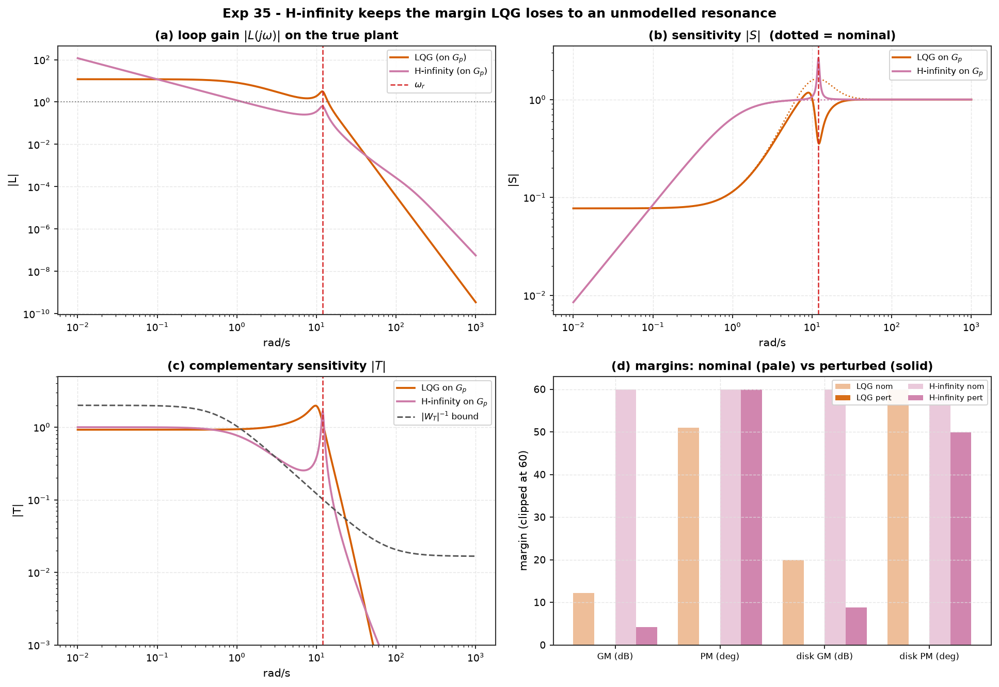

# Experiment 35 — H-infinity vs LQG under an unmodelled resonance

**Question.** You model a servo as a smooth second-order plant and design a
controller. The real hardware has a lightly-damped structural mode an octave or
so above your crossover that you never put in the model. **LQG**, tuned for a
tight nominal loop, places no ceiling on `|T|` out where that mode lives.
**H-infinity mixed-sensitivity**, with a `W_T` that forces `|T|` to roll off
past the mode, does. When the resonance turns out to be real, which loop
survives — and what did the survivor pay for it?

Companion: [`aimct.controllers.hinf`](../../src/aimct/controllers/hinf.py)
(`mixsyn`, `weight_S` / `weight_T`, `StateSpace`),
[`aimct.controllers.solve_care`](../../src/aimct/controllers/lqr.py) (the two LQG
Riccati equations), and the
[H-infinity reference](../../docs/references/hinf-reference.md).

## Setup

| | |
| :-- | :-- |
| **nominal design plant** | `G(s) = 12 / ((s+1)(s+3))` — DC gain 4, poles −1 and −3 |
| **unmodelled mode** | `R(s) = ω_r² / (s² + 2ζ_r ω_r s + ω_r²)`, `ω_r = 12` rad/s, `ζ_r = 0.08` |
| **true plant** | `G_p(s) = G(s)·R(s)` — peak multiplicative error `|R−1| ≈ 1/(2ζ_r) ≈ 6` near `ω_r` |

* **LQG** — `solve_care` twice (LQR gain + Kalman gain), folded into a `y→u`
  controller. Tuned **aggressively**: nominal loop crossover ≈ 7 rad/s.
* **H-infinity** — `mixsyn` with `W_S` (bandwidth ≈ 1 rad/s), a flat `W_KS`, and
  `W_T` cornering at 1.2 rad/s up to a high-frequency level `1/A = 60` — far
  above the ≈ 6 resonance error. Nominal bandwidth is **deliberately dropped to
  ≈ 1 rad/s** to force `|T(ω_r)|` below `1/|R−1|`. Achieved `γ = 0.981`.

```bash
python experiments/35_hinf_vs_lqg/run.py
AIMCT_EXP_FULL=1 python experiments/35_hinf_vs_lqg/run.py   # committed numbers
```

## Results (`AIMCT_EXP_FULL=1`)

| controller | plant | stable | GM | PM | disk α | disk GM | disk PM | ‖S‖∞ | ‖T‖∞ |
| :-- | :-- | :-: | :-: | :-: | :-: | :-: | :-: | :-: | :-: |
| **LQG** | nominal | yes | 12.2 dB | 50.9° | 0.82 | 19.9 dB | 78.5° | 1.63 | 1.16 |
| **LQG** | **perturbed** | **NO** | — | — | — | — | — | — | 1.98 |
| **H-infinity** | nominal | yes | ∞ | 90.3° | 1.98 | ∞ | 180° | 1.01 | 1.00 |
| **H-infinity** | **perturbed** | **yes** | 4.2 dB | 89.4° | 0.47 | 8.8 dB | 49.9° | 2.65 | 1.66 |

`disk α` = skew-0 disk margin `1 / max_ω |S(jω) − 0.5|`; `disk GM` / `disk PM`
are the *simultaneous* gain-and-phase variation it guarantees the loop tolerates.



## Takeaways

1. **The unmodelled resonance destabilises LQG and does not destabilise
   H-infinity.** LQG's nominal margins look perfectly ordinary (12 dB / 51°,
   `‖S‖∞ = 1.6`), but with `R(s)` present a closed-loop pole crosses into the
   right half plane. H-infinity keeps every closed-loop pole in the left half
   plane; its margins degrade (4.2 dB / 89°, disk 8.8 dB / 50°) but the loop is
   alive.

2. **Why LQG fails: it left gain in the loop where the mode is.** At `ω_r` the
   aggressive LQG loop still has `|L| ≈ 0.4`; the resonance multiplies that by
   ≈ 6 and adds a 180° phase swing, pushing the Nyquist curve around −1. LQG
   optimises a *nominal* quadratic cost — it has no term that says "keep `|T|`
   small out here," so it doesn't.

3. **Why H-infinity survives: `W_T` is a robustness certificate.** With
   `|W_T(ω_r)| > |R−1|`, the synthesis guarantees
   `|T(ω_r)| < 1/|W_T(ω_r)| < 1/|R−1|`, so `|W_m T|∞ < 1` and the small-gain
   theorem gives robust stability for *every* `‖Δ‖∞ ≤ 1` — this particular
   resonance included, though it never appeared in the design model. The
   nominal H-infinity loop is extremely gentle by construction (∞ gain margin,
   90° phase margin, `‖S‖∞ = 1.01`), which is exactly what "leave no exploitable
   gain anywhere" looks like.

4. **The robustness is not free, and the cost is visible.** H-infinity's nominal
   closed-loop bandwidth is ≈ 1 rad/s against LQG's ≈ 7. Rejecting a step
   disturbance or following a fast reference, the H-infinity loop is markedly
   slower. This is the trade stated plainly: nominal speed given up for a
   stability guarantee against a whole ball of unmodelled dynamics, turned by
   the single knob `A` in `W_T`. If you *knew* the mode's frequency and damping
   you would model it and do better than either; the point is what to reach for
   when you only know that *something* fast and lightly damped is probably up
   there.

5. **H-infinity is LQG that stopped trusting the model.** The only structural
   difference in the synthesis is the `γ⁻²` term in the two Riccati equations —
   a worst-case disturbance feedforward. Send `γ → ∞` and the H-infinity
   controller becomes the LQG one. Everything above is that term doing its job.
