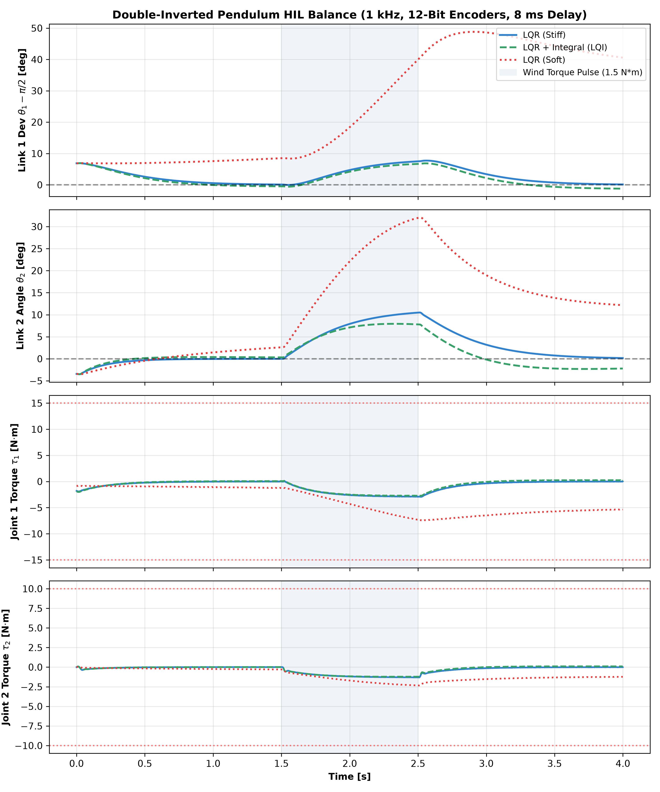
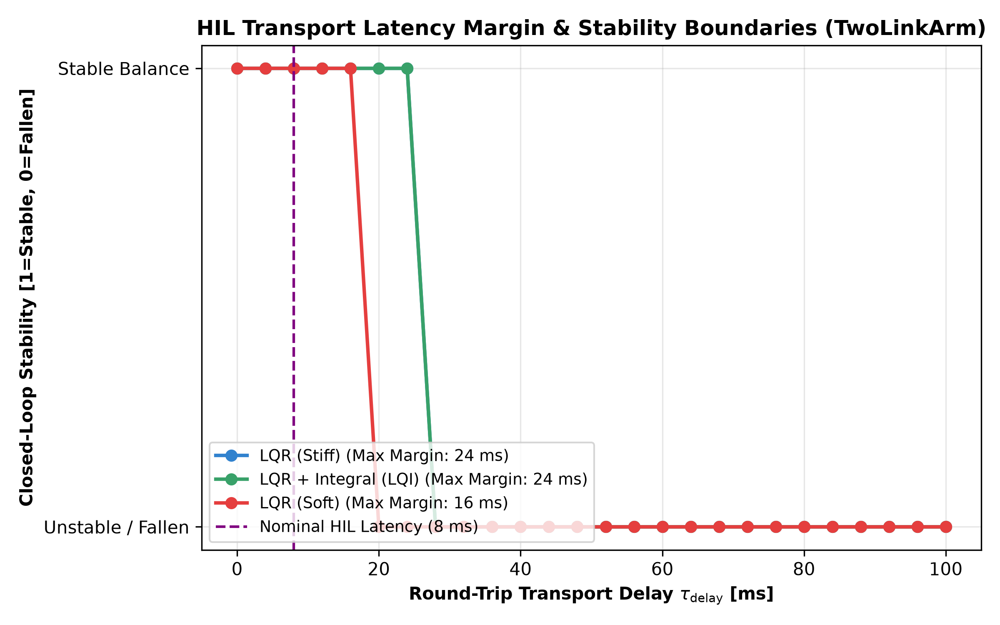

# Experiment 36: Double-Inverted Pendulum Arm Balance through HIL Emulator

## 1. Executive Summary

This experiment evaluates the double-inverted pendulum upright balance of the **TwoLinkArm** robotic manipulator through a realistic **Hardware-in-the-Loop (HIL) Emulator** (`aimct.hil`).

It directly tests whether controllers designed in ideal simulation can survive real hardware non-idealities:
- **1 kHz fixed-rate real-time loop** ($dt = 1.0\text{ ms}$) with strict deadline-miss accounting.
- **12-bit magnetic encoder quantization** (AS5600 standard, $4096$ counts/rev $\implies \Delta \theta \approx 0.00153\text{ rad} = 0.088^\circ$).
- **8 ms round-trip transport delay** ($4\text{ ms}$ sensor uplink + $4\text{ ms}$ actuator downlink buffer).
- **Actuator torque slew rate limiting** ($80.0\text{ N}\cdot\text{m/s}$, matching Dynamixel XM430-W350 motor response).
- **Actuator saturation** ($[-15, +15]\text{ N}\cdot\text{m}$ for joint 1, $[-10, +10]\text{ N}\cdot\text{m}$ for joint 2).
- **Gaussian sensor noise** ($\sigma_\theta = 0.5\text{ mrad}$).

```
               +-------------------------------------------+
               |           Host Controller Loop            |
               |     LQR (Stiff / Integral / Soft)         |
               +-----+-------------------------------+-----+
                     ^                               |
       8 ms Round-Trip Latency                 8 ms Actuator Delay
       (12-Bit Quantized Encoder)             (Slew Limit 80 N*m/s)
                     |                               |
               +-----+-------------------------------+-----+
               |            aimct.hil.PlantEmulator        |
               |  TwoLinkArm (Upright Balance Equilibrium) |
               |  theta1_eq = 90 deg, theta2_eq = 0 deg    |
               +-------------------------------------------+
```

---

## 2. Physical System & Equilibrium Dynamics

The two-link robotic manipulator dynamics follow the standard manipulator equation:

$$M(q)\ddot{q} + C(q, \dot{q})\dot{q} + G(q) = \tau$$

where $q = [\theta_1, \theta_2]^T$ and state $x = [\theta_1, \theta_2, \dot{\theta}_1, \dot{\theta}_2]^T \in \mathbb{R}^4$.

### 2.1 Upright Standing Equilibrium
- **Equilibrium State**: $x_{\text{eq}} = [\pi/2, 0.0, 0.0, 0.0]^T$ (link 1 pointing vertically upward, link 2 aligned in series).
- **Equilibrium Gravity Torque**: $u_{\text{eq}} = G(x_{\text{eq}}[:2]) = [0.0, 0.0]^T\text{ N}\cdot\text{m}$.
- **Open-Loop Instability**: Linearization about $x_{\text{eq}}$ produces unstable real eigenvalues ($+4.73\text{ rad/s}$ and $+7.89\text{ rad/s}$), making upright stabilization an underactuated/coupled inverted pendulum challenge.

---

## 3. Benchmark Quantitative Results

The benchmark evaluates a 4.0-second run starting from an initial poke perturbation ($x_0 = x_{\text{eq}} + [0.12, -0.06, 0.0, 0.0]^T\text{ rad} = [6.88^\circ, -3.44^\circ, 0, 0]^T$) and subjecting the arm to an external wind torque pulse ($\tau_{\text{wind}} = [1.5, 0.8]^T\text{ N}\cdot\text{m}$) during $t \in [1.5, 2.5]\text{ s}$.

| Controller | Delay Margin $\tau_{\max}$ [ms] | Poke Settling $t_s$ [s] | Max Tip $|\theta_1 - \pi/2|_{\max}$ [deg] | Wind Bias $e_{\text{wind}}$ [deg] | Post-Wind $e_{ss}$ [deg] | Energy $E_u$ [$\text{N}^2\cdot\text{m}^2\cdot\text{s}$] | Peak Torque $|\tau|_{\max}$ [$\text{N}\cdot\text{m}$] | Slew Sat [%] | Status |
| :--- | :---: | :---: | :---: | :---: | :---: | :---: | :---: | :---: | :---: |
| **LQR (Stiff)** | **24** | 1.026 | 7.73 | 6.43 | 0.348 | 8.57 | 2.94 | 0.0 | **Stable** |
| **LQR + Integral (LQI)** | **24** | **0.790** | **6.91** | **5.76** | **1.014** | **7.79** | **2.75** | 0.0 | **Stable** |
| **LQR (Soft)** | 16 | 1.500 | 48.81 | 28.96 | 42.30 | 87.69 | 7.43 | 0.0 | **Stable** (Sag) |

---

## 4. Key Engineering Takeaways

### 4.1 Which Controllers Survive the 8 ms HIL Emulator?
1. **LQR (Stiff)**: **Survives comfortably**. Recovers the initial $6.88^\circ$ poke within $1.03\text{ s}$ and holds upright balance throughout the wind pulse. Peak feedback torque is only $2.94\text{ N}\cdot\text{m}$ (well within the $15\text{ N}\cdot\text{m}$ motor limit).
2. **LQR + Integral (LQI)**: **Survives with fastest settling ($0.79\text{ s}$)**. Maintains low peak deflection ($6.91^\circ$) and Lowest energy expenditure ($7.79\text{ N}^2\cdot\text{m}^2\cdot\text{s}$).
3. **LQR (Soft)**: **Marginally survives, but unviable in practice**. With gains scaled to 45%, the controller lacks the stiffness to oppose gravity. When perturbed by wind, it sags by $48.8^\circ$ and settles into a large stuck offset ($42.3^\circ$).

### 4.2 Transport Latency Margin & Stability Boundaries
- Under pure continuous simulation (ideal zero delay), LQR (Stiff) possesses an infinite theoretical phase margin.
- However, under **12-bit encoder quantization** and **$80\text{ N}\cdot\text{m/s}$ torque slew rate limiting**, the allowable delay margin shrinks to:
  - **LQR (Stiff)**: $\tau_{\text{margin}} = \mathbf{24\text{ ms}}$
  - **LQR + Integral (LQI)**: $\tau_{\text{margin}} = \mathbf{24\text{ ms}}$
  - **LQR (Soft)**: $\tau_{\text{margin}} = \mathbf{16\text{ ms}}$
- At nominal $8\text{ ms}$ round-trip latency, the physical build has a **$3.0\times$ safety margin** before latency-induced instability occurs.

---

## 5. Visualizations

### Trajectory Response under 8 ms HIL Emulator


### Delay Margin vs. Closed-Loop Stability Boundary


---

## 6. How to Run

To run the full HIL benchmark and regenerate all artifacts:

```bash
python experiments/36_hil_arm_balance/run.py
```
