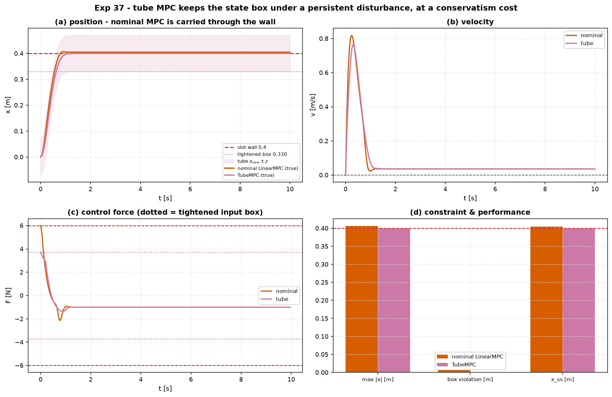

# Experiment 37 — tube MPC vs nominal MPC under a persistent disturbance

**Question.** A mass on a spring must stay inside a slot `|x| ≤ 0.40 m` while an
unmodelled force pushes on it every step — a bounded process disturbance
`x⁺ = A_d x + B_d u + w`, `w ∈ W`. Nominal
[`LinearMPC`](../../src/aimct/controllers/mpc.py) plans as if `w = 0`. Does the
constraint hold? And what does making it hold *robustly* cost?

Companion: [`aimct.controllers.TubeMPC` / `mrpi_box`](../../src/aimct/controllers/tube_mpc.py),
[`LinearMPC`](../../src/aimct/controllers/mpc.py), and the
[tube-MPC reference](../../docs/references/tube-mpc-reference.md).

## Setup

| | |
| :-- | :-- |
| plant | `MassSpringDamper(m=1, k=1, c=4)`, ZOH at `dt = 0.05 s` |
| constraint | slot `|x| ≤ 0.40 m`, input `|F| ≤ 6 N` |
| disturbance `W` | box half-widths `[0, 0.07]` — a persistent force on the velocity channel |
| realisation | worst case: a **constant** push toward the wall |
| setpoint | `x_ref = 0.38 m` (hold near the wall) |

**Nominal `LinearMPC`** — `N = 30`, `Q = diag(60, 2)`, `R = 0.15`; state box
soft, no disturbance model.
**`TubeMPC`** — same weights; ancillary `K` = discrete-LQR gain; the mРPI box
`Z = ⟦ Σᵢ |A_Kⁱ| ŵ ⟧`; nominal MPC solved on the state box tightened by `Z` and
the input box tightened by `|K| Z`; applied law `u = u_nom + K (x − x_nom)`.

```bash
python experiments/37_tube_mpc/run.py
AIMCT_EXP_FULL=1 python experiments/37_tube_mpc/run.py   # committed numbers
```

## Results (`AIMCT_EXP_FULL=1`)

mРPI box half-widths (built at `dt = 0.05`): **`z = [0.070, 0.283]`** (140
series terms, per-step contraction ≈ 0.82). Tightened position box
`|x_nom| ≤ 0.330` (wall `0.40` minus `z₁ = 0.070`); tightened input box
`|u_nom| ≤ 3.7 N`.

| controller | max \|x\| | box violation | violates | steps outside | x_ss | peak \|F\| | rms F |
| :-- | :-: | :-: | :-: | :-: | :-: | :-: | :-: |
| nominal LinearMPC | 0.407 | **7 mm** | **YES** | 124 / 140 | 0.405 | 6.00 | 1.30 |
| TubeMPC | 0.400 | **0** | no | 0 / 140 | 0.400 | 3.73 | 1.18 |



## Takeaways

1. **Nominal MPC violates the constraint the whole run.** It parks its
   *nominal* plan at the `0.38 m` setpoint; the persistent push then carries the
   *true* mass to a `0.405 m` steady state — ~7 mm past the `0.40 m` wall — and
   holds it there for 124 of 140 steps. The soft state penalty registers the
   violation; it does not stop it, because the disturbance never decays.

2. **Tube MPC holds the constraint for every disturbance in the box.** The mРPI
   box `z₁ = 0.070 m` is the largest the error `x − x_nom` can reach under any
   `w ∈ W`. Tightening the nominal box to `0.330 m` guarantees
   `x ≤ 0.330 + 0.070 = 0.400 m`. In the worst-case run the true mass sits
   *exactly* on the wall and never crosses it — the tube guarantee is tight
   here, not loose.

3. **The cost is explicit and bounded.** The tube's nominal setpoint is
   `0.330 m`, **50 mm short** of the `0.38 m` the nominal controller aims for,
   and the tube's control is confined to the tightened `±3.7 N` input box
   (nominal MPC uses the full `±6 N`). Both the state backoff `z₁` and the
   input backoff `|K| z` scale **linearly** with the disturbance bound `ŵ` — so
   the conservatism shrinks proportionally as the disturbance is tightened and
   vanishes when `W → 0` (`TubeMPC` with `W = 0` is exactly `LinearMPC`).

4. **When to reach for it.** Whenever a hard state constraint must survive a
   persistent, bounded, unmodelled input — a wind bias, a friction offset, a
   quantised actuator — and a soft penalty's "usually fine" is not good enough.
   The box mРPI is conservative (the exact set is a tighter polytope) but
   from-scratch and dependency-free; it works well when the closed loop is not
   too tightly coupled (`ρ(|A_K|)` modest). For a strongly-coupled unstable
   plant like the cart-pole the box hull inflates and a polytopic mРPI would be
   the next step.
