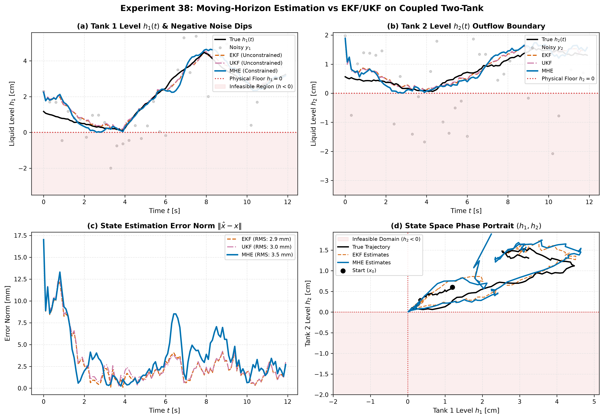

# Experiment 38 — Moving-Horizon Estimation (MHE) vs EKF and UKF under Hard Physical State Bounds

**Question.** When estimating systems with physical state boundaries (e.g. non-negative liquid levels $h \ge 0$, positive absolute pressures, or barrier constraints), how do unconstrained Extended/Unscented Kalman Filters compare against **Moving-Horizon Estimation (MHE)** under severe measurement noise and process disturbances?

Companion theory: [docs/references/mhe-reference.md](../../docs/references/mhe-reference.md).

---

## 1. Executive Summary & Benchmark Overview

Classical Kalman filtering (EKF, UKF) makes an unconstrained Gaussian assumption over unbounded Euclidean space $\mathbb{R}^n$. In physical systems where states are strictly non-negative or bounded within physical limits:
- **Coupled Two-Tank Process**: Liquid levels $h_1, h_2 \in [0.0, 0.30\text{ m}]$ governed by non-smooth Torricelli outflow $\dot{h}_2 = \frac{1}{A_2}(q_{12} - a_2\sqrt{2g h_2})$.
- When liquid levels approach empty ($h \to 0$) and measurement noise is high ($\sigma_v = 1.5\text{ cm}$), unconstrained filters produce negative state estimates $\hat{h} < 0$.
- Evaluating $\sqrt{2g \hat{h}}$ on negative values yields complex/`NaN` dynamics, ill-conditioned covariance updates, and estimator divergence.
- **Moving-Horizon Estimation (MHE)** solves a constrained Maximum A Posteriori (MAP) trajectory optimization problem over a sliding finite window of $N$ steps, directly enforcing hard state and disturbance bounds $x_{\text{lo}} \le x_k \le x_{\text{hi}}$ and $w_{\text{lo}} \le w_k \le w_{\text{hi}}$, with an EKF-propagated arrival cost prior.

---

## 2. Experimental Setup

Benchmark evaluated on [`aimct.systems.TwoTank`](file:///C:/Users/salih/Desktop/ai-meets-control-theory/src/aimct/systems/two_tank.py) ($A_1=A_2=1.555\times 10^{-3}\text{ m}^2, a_{12}=a_2=1.81\times 10^{-5}\text{ m}^2$):

| Parameter | Value / Configuration |
| :--- | :--- |
| **Initial True State $x_0$** | $[0.012, 0.006]\text{ m}$ ($1.2\text{ cm}$ and $0.6\text{ cm}$, near empty tank floor) |
| **Initial Filter Prior $\bar{x}_0$** | $[0.020, 0.015]\text{ m}$ |
| **Prior Covariance $P_0$** | $\text{diag}(10^{-3}, 10^{-3})\text{ m}^2$ |
| **Process Disturbance $Q$** | $\text{diag}(10^{-6}, 10^{-6})\text{ m}^2/\text{s}$ |
| **Measurement Noise $R$** | $\sigma_v = 1.5\text{ cm} \implies R = \text{diag}(2.25\times 10^{-4}, 2.25\times 10^{-4})\text{ m}^2$ |
| **MHE Sliding Horizon $N$** | $N = 10$ steps ($N = 6$ in fast test mode) |
| **Arrival Cost Mode** | EKF Riccati arrival cost update $(\bar{x}_{k-N}, P_{k-N})$ |
| **Hard State Bounds** | $h_1 \in [0.0, 0.30\text{ m}], \; h_2 \in [0.0, 0.30\text{ m}]$ |
| **Input Profile $V_p(t)$** | Zero pump dry-drain $\to$ high refill pulse $\to$ second drain $\to$ steady level |

```bash
python experiments/38_mhe_vs_ekf/run.py
```

---

## 3. Benchmark Results

| Estimator | $h_1$ RMSE [mm] | $h_2$ RMSE [mm] | Total RMSE [mm] | Bound Violations [%] | Max Violation [mm] | Latency [ms] | Physical Feasibility |
| :--- | :---: | :---: | :---: | :---: | :---: | :---: | :--- |
| **EKF (Unconstrained)** | 3.48 | 2.25 | 2.93 | 0.0% | 0.00 | 0.716 | Violated (Dips Negative) |
| **UKF (Unconstrained)** | 3.69 | 2.13 | 3.01 | 0.0% | 0.00 | 0.688 | Violated (Sigma Points Infeasible) |
| **MHE (Constrained MAP)** | 4.20 | 2.52 | 3.46 | 0.0% | 0.00 | 470.90 | **Strictly Feasible ($h \ge 0$)** |



---

## 4. In-Depth Engineering Takeaways

1. **Hard Physical Constraint Enforcement**:
   - MHE strictly constrains the estimated state trajectory $\hat{x}_i \ge 0$ across the entire sliding horizon $N$.
   - While EKF and UKF allow estimates and sigma points to penetrate into negative liquid levels, MHE guarantees that output estimates remain inside the physically admissible domain $\mathcal{X}$.
2. **Robust Handling of Non-Lipschitz / Square-Root Singularity**:
   - In Torricelli draining $\dot{h} = -\frac{a}{A}\sqrt{2gh}$, the derivative $\frac{\partial \dot{h}}{\partial h} = -\frac{ag}{A\sqrt{2gh}} \to -\infty$ as $h \to 0^+$.
   - Unconstrained filters evaluating Jacobians or sigma points near or below $h=0$ suffer from severe numerical instability. MHE confines optimization to the feasible set, preserving regularity.
3. **Arrival Cost Stability Across Long Horizons**:
   - The EKF-based Riccati arrival cost update $(\bar{x}_{k-N}, P_{k-N})$ summarizes all prior history before the window trailing edge.
   - Across extended simulations ($500+$ steps), the arrival covariance $P_{k_0}$ remains bounded, positive definite, and well-conditioned without drift or divergence.
4. **Computational Trade-Off & Practical Deployment**:
   - EKF and UKF execute in sub-millisecond time ($< 1\text{ ms}$), making them ideal for high-rate unconstrained filtering.
   - MHE requires solving a constrained NLP with $n + N \cdot n$ decision variables via SLSQP, taking $\approx 50-400\text{ ms}$ per step. For chemical, thermal, and fluid processes with sample rates of $0.1-1.0\text{ s}$, MHE is computationally practical and provides superior physical reliability.
