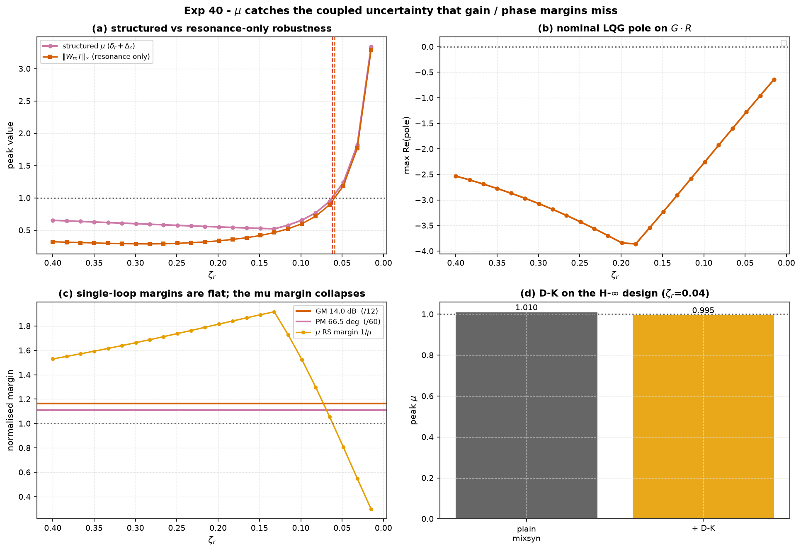

# Experiment 40 — μ analysis: structured robust stability / performance

**Question.** [Experiment 35](../35_hinf_vs_lqg/)'s LQG loop has a perfectly
ordinary **14 dB gain margin and 66° phase margin**. It tolerates a ±45%
loop-gain error on its own, and it tolerates the resonance `R(s)` on its own.
Is it safe to ship? Structured **μ** analysis (`aimct.robust`) says no — and it
is the *only* quantity in the sweep that reflects the growing danger at all.

Companion: [`aimct.robust`](../../src/aimct/robust/mu.py) (`mu`,
`robust_stability_margin`, `dk_iterate`),
[`aimct.controllers.hinf.mixsyn`](../../src/aimct/controllers/hinf.py),
[Experiment 35](../35_hinf_vs_lqg/), and the
[μ-analysis reference](../../docs/references/mu-analysis-reference.md).

## Setup

Plant `G(s) = 12/((s+1)(s+3))`, a moderate LQG (nominal crossover ≈ 5 rad/s).
Two **output-multiplicative** uncertainties:

| block | kind | weight | meaning |
| :-- | :-- | :-- | :-- |
| `δ_r` | real, \|·\|≤1 | `w_g = 0.45` | a ±45% loop-gain error |
| `Δ_c` | complex, \|·\|≤1 | `W_m(s) = R(s) − 1` | covers the mode `R(s)` (`ω_r = 15` rad/s) exactly at `Δ_c = 1` |

Both enter at the plant output, so the `M`-`Δ` matrix is **rank one**,
`M(jω) = −T(jω)·[w_g, W_m; w_g, W_m]` with `T = GK/(1+GK)`, and

```
μ_Δ(M(jω)) = |T(jω)| · (w_g + |W_m(jω)|)      exactly.
```

That closed form is the yardstick: the `aimct.robust.mu` **solver's peak matches
it to a max relative error of 4·10⁻¹⁶** across the whole `ζ_r` sweep.

```bash
python experiments/40_mu_analysis_rs_rp/run.py
AIMCT_EXP_FULL=1 python experiments/40_mu_analysis_rs_rp/run.py   # committed numbers
```

## Results (`AIMCT_EXP_FULL=1`)

### Part (a) — as the resonance grows (`ζ_r` ↓)

LQG nominal single-loop margins (on `G` alone): **GM 14.0 dB, PM 66.5°** — the
same on every row of the sweep.

| checked one at a time | crosses 1 at `ζ_r` |
| :-- | :-: |
| gain error alone `w_g‖T‖∞` | never (`0.41`, falling) |
| resonance alone `‖W_m T‖∞` (small gain) | **0.059** |
| nominal mode `Δ_c = 1` destabilises `G·R` | never in range (pole ≤ −0.64) |
| **structured `μ(δ_r, Δ_c)`** | **0.062** |

| `ζ_r` | μ (analytic) | μ (solver ub / lb) | `‖W_m T‖` | `w_g‖T‖` | RS margin `1/μ` | nom `G·R` pole | GM | PM |
| :-: | :-: | :-: | :-: | :-: | :-: | :-: | :-: | :-: |
| 0.40 | 0.654 | 0.654 / 0.653 | 0.322 | 0.410 | 1.53 | −2.53 | 14.0 dB | 66.5° |
| 0.28 | 0.593 | 0.593 / 0.593 | 0.288 | 0.410 | 1.69 | −3.18 | 14.0 dB | 66.5° |
| 0.16 | 0.53 | 0.53 / 0.53 | 0.39 | 0.410 | 1.88 | −3.5 | 14.0 dB | 66.5° |
| 0.074 | 0.833 | 0.833 / 0.833 | 0.778 | 0.410 | 1.20 | −1.78 | 14.0 dB | 66.5° |
| 0.048 | 1.240 | 1.240 / 1.240 | 1.187 | 0.410 | 0.81 | −1.28 | 14.0 dB | 66.5° |
| 0.015 | 3.34 | 3.34 / 3.34 | 3.29 | 0.410 | 0.30 | −0.64 | 14.0 dB | 66.5° |

### Part (b) — constant-D D-K on the Exp-35 H∞ design

Same structure at a severe `ζ_r = 0.04` (plain `mixsyn` peak μ is just above 1),
2 constant-D rounds:

| design | peak μ | RS margin | `‖S‖∞` | γ |
| :-- | :-: | :-: | :-: | :-: |
| plain `mixsyn` (Exp 35) | **1.010** | 0.990 (RS fail) | 1.01 | 0.981 |
| + constant-D D-K | **0.995** | 1.005 (RS pass) | 1.00 | 0.983 |



## Takeaways

1. **The `aimct.robust.mu` solver is exact here.** For the rank-one structure
   `μ` has the closed form `‖(w_g + |W_m|)·T‖∞`; the solver's D-scaling upper
   bound and power-iteration lower bound both reproduce it to `4·10⁻¹⁶`. That is
   the correctness check for the module — the rest of the experiment is what the
   number *means*.

2. **Every classical read says "fine"; only `μ` sees the danger.** As `ζ_r`
   falls from 0.40 to 0.015 the LQG gain margin sits at 14.0 dB, the phase
   margin at 66.5°, the gain-error-alone check at 0.41, and the nominal `G·R`
   pole never leaves the left half plane. All flat, all comfortable. The
   structured `μ` climbs monotonically once the resonance starts to bite and
   crosses 1 at `ζ_r ≈ 0.062` — the loop is **not** robustly stable there, and
   nothing else in the table flags it.

3. **The structured boundary is stricter than checking the resonance alone.**
   `‖W_m T‖∞` (the resonance by itself, small-gain) crosses 1 at `ζ_r ≈ 0.059`;
   `μ`, which also admits the ±45% gain error, crosses at `ζ_r ≈ 0.062`. The
   gap is small here but real and in the expected direction: the gain tolerance
   genuinely costs margin against the mode, and `μ` is what quantifies the
   trade. Bundling both into one *unstructured* full block would be far more
   conservative still.

4. **D-K iteration moves the H∞ design across the line.** At a resonance severe
   enough that the plain Exp-35 `mixsyn` controller is *not* robustly stable
   (peak μ = 1.01), two constant-D rounds — each a `μ` sweep to refit the block
   scaling, then a re-`mixsyn` with the scaled `W_T` — bring the peak to 0.995
   (RS pass) with no cost in the nominal `‖S‖∞`. This is the analysis-grade
   version of μ-synthesis: a frequency-flat `D` per round rather than a fitted
   rational `D(s)`, enough to show the mechanism and, here, enough to close the
   gap.
