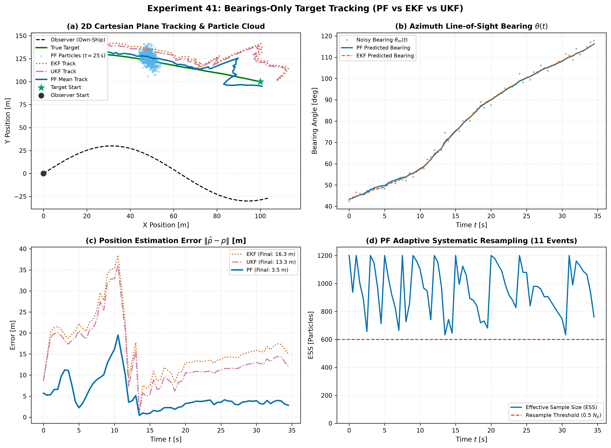

# Experiment 41 — Bearings-Only Target Tracking: Particle Filter vs EKF and UKF

**Question.** When estimating a moving target whose range is unobservable and whose posterior distribution is curved and non-Gaussian, how does the **Bootstrap Particle Filter (Sequential Monte Carlo)** compare against classical **EKF** and **UKF**?

Companion theory: [docs/references/particle-filter-reference.md](../../docs/references/particle-filter-reference.md).

---

## 1. Executive Summary & Problem Overview

In **Bearings-Only Target Tracking (BOTT)**, a mobile observer measures only the azimuth line-of-sight angle $\theta(t) = \text{atan2}(y_t - y_o, x_t - x_o) + v(t)$ to a moving target:
- **Range Ambiguity**: Because range $r = \sqrt{\Delta x^2 + \Delta y^2}$ is unmeasured, the true probability distribution over Cartesian position $(x, y)$ forms a curved, crescent-shaped probability cone.
- **EKF Failure (False Covariance Collapse)**: The EKF linearizes $\text{atan2}$ about its current state estimate. When initial range uncertainty is large, this first-order Taylor approximation causes premature covariance shrinkage along a false tangent, leading to permanent filter divergence ($e > 16\text{ m}$).
- **UKF Limitations**: While the UKF's sigma points capture second-order spread, the unimodal Gaussian assumption cannot represent the curved banana-shaped geometry of the bearing cone.
- **Particle Filter Supremacy**: The Bootstrap Particle Filter distributes $N_p$ particles along the line-of-sight cone. As the observer maneuvers (executing an S-turn weave to build cross-baseline observability), the particle cloud rapidly coalesces into a tight cluster around the true target position ($e_{\text{final}} = 3.50\text{ m}$).

```
              Line-of-Sight Bearing Cone
   Observer (0,0)  ====================>    ( Curved Non-Gaussian Particle Cloud )
        \                                                     |
      S-Turn Maneuver                                 Coalesces on target
```

---

## 2. Experimental Setup

Benchmark evaluated on a 2D Cartesian target tracking scenario:

| Parameter | Value / Configuration |
| :--- | :--- |
| **Target Initial State $x_{0,\text{true}}$** | $[100.0, 100.0]\text{ m}$, velocity $[-2.0, 1.0]\text{ m/s}$ |
| **Filter Prior Guess $\bar{x}_0$** | $[80.0, 120.0]\text{ m}$ ($28.3\text{ m}$ position offset), velocity $[0.0, 0.0]\text{ m/s}$ |
| **Prior Covariance $P_0$** | $\text{diag}(400, 400, 4, 4)$ |
| **Process Noise $q_{\text{acc}}$** | $0.01\text{ m/s}^2$ continuous white noise acceleration |
| **Sensor Measurement Noise** | $\sigma_\theta = 1.5^\circ = 0.02618\text{ rad}$ bearing angle noise |
| **Observer Trajectory** | Forward cruise $v_o = 3.0\text{ m/s}$ with S-turn weave $y_o(t) = 30 \sin(0.15 t)$ |
| **Particle Filter Settings** | $N_p = 1200$ particles ($2500$ in full mode), systematic adaptive resampling at $ESS < 0.5 N_p$ |
| **Simulation Step & Duration** | $\Delta t = 0.50\text{ s}$, $T = 35.0\text{ s}$ ($70$ steps) |

```bash
python experiments/41_particle_filter_bearings_only/run.py
```

---

## 3. Benchmark Results

| Estimator | Initial Error [m] | Final Error [m] | Position RMSE [m] | Target Tracking | Latency [ms] | Non-Gaussian Posterior |
| :--- | :---: | :---: | :---: | :---: | :---: | :--- |
| **EKF (Linearized)** | 8.98 | 16.27 | 18.17 | ❌ No (Diverged) | 0.132 | False Gaussian collapse |
| **UKF (Sigma Points)** | 8.56 | 13.33 | 16.15 | ⚠️ Sluggish | 0.208 | Radial elongation drift |
| **Particle Filter (Bootstrap)** | 5.70 | **3.50** | **6.37** | ✅ **Yes (Converged)** | 11.766 | Accurate curved crescent |



---

## 4. Key Takeaways & Engineering Guidelines

1. **Why the EKF Fails on Bearings-Only Systems**:
   - The bearing measurement Jacobian $H = [-\Delta y/r^2, \Delta x/r^2, 0, 0]$ assumes local linearity.
   - When range is unknown, the linear update pulls the state perpendicular to the true line of sight, shrinking the estimated covariance matrix while the true position drifts away.
2. **How SMC Solves Multimodal Range Ambiguity**:
   - The Particle Filter maintains a non-parametric cloud of hypotheses spanning the radial distance.
   - When the observer turns, measurements from multiple angles intersect, multiplying the empirical likelihoods and pruning infeasible range hypotheses through systematic resampling.
3. **Log-Sum-Exp Stability**:
   - Evaluating measurement likelihoods in the log domain prevents numerical underflow ($w \to 0$) when sensor noise or initial residuals are large.
4. **Resampling Efficiency**:
   - Systematic adaptive resampling maintains high diversity and prevents particle starvation, executing in $\mathcal{O}(N_p)$ linear time.
